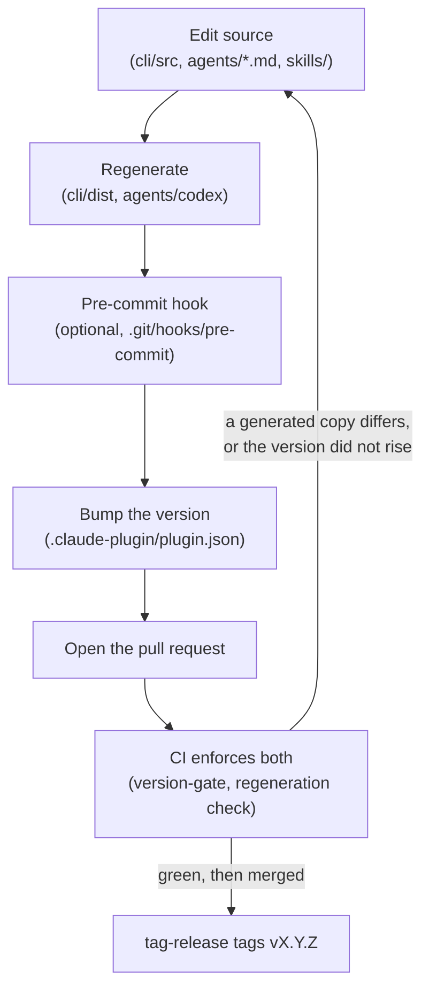

# Contributing to SpecHub

*Two sets of generated files and one version check decide whether your pull request goes green.*

SpecHub ships as a Claude Code plugin, so an installed copy runs files straight out of a plugin cache.

- **Two build steps write files this repository commits**: `cli/dist` and `agents/codex`
- **Regenerate whichever your change invalidates**, or CI fails on the stale copy
- **Bump the version in `.claude-plugin/plugin.json`**
    - The cache only re-pulls when the version changes
- **CI checks both**
    - A red run tells you which one you missed



| What you want | Where |
| --- | --- |
| Where a file goes | section 1 |
| Editing `assets/` and its helper scripts | section 2 |
| Regenerating `cli/dist` | section 3 |
| Regenerating `agents/codex` | section 4 |
| Running the tests | section 5 |
| Bumping, opening the pull request, and the tag | section 6 |
| Writing standards | section 7 |

## 1. Plugin layout

*Seven directories and one file, each with one job.*

```
.claude-plugin/plugin.json   – plugin manifest (version, name, description)
agents/                      – subagent definitions
hooks/                       – SessionStart, Stop and UserPromptSubmit hooks
skills/                      – slash-command skills
output-styles/               – output styles (ac-writing-style)
cli/                         – Node.js CLI (TypeScript source + built dist/)
assets/                      – files a skill installs on a user's machine, and the model never reads them
docs/                        – long-form docs a skill links to instead of inlining
TROUBLESHOOTING.md           – downstream install diagnostics for Claude Code
```

## 2. Assets and helper scripts

*`assets/` holds what a skill installs rather than reads. One duplicate key there costs the user their whole config file.*

Today that is `assets/terminal-workspace/setup.sh`, which installs the optional terminal workspace.

Two rules govern it.

- **Every helper script carries the `spechub-*` prefix and lives in a heredoc inside `setup.sh`**, and never as a separate file
    - One script to install means one file to keep idempotent
    - Editing a helper means editing the heredoc
    - `uninstall` removes them by that prefix
        - A helper named anything else leaks
- **Every edit to a user's config sits between the managed markers**, `# >>> spechub terminal-workspace >>>` and `# <<< ... <<<`
    - Re-applying replaces only those regions
        - Hand-written config around them survives
    - Never write outside the markers, and never assume the file is absent

### 2.1. Merging into a user's TOML config

*TOML forbids a duplicate key. The managed block therefore either claims a key or concedes it.*

- herdr rejects a config that holds a duplicate, and yazi throws its config away and falls back to presets
- The block **claims** each key it writes, meaning it deletes the user's own copy of that key first
- The block **concedes** a key it cannot prove is free, meaning it writes nothing there and says so

The herdr keymap is the first case.

- The block claims every key it sets
- Before the merge it removes a same-name assignment in the user's own `[keys]`
- It also removes any `[[keys.command]]` bound to a key the block binds
- The same applies to `[worktrees]`, which the block re-declares in full

Merging into an existing `[keys]` produces **two** managed regions rather than one.

- A bare key must sit inside `[keys]`
- `[[keys.command]]` and `[worktrees]` are top-level tables, so they cannot
- What must hold is that re-applying never accumulates regions

`yazi.toml` is the same case, and stricter.

- A yazi config that falls back to presets loses every setting the user has
- The managed block writes into four namespaces: `mgr`, `opener.markdown`, `plugin.prepend_previewers`, and `open.prepend_rules`
- Every one of them is a claimed-key case
- An array-of-tables entry adds to the config only where the name is free, or where it already holds an array of tables
    - `[[plugin.prepend_previewers]]` is fine under a `[plugin]` that leaves `prepend_previewers` unset
    - It is a duplicate under a `[plugin]` that holds it as an inline array, which is the form yazi's own documentation teaches

How `setup.sh` decides:

- It asks `tomllib` which namespaces the user has claimed
- It puts the question in the exact form the block would write it
- It appends that header to the config outside the markers, then sees whether the whole thing still parses
- Whatever the parser rejects is a namespace the user already claimed
    - `setup.sh` leaves it alone

A dict lookup would not do.

- TOML also refuses to reopen an inline table or to overwrite a scalar
- Neither `opener = { text = [...] }` nor `opener = "nope"` has an `opener.markdown` key to find
- A lookup therefore calls both free, and the write then kills the file
- A config that already fails to parse concedes all four namespaces
    - Such a file teaches `setup.sh` nothing, and repairing a user's config is not its job

The fallback path, for a machine without Python 3.11:

- `tomllib` needs Python 3.11
- Without it, the fallback names the top-level table anywhere the text could open one
- That means bare, `"quoted"` or `'literal'`, as a header or as a key of its own
- That mostly concedes namespaces which would have been safe to write
    - Each of those concessions costs one setting, where guessing the other way costs the file
- The fallback errs the other way in one place
    - Text cannot see that a config never parsed
        - The fallback writes all four into a file the parsed path would have conceded whole
- `setup.sh` leaves whatever it concedes to the user and names it in a `say` line
    - A config that parses with a setting missing beats one yazi throws out

### 2.2. Testing a setup.sh change

*Test against a fake home, never your own.*

```bash
export FAKE=$(mktemp -d)
mkdir -p "$FAKE/.config/spechub"
cp assets/terminal-workspace/config.example.yaml "$FAKE/.config/spechub/tw.yaml"
HOME=$FAKE SPECHUB_TW_CONFIG=$FAKE/.config/spechub/tw.yaml SPECHUB_TW_BIN=$FAKE/bin \
  bash assets/terminal-workspace/setup.sh apply
```

Then check three things.

- The generated config parses
- Running `apply` twice does not grow the managed block count
- Running `uninstall` leaves nothing behind

Run the guard suite too, which is offline and needs no herdr:

```bash
bash tests/test-terminal-workspace.sh
```

- It checks setup.sh against `docs/terminal-workspace.md` in both directions
- Every `spechub-*` and every bound command the docs mention must be something setup.sh installs
- The docs must also cover every default keybinding
- It merges the generated keymap onto a hand-written config and asserts the result is valid TOML
- CI runs it on every push and pull request
- Rename a helper or change a default key and this suite fails until the docs follow

## 3. CLI build discipline

*The CLI ships pre-built and bundled. `cli/dist/index.js` has to work with no `node_modules/` beside it.*

- `cli/dist/index.js` is a single self-contained file
- esbuild inlines every runtime dependency into it: commander, chalk, fast-glob, yaml, and zod
- Claude Code clones and runs a marketplace plugin directly, with no `npm install` step downstream

After any change in `cli/src/`:

```
cd cli
npm install     # only needed when package.json changed
npm run build   # rebuilds dist/index.js via esbuild (see build.mjs)
npm run typecheck  # tsc --noEmit, catches type errors the bundler skips
npm run lint    # eslint, type-aware rules over src/ (see eslint.config.js)
git add src/ dist/ package.json package-lock.json
```

- Both `src/` and `dist/` belong in the same commit
- A stale `dist/` ships broken or misleading behaviour to every downstream user until the next release

To verify the bundle survives a fresh install, park `node_modules/` first, then exercise the bin wrapper:

```
mv node_modules /tmp/nm-park && node bin/spechub.js --help; mv /tmp/nm-park node_modules
```

- A healthy bundle prints the full subcommand list
- A throw of `Dynamic require of "node:..."` means the esbuild banner in `build.mjs` regressed

### 3.1. The recommended pre-commit hook

*The pre-commit hook saves you a red run. CI is what actually enforces the two generated sets.*

Drop this into `.git/hooks/pre-commit` inside the spechub clone, not the marketplace parent. Then run `chmod +x .git/hooks/pre-commit`. Git ignores hook files, so this stays per-clone.

```bash
#!/usr/bin/env bash
# Regenerate whichever committed generated files the staged diff invalidates.
set -euo pipefail

staged=$(git diff --cached --name-only)

if grep -q '^cli/src/' <<<"$staged"; then
  echo "pre-commit: cli/src changed – rebuilding dist/"
  (cd cli && npm run build)
  git add cli/dist cli/package.json
fi

if grep -qE '^agents/[^/]+\.md$' <<<"$staged"; then
  echo "pre-commit: agents/*.md changed – regenerating agents/codex/"
  node scripts/gen-codex-agents.mjs
  git add agents/codex
fi
```

- Each block fires only when its own source is part of the staged diff, then stages what it regenerates
- The commit aborts if either command fails
- The repository commits two sets of generated files
    - The hook has two blocks
    - `cli/dist` comes from esbuild
    - `agents/codex/*.toml` comes from `scripts/gen-codex-agents.mjs`, which reads the markdown in `agents/`
    - Editing an agent's markdown and committing without the second block leaves a red run
- The hook is optional and easy to forget to install
    - `.github/workflows/ci.yml` regenerates each set and fails the run if the committed copy differs
    - Treat the hook as a convenience, and never as the guarantee

`spechub/project.yaml` names both commands in one place.

- Its `commands.build` runs the esbuild build and the Codex generator together
- Anything that verifies a build therefore leaves the tree matching what CI expects

### 3.2. What `npm run build` does to the version

*`npm run build` syncs `cli/package.json` for tidiness. `spechub --version` never depends on that sync.*

- `npm run build` syncs `cli/package.json`'s version from `.claude-plugin/plugin.json`, then runs esbuild
- That is why both the pre-commit hook and the `git add` recipe above stage `cli/package.json` alongside `dist/`
- `spechub --version` reads `.claude-plugin/plugin.json` directly at runtime, in `cli/src/lib/version.ts`
    - The reported version is right whether or not anything rebuilt
    - It has to work that way, because the rebuild only fires when `cli/src/` changes
    - Bumping the plugin alone would otherwise leave a baked-in copy behind
    - That is exactly how the CLI came to report `0.1.0` while the plugin was at 0.14.2

## 4. Codex agent definitions

*`agents/*.md` is the source, the generator writes the TOML, and Codex discards a file holding one unrecognised key.*

- `scripts/gen-codex-agents.mjs` generates `agents/codex/*.toml` from `agents/*.md`
- Commit the generated files, and never hand-edit the TOML

```sh
node scripts/gen-codex-agents.mjs
```

Why the hook installs them:

- Codex cannot ship agent definitions inside a plugin
    - The SessionStart hook installs them into `~/.codex/agents/`
- It re-reconciles on every session
- It only overwrites a file carrying the generated marker
    - It leaves alone an agent of yours that shares a name
- It does nothing at all on a machine with no `~/.codex`

The generator emits only the three keys Codex applies: `name`, `description`, and `developer_instructions`. It deliberately omits others.

- `model` – ours says `opus`, a Claude alias that means nothing to Codex
    - Omitting it makes a subagent inherit the parent's model
    - That is what we want
- `sandbox_mode` and `mcp_servers` – Codex parses then ignores both
    - A child agent may never escalate past its parent
    - Emitting them would imply a guarantee that does not hold

One unrecognised key discards the whole file.

- Codex parses an agent file with `deny_unknown_fields`
- It logs the rejection somewhere nobody reads
- CI parses every generated file and fails on any key outside the allowed three

Keep the markdown harness-neutral.

- Naming Claude Code's tools directly, as in "use Grep/Glob", produces instructions that are wrong under Codex
- Prefer "search the codebase"
- Fixing it in the markdown keeps the generator free of a translation layer

## 5. Testing

*Two layers, two commands.*

- Run `cd cli && npm test` for the CLI tests
- Run `bash tests/run-all.sh` for the hook suites

## 6. Releasing

*CI enforces the version bump, because the plugin cache only re-pulls when the version changes.*

- The `version-gate` check runs on every pull request to `main`
- It fails when the change touches a shipped path without raising the version in `.claude-plugin/plugin.json`
- A **shipped path** is a file an installed copy of the plugin loads or runs
    - A change to one must roll out to every machine
- A merge to `main` that leaves the version alone is invisible to every installed copy
- That is what the gate exists to prevent

### 6.1. Inert paths

*Everything is a shipped path except this list.*

These files never reach an installed copy, so changing them needs no bump:

```
README.md
CONTRIBUTING.md
CONTEXT.md
LICENSE
THIRD_PARTY_NOTICES
docs/adr/**
docs/migrate-0.8.md
tests/**
.github/**
.claude/**
spechub/**
```

- The `INERT_PATHS` array at the top of `scripts/version-gate.sh` holds a second copy of this list
- Change one and change the other
- The gate treats a new top-level path as shipped
    - It works from a deny-list

### 6.2. Picking the level

*The gate checks that the version went up. You pick the level.*

- Use semver: patch for a fix, minor for a feature, major for a breaking change

### 6.3. The no-bump label

*The `no-bump` label is the exception. It is never a way past a red check.*

- Add the `no-bump` label to the pull request to pass the gate without a bump
- This is for a change that touches a shipped path but genuinely should not roll out
    - Reformatting a file with no behavioural effect
    - A fix that has to wait for a later release
- A version that goes *down* fails even with the label
    - An installed copy never downgrades

### 6.4. Before you open the pull request

1. Bump `.claude-plugin/plugin.json`.
2. Confirm `cli/dist/` is up to date. The pre-commit hook handles this if installed.
3. Commit via `/commit` from the marketplace repo. It handles the submodule and parent ordering.

### 6.5. After the merge

*Nothing to tag by hand.*

- The `tag-release` workflow watches `main` for a change to `.claude-plugin/plugin.json`
- It creates an annotated tag `vX.Y.Z` for the new version

### 6.6. Why the CLI is not on npm

*The CLI ships only as part of the plugin. That is deliberate.*

Installing it is not a step.

- The plugin ships `cli/dist/index.js` in the repository
    - It arrives already built when Claude Code copies the plugin into its cache
- The SessionStart hook then symlinks it into place
- There is no npm install, no `node_modules` in the cache, and no network call
- The only requirement is Node 20 on PATH

Publishing to npm as well would buy a second door to the same code and cost three things.

- **Version skew, which is currently impossible** – skills and CLI ship in one tarball at one version
    - A globally installed CLI pins the version you installed
        - A plugin release with a new CLI flag can break a skill
    - Preventing that needs a version check at session start
    - That is more machinery than the symlink it would replace
- **A network dependency on a path that has none** – `npm install -g` fails on no network, a locked-down prefix, or a proxy
    - The bundled CLI works offline
- **PATH propagation** – a non-interactive agent subshell does not always inherit an npm global bin, notably under nvm

Using SpecHub from another agent harness does not need npm either.

- On any machine with the plugin, the hook creates `~/.local/bin/spechub`, which has no Claude Code dependency
- It works as a typed command whenever `~/.local/bin` is on PATH
- The hook warns when it is not
- What another harness lacks is the orchestrator instructions, and not the binary

Revisit this only if a machine needs the CLI with **no plugin installed at all**.

- That means CI, or a device that runs an agent but not Claude Code
- We keep the package publishable for that day
    - `npm pack --dry-run` from `cli/` shows the file list, and `prepublishOnly` runs the build
    - The bare `spechub` name on npm belongs to an unrelated project
        - The package would be `spechub-cli` with `spechub` as its binary

### 6.7. Who owns `spechub` on PATH

*The SessionStart hook defers to a `spechub` already on PATH. Agents are outside this entirely.*

- The hook leaves an existing `spechub` on PATH alone if it is not the hook's own symlink
- It says where the winner came from
- Two managers pointing one command name at different copies make a silent race, which PATH order decides
- The hook should not be one of the racers
- Skills and agents call `~/.claude/spechub/bin/spechub` by absolute path
    - That is always the plugin's own CLI, whatever PATH says

## 7. Writing standards

*Two skills own every durable artifact this repository ships, the skill files and these docs included.*

- Prose follows the `writing` skill in `skills/writing/`, which owns words, sentences, paragraphs, and heading style
- Shape follows the `visual-docs` skill in `skills/visual-docs/`, which owns the Minto pyramid, diagram-first structure, and bullet discipline
    - Section 3 of that skill holds the bullet rules
        - 90% or more of the body in bullets, one sentence each, no trailing period
        - Markdown nests four spaces per level
- Run `~/.claude/spechub/bin/spechub lint-prose <paths>` before you open the pull request
    - It checks sentence length, paragraph length, passive voice, the `vocabulary.md` deny lists, marks and emoji
    - It warns and never blocks
    - It does not yet check the bullet rules
