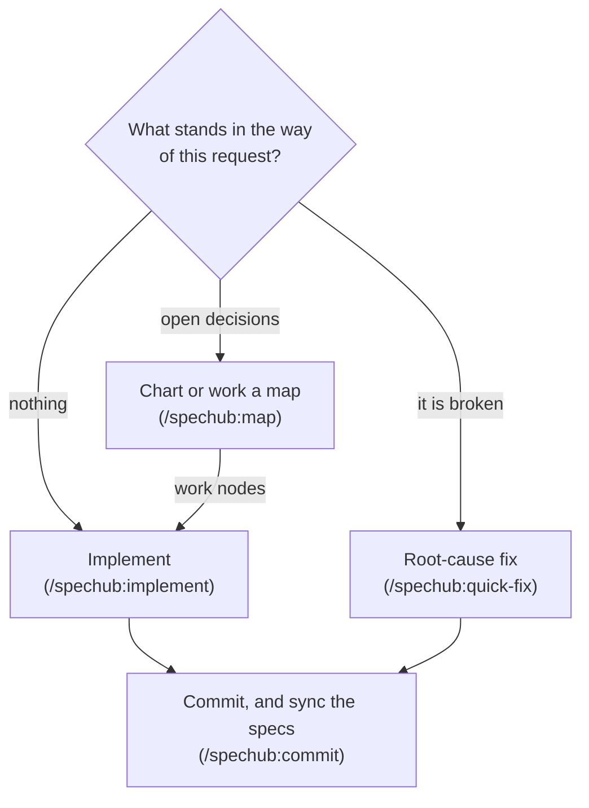

# SpecHub

SpecHub is a Claude Code plugin for spec-driven test-driven development (TDD). Planning machinery normally comes in fixed sizes, so a typo fix pays for the ladder a fifty-question effort needs. How much structure should one request get? Exactly as much as the fog demands, where fog is the part of the work nobody can state precisely yet.



Every box above is section 1. The rest of this file is reference.

| What you want          | Where     |
| ---------------------- | --------- |
| How the fog picks the size | section 1 |
| Install                | section 2 |
| Configure a project and a machine | section 3 |
| The CLI                | section 4 |
| Every skill            | section 5 |
| Every agent            | section 6 |
| Output style           | section 7 |
| Terminal workspace     | section 8 |
| Design principles      | section 9 |
| Licence and credits    | section 10 |

## 1. No path selection: the fog picks the size

*One entry point serves a one-question change and a fifty-question effort, and nothing declares which.*

- **The way is clear** – `/spechub:implement` runs the TDD pipeline of section 6 on the request directly
    - A small unit of work is simply small
- **Something broke** – `/spechub:quick-fix` forces root-cause analysis before any edit
- **Decisions need settling** – `/spechub:map` charts a map when none exists, and works the frontier when one does
    - You settle a single question in conversation, and SpecHub calls that interview technique grilling
    - The question leaves an architecture decision record (ADR), a short note stating the decision and the reason
    - A long effort becomes a map instead, worked across sessions

A map is a set of small records called nodes.

- **A node** is one question to settle or one piece of work to do
- **A status** is one of five: `fog`, `open`, `claimed`, `resolved` and `out-of-scope`
    - A `fog` node holds something nobody can state precisely yet
    - An `open` node is ready to settle, and a `claimed` node is one someone works now
    - You have settled a `resolved` node, and you have deliberately dropped an `out-of-scope` node
- **A provenance parent** is the node whose answer raised this one
- **A blocking edge** names a node that must resolve before this one starts
- **A mode** says who settles the node: `hitl` for a human, `afk` for an agent working alone
- **The frontier** is the set of nodes you can work right now, the open nodes with nothing unresolved blocking them
- **A tracker** is the swappable storage layer behind a map, with GitHub issues first-class and plain files as the fallback
- **The packaging walk** collects a map into one brief, so a fresh session picks up an effort without re-reading everything

Every rule in SpecHub exists because something went wrong without it. SpecHub grew over months of real product development with Claude Code.

For the full picture, each step and how they connect, read [docs/workflows.md](docs/workflows.md).

## 2. Install

*Two commands install the plugin, and one sets it up in a project.*

Prerequisites:

- [Claude Code](https://claude.com/claude-code) CLI
- Node.js 20 or later, for the SpecHub CLI

```
/plugin marketplace add ac8318740/ac-agentic-coding
/plugin install spechub@ac-agentic-coding
```

Then in your project:

```
/spechub:setup
```

- `/spechub:setup` detects the project type, then writes `spechub/project.yaml` with workflow settings
- The SessionStart hook loads the orchestrator instructions whenever it detects a spechub project
- Your CLAUDE.md stays clean for project-specific content
- Upgrading from a version before 0.8.0 means deleting one stale `@import` line, which [docs/migrate-0.8.md](docs/migrate-0.8.md) covers

## 3. Configure a project and a machine

*The project states what to run, and the machine states what it can do.*

- `spechub/project.yaml` holds every project-scoped setting, and [docs/config-reference.md](docs/config-reference.md) gives each key, its values, its default and what changes
- `~/.config/spechub/config.json` holds the eight `host.*` axes, which `/spechub:host` writes once per machine
    - [docs/dev-setups.md](docs/dev-setups.md) gives every axis, what reads it, and how to describe a fresh machine
- `/spechub:setup` copies the commands and directories from one of three language profiles
    - **python** – pytest, ruff, mypy
    - **node-typescript** – npm test, eslint, tsc
    - **fullstack-python** – Python backend, plus a Node or TypeScript frontend
- `spechub config check` audits the project and the machine, and exits 2 on an unset required axis

## 4. The CLI

*Four tracker operations carry the whole map, and an invariant path makes the CLI reachable from any agent.*

SpecHub ships a Node.js CLI: `spechub config`, `spechub list`, `spechub node ...` and `spechub archive`.

- A tracker provides four operations and nothing more: create, read, update, list
    - GitHub issues are the first-class tracker, because they already hold the two links a map needs
    - Sub-issues carry the provenance parent, and issue dependencies carry the blocking edges
    - The files tracker is the fallback, and it writes one markdown file per node under `spechub/maps/<name>/`
- The CLI builds everything else on those four operations
    - `spechub node frontier` lists the open nodes with nothing unresolved blocking them, closest to the root node first
    - `spechub node walk` packages the map for a handoff, reading the nodes in provenance order
    - The walk includes the root node in full, plus any node marked pinned, which means always worth carrying along
    - The skills claim and resolve a node with `update` calls

Two symlinks reach the CLI, and the SessionStart hook maintains both.

- `~/.claude/spechub/bin/spechub` is the invariant absolute path every skill and agent calls
    - Agents therefore do not depend on your shell `PATH`
    - The CLI keeps working across plugin version bumps, non-interactive subshells and fresh agent contexts
- `~/.local/bin/spechub` is for typing `spechub` at a terminal yourself
    - Add `~/.local/bin` to your `PATH` to use it, and the hook prints a one-line reminder when it is absent
    - Nothing in the plugin breaks without it

If `spechub` does not run after install, read [TROUBLESHOOTING.md](TROUBLESHOOTING.md). A Claude Code session reads it and applies the fix directly.

## 5. Every skill

*Four groups, ordered by when you reach for them.*

### 5.1. Implementation

| Skill | Description |
|-------|-------------|
| `/spechub:implement` | Claim agent-workable (afk) nodes from the map frontier and run the TDD pipeline, or run directly on the request when no map exists |

For work with open decisions, chart it with `/spechub:map` first.

### 5.2. Planning

| Skill | Description |
|-------|-------------|
| `/spechub:map` | Entry point for planned work, charting a map if none exists and working the frontier if one does |
| `grilling` | Interview technique, asking the whole frontier per round, each question with a recommended answer (model-invoked) |
| `record-context` | Writes durable records when a decision lands: an ADR, a glossary term, both, or neither (model-invoked) |

### 5.3. Operations

| Skill | Description |
|-------|-------------|
| `/spechub:commit` | Git commit with mandatory spec sync |
| `/spechub:archive` | Close out a cleared map, checking the residue landed, then disposing of the nodes |
| `/spechub:sync` | Update specs from code changes |
| `/spechub:handoff` | Hand work to a visible agent, a new one in its own pane or one already running, with acknowledgement |
| `/spechub:compact-and-continue` | Anchor the session's load-bearing state to survive compaction, then continue in place |

The residue is the durable output an effort leaves behind: spec updates, ADRs and glossary entries.

### 5.4. Setup and supporting

| Skill | Description |
|-------|-------------|
| `/spechub:setup` | Set up SpecHub in a project, and change how a project already set up is configured |
| `/spechub:host` | Declare this machine's dev setup once, as the `host.*` axes |
| `/spechub:bootstrap` | Generate initial living specs from code |
| `/spechub:explore` | Thinking partner mode, read-only |
| `/spechub:quick-fix` | Structured bug fix workflow with root cause analysis |
| `/spechub:pre-commit-review` | Deep quality review of all changes since last commit |
| `/spechub:test-conventions` | Test placement rules and naming conventions |
| `/spechub:code-review` | Linus Torvalds code philosophy for reviews |
| `/spechub:browser-verify` | agent-browser command reference, CDP troubleshooting, and selector strategy |
| `/spechub:bridge` | Set up and operate the Playwriter cross-device browser bridge |
| `/spechub:visual-docs` | Write docs that lead with a diagram and derive structure from it (Minto pyramid) |
| `/spechub:new-worktree` | Create a git worktree off the remote base branch and continue the task inside it |
| `/spechub:teardown-worktree` | Retire finished worktrees and delete their merged local and remote branches |
| `/spechub:terminal-workspace` | Set up a keyboard-only terminal for driving agents on a dev machine |

## 6. Every agent

*Four phases with hard walls between them, and the wall between phase 1 and phase 2 does the work.*

| Agent | Role |
|-------|------|
| `test-writer` | Writes tests from requirements only, before the code under strict TDD and after it under relaxed |
| `task-executor` | TDD phase 2, making tests pass, and it cannot modify tests |
| `task-checker` | TDD phase 3, verifying everything: mock skepticism, test baseline, regressions, TDD isolation audit |
| `frontend-verifier` | TDD phase 4, real browser verification via agent-browser CLI, when `project.yaml` configures a frontend |

- The coordinating session delegates research and implementation to these agents instead of doing the work itself
- A FAIL from the task-checker routes back to the task-executor with the reason
- The frontend-verifier runs under three conditions: a configured frontend, changed frontend files, and verification switched on

## 7. Output style

*The plugin ships one output style, and it applies the house standard to every chat reply.*

- Claude Code shows the style as `spechub:ac-writing-style`
- It applies the `writing` skill's plain-language rules and the `visual-docs` skill's Minto pyramid and bullet discipline
- A reply leads with the answer and puts 90% or more of what follows in bullets
- Each bullet holds one sentence and ends without a period
- Sub-bullets nest as far as the point needs, indented eight spaces at the first level and four more at each level below
- Every word has to earn its place: no em dash, no emoji, no puffery, and no contrast clause that does no work

How to turn it on:

- `/spechub:setup` offers the style on both paths, late and optional on a new project, and as a health-check row on one already set up
- The skill writes `outputStyle` for you, and asks first
- Use `~/.claude/settings.json` for every project, or `.claude/settings.local.json` for this one
- A project value overrides the global one
- The style applies after `/clear`, or in a new session
- The plugin never forces it on

## 8. Terminal workspace for driving several agents

*A keyboard-only terminal for driving several agents on a dev machine, and SpecHub needs none of it.*

- `/spechub:terminal-workspace` installs every tool and writes every config
- [docs/terminal-workspace.md](docs/terminal-workspace.md) gives the exact config, every key, and the traps worth knowing
- The setup builds on herdr, a terminal multiplexer that keeps each agent's terminal running after you disconnect
    - You attach from your own machine with `herdr --remote`, so your own clipboard and browser reach the session
    - Each agent can get its own git worktree, meaning its own checkout on its own branch
- gh-dash then triages pull requests and diffnav reads diffs, both without leaving the terminal

## 9. Design principles

*Five rules explain every default SpecHub ships.*

- **TDD is structural under strict, instructional under relaxed** – the executor cannot touch test files either way
    - Under strict TDD the test-writer runs first, so no implementation exists for it to see
    - Under relaxed it runs after the executor, and only its instructions keep it from reading the code it tests
    - The two settings do not give equal independence, which is why strict is the default
- **Specs converge toward reality** – every commit updates the living specs via spec sync
    - Agents fix an inaccuracy on sight
    - Specs track what the code implements, never what anyone plans
- **Progressive materialisation** – structure appears only when it has to persist
    - A typo fix needs no machinery, and a long effort earns a map
    - The same entry point serves both, and nothing declares which
- **Planning outweighs coding** – three parallel explorers run before anyone writes code
    - Mock audits, mutation checks, regression suites and integration wiring follow
- **Strict defaults, easy to relax** – run `spechub config set` to adjust TDD strictness, orchestrator mode, or how grilling presents questions

## 10. Licence and credits

*[MIT](LICENSE), and four projects shaped the design.*

- **[OpenSpec](https://github.com/Fission-AI/OpenSpec)** – SpecHub forks its CLI from OpenSpec, which was the core spec engine under the original workflow
    - The spec-driven concepts all originate there: proposals, designs, tasks, living specs, change management and archiving
- **[Taskmaster AI](https://github.com/eyaltoledano/claude-task-master)** – Taskmaster's task management model inspired the orchestrator pattern and the agent coordination approach
- **[Skills for Real Engineers](https://github.com/mattpocock/skills)** by Matt Pocock – the Wayfinder map, the grilling technique, and the durability rule for agent briefs
    - SpecHub's node graph is a direct adaptation of Wayfinder
    - MIT licensed, and [THIRD_PARTY_NOTICES](THIRD_PARTY_NOTICES) records it
- Additional inspiration comes from [Superpowers](https://github.com/obra/superpowers), [GSD](https://github.com/gsd-build/get-shit-done) and [Spec Kit](https://github.com/github/spec-kit)

The optional terminal workspace installs, but does not bundle, the three tools you drive and the five behind them. Each one keeps its own licence.

- [herdr](https://herdr.dev)
- [tuicr](https://github.com/agavra/tuicr) by agavra, which reviews a pull request inside the terminal
- [gh-dash](https://github.com/dlvhdr/gh-dash) and [diffnav](https://github.com/dlvhdr/diffnav) by dlvhdr
- [delta](https://github.com/dandavison/delta) by dandavison
- [yazi](https://github.com/sxyazi/yazi) by sxyazi, the file manager that previews whatever the cursor sits on
- [mermaid-ascii](https://github.com/AlexanderGrooff/mermaid-ascii) by AlexanderGrooff
- [glow](https://github.com/charmbracelet/glow) by charmbracelet

The optional fork build of tuicr compiles [agavra/tuicr#607](https://github.com/agavra/tuicr/pull/607) by [antonio2368](https://github.com/antonio2368). It also compiles [agavra/tuicr#633](https://github.com/agavra/tuicr/pull/633) and one counts fix not yet submitted upstream, both written for this fork. That build is off by default and temporary. See [docs/terminal-workspace.md](docs/terminal-workspace.md).
