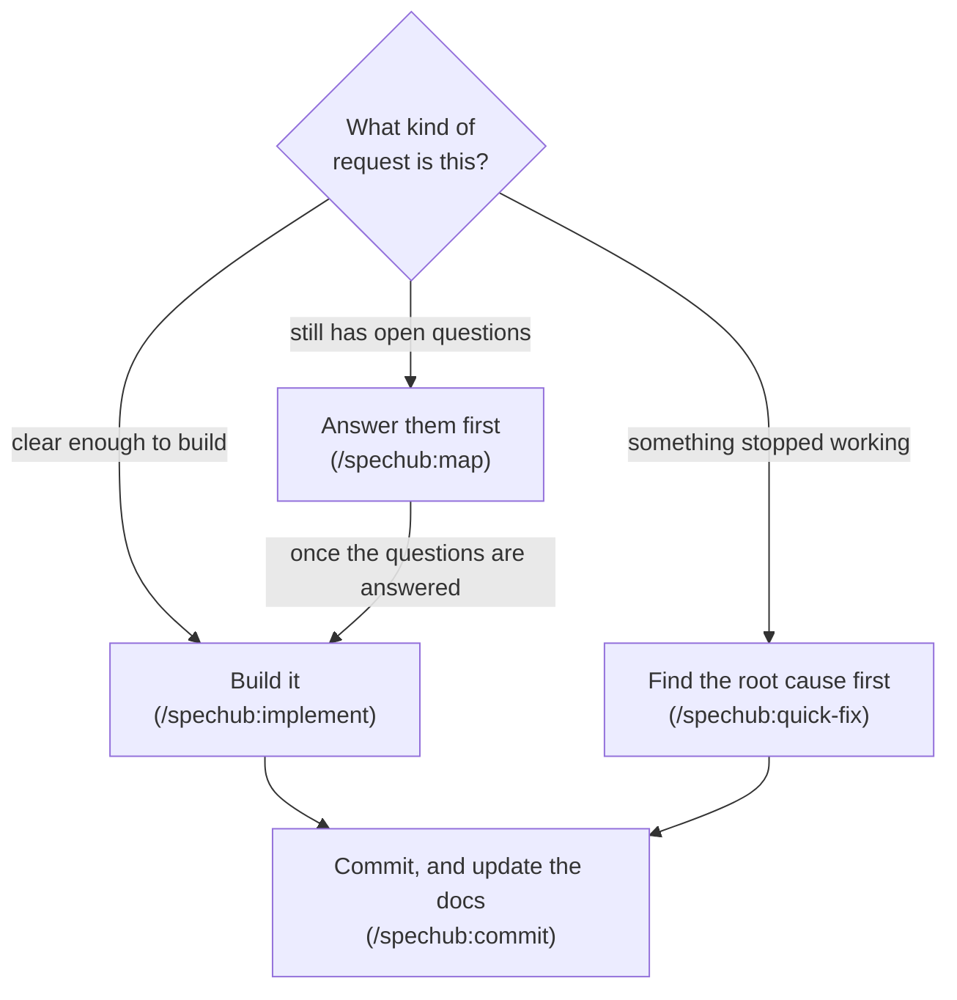

# SpecHub

SpecHub is a Claude Code plugin. It makes Claude plan before it codes, write the tests before the implementation, and keep your docs matching the code.

- **SpecHub aims to solve two common failure modes Claude introduces when coding**
    - Claude starts building before the requirements are clear
    - Claude writes code, then creates tests that pass against the code it just wrote
- **SpecHub introduces structure around how your agent works**
    - Every change goes through a test-writer, an implementer, and a checker
    - Every commit updates your specs from the diff
- **Downside: this structure may make your agent take longer on small tweaks than necessary**



Every box above is section 2. The rest of this file is reference.

| What you want | Where |
| ------------- | ----- |
| Quickstart | section 1 |
| The three commands, and which one to use | section 2 |
| Configure a project and a machine | section 3 |
| The CLI | section 4 |
| Every skill | section 5 |
| Every agent | section 6 |
| Output style | section 7 |
| Terminal workspace | section 8 |
| Design principles | section 9 |
| Licence and credits | section 10 |

## 1. Quickstart

You need the [Claude Code](https://claude.com/claude-code) CLI and Node.js 20 or later.

Install the plugin:

```
/plugin marketplace add ac8318740/ac-agentic-coding
/plugin install spechub@ac-agentic-coding
```

Then, in your project:

```
/spechub:setup
```

- `/spechub:setup` detects the project type, then writes `spechub/project.yaml` with workflow settings
- The SessionStart hook loads the orchestrator instructions whenever it detects a spechub project
- Your CLAUDE.md stays clean for project-specific content
- Upgrading from a version before 0.8.0 means deleting one stale `@import` line (see [docs/migrate-0.8.md](docs/migrate-0.8.md))

## 2. The three commands, and which one to use

*Pick by what is in your way: nothing, a bug, or an unanswered question.*

Two words first, because the third command below uses them.

- **A map** is a to-do graph SpecHub keeps for one piece of work
- **A node** is one entry on that graph: one question to answer, or one piece of work to do

The three commands:

- **The request is clear enough to build** – run `/spechub:implement`
    - It runs the four agents of section 6 on your request
    - A one-line change stays a one-line change
- **Something already built stopped working** – run `/spechub:quick-fix`
    - It makes Claude find the root cause before it edits anything
- **The request still has open questions** – run `/spechub:map`
    - Claude interviews you one round at a time
    - Each round asks every question it can answer next
    - Each question comes with Claude's recommended answer, so you confirm instead of composing
    - A single question ends there, and Claude writes the decision down as a short note under `docs/adr/`
    - A big feature needs dozens of questions, and Claude stores those as a map you work through across several sessions

### 2.1. What a map holds

*`/spechub:map` builds a map only when a single conversation cannot settle every question.*

Each node carries one of five statuses.

| Status | Meaning |
| ------ | ------- |
| `fog` | anything you cannot yet articulate clearly |
| `open` | ready to answer or build |
| `claimed` | someone is working on it now |
| `resolved` | done |
| `out-of-scope` | dropped on purpose |

Each node also records four things.

- **What raised it**, so you can read the decisions back in the order they happened
- **What must finish first**, so SpecHub can tell you what is ready to start
- **Who answers it**: you, or Claude working alone
- **Where it lives**: a GitHub issue by default, or a markdown file under `spechub/maps/` with no GitHub remote

Two things SpecHub does with a finished map.

- **It works through the nodes that are ready to start**, meaning the open ones with nothing unfinished blocking them
    - SpecHub calls that set the **frontier**
- **It packs the whole map into a single brief**, so a fresh Claude session picks up where the last one stopped

Every rule in SpecHub exists because something went wrong without it, over months of real product development with Claude Code.

For the full picture, each step and how they connect, read [docs/workflows.md](docs/workflows.md).

## 3. Configure a project and a machine

*The project states what to run. The machine states what it can do.*

- `spechub/project.yaml` holds every project-scoped setting
    - [docs/config-reference.md](docs/config-reference.md) gives each key, its values, its default and what changes
- `~/.config/spechub/config.json` holds the eight `host.*` axes
    - `/spechub:host` writes them once per machine
    - [docs/dev-setups.md](docs/dev-setups.md) gives every axis, what reads it, and how to describe a fresh machine
- `/spechub:setup` copies the commands and directories from one of three language profiles
    - **python** – pytest, ruff, mypy
    - **node-typescript** – npm test, eslint, tsc
    - **fullstack-python** – Python backend, plus a Node or TypeScript frontend
- `spechub config check` audits the project and the machine
    - It exits 2 when a required host axis has no value

## 4. The CLI

*Four storage operations carry the whole map. One fixed path makes the CLI reachable from any Claude session.*

SpecHub ships a Node.js CLI: `spechub config`, `spechub list`, `spechub node ...`, and `spechub archive`.

- The storage behind a map provides four operations and nothing more: create, read, update, list
    - GitHub issues are the default
        - An issue already holds the two links a map needs
    - A sub-issue records what raised a node
    - An issue dependency records what must finish first
    - Markdown files are the fallback, one per node under `spechub/maps/<name>/`
- The CLI builds everything else on those four operations
    - `spechub node frontier` lists what is ready to start now, closest to the original goal first
    - `spechub node walk` packs the whole map into one brief for a fresh session, in the order the decisions happened
    - The brief always includes the original goal, plus any node you marked as worth carrying along
    - The skills claim and resolve a node with `update` calls

Two symlinks reach the CLI. The SessionStart hook maintains both.

- `~/.claude/spechub/bin/spechub` is the fixed path every skill and agent calls
    - Agents therefore do not depend on your shell `PATH`
    - The CLI keeps working across plugin version bumps, non-interactive subshells and fresh agent contexts
- `~/.local/bin/spechub` is for typing `spechub` at a terminal yourself
    - Add `~/.local/bin` to your `PATH` to use it
    - The hook prints a one-line reminder when it is absent
    - Nothing in the plugin breaks without it

If `spechub` does not run after install, read [TROUBLESHOOTING.md](TROUBLESHOOTING.md). A Claude Code session reads it and applies the fix directly.

## 5. Every skill

*Four groups, ordered by when you reach for them.*

### 5.1. Implementation

| Skill | Description |
|-------|-------------|
| `/spechub:implement` | Build what is ready to start, running the four agents of section 6, whether or not a map exists |

For work with open decisions, chart it with `/spechub:map` first.

### 5.2. Planning

| Skill | Description |
|-------|-------------|
| `/spechub:map` | Answer the open questions first, building the to-do graph on the first run and working through it after |
| `grilling` | The interview itself, asking every question it can answer next per round, each with a recommended answer (Claude invokes it) |
| `record-context` | Writes a decision down when one lands: a short note, a glossary term, both, or neither (Claude invokes it) |

### 5.3. Operations

| Skill | Description |
|-------|-------------|
| `/spechub:commit` | Commit, and update the specs under `spechub/specs/` from the diff first |
| `/spechub:archive` | Close a finished map, after checking the decisions reached your specs and notes, then delete the nodes |
| `/spechub:sync` | Update the specs from code changes, outside a commit |
| `/spechub:handoff` | Hand work to a visible agent, a new one in its own pane or one already running, with acknowledgement |
| `/spechub:compact-and-continue` | Anchor the session's load-bearing state to survive compaction, then continue in place |

What an effort leaves behind is what matters: updated specs, decision notes and glossary entries. The nodes themselves are scaffolding.

### 5.4. Setup and supporting

| Skill | Description |
|-------|-------------|
| `/spechub:setup` | Set up SpecHub in a project, and change how a project already set up is configured |
| `/spechub:host` | Declare this machine's dev setup once, as the `host.*` axes |
| `/spechub:bootstrap` | Write the first set of specs by reading your existing code |
| `/spechub:explore` | Thinking partner mode, read-only |
| `/spechub:quick-fix` | Structured bug fix workflow with root cause analysis |
| `/spechub:pre-commit-review` | Deep quality review of all changes since last commit |
| `/spechub:test-conventions` | Test placement rules and naming conventions |
| `/spechub:code-review` | Linus Torvalds code philosophy for reviews |
| `/spechub:browser-verify` | agent-browser command reference, CDP troubleshooting, and selector strategy |
| `/spechub:bridge` | Set up and operate the Playwriter cross-device browser bridge |
| `/spechub:visual-docs` | Write docs that lead with a diagram and derive structure from it (Minto pyramid) |
| `/spechub:new-worktree` | Create a git worktree off the remote base branch and continue the task inside it |
| `/spechub:teardown-worktree` | Retire finished worktrees and delete their merged local and remote branches |
| `/spechub:terminal-workspace` | Set up a keyboard-only terminal for driving agents on a dev machine |

## 6. Every agent

*Four agents run in order. The one rule that matters: the test-writer never sees the implementation.*

| Agent | Role |
|-------|------|
| `test-writer` | Writes tests from requirements only, before the code under strict TDD and after it under relaxed |
| `task-executor` | TDD phase 2, making tests pass, and it cannot modify tests |
| `task-checker` | TDD phase 3, verifying everything: mock skepticism, test baseline, regressions, TDD isolation audit |
| `frontend-verifier` | TDD phase 4, real browser verification via agent-browser CLI, when `project.yaml` configures a frontend |

- The Claude session you talk to coordinates
    - It hands every piece of research and code to these agents
- A fail from the task-checker sends the work back to the task-executor with the reason
- The frontend-verifier runs under three conditions: a configured frontend, changed frontend files, and verification switched on

## 7. Output style

*The plugin ships one output style. It applies the house standard to every chat reply.*

- Claude Code shows the style as `spechub:ac-writing-style`
- It applies the `writing` skill's plain-language rules and the `visual-docs` skill's Minto pyramid and bullet discipline
- A reply leads with the answer and puts 90% or more of what follows in bullets
- Each bullet holds one sentence and ends without a period
- Sub-bullets nest as far as the point needs, indented eight spaces at the first level and four more at each level below
- Every word has to earn its place: no em dash, no emoji, no puffery, and no contrast clause that does no work

How to turn it on:

- `/spechub:setup` offers the style on both paths
    - On a new project it comes late, and it is optional
    - On a project already set up it is a health-check row
- The skill writes `outputStyle` for you
- It asks first
- Use `~/.claude/settings.json` for every project, or `.claude/settings.local.json` for this one
- A project value overrides the global one
- The style applies after `/clear`, or in a new session
- The plugin never forces it on

## 8. Terminal workspace for driving several agents

*An optional keyboard-only setup for running several agents on a remote machine. SpecHub works fine without it.*

- `/spechub:terminal-workspace` installs every tool and writes every config
- [docs/terminal-workspace.md](docs/terminal-workspace.md) gives the exact config, every key, and the traps worth knowing
- The setup builds on herdr, a terminal multiplexer that keeps each agent's terminal running after you disconnect
    - You attach from your own machine with `herdr --remote`
    - Your own clipboard and browser then reach the session
    - Each agent can get its own git worktree, meaning its own checkout on its own branch
- gh-dash then triages pull requests and diffnav reads diffs, both without leaving the terminal

## 9. Design principles

*Five rules explain why every default is what it is.*

- **Strict TDD holds because of the order the agents run in** – relaxed TDD holds only because the instructions say so
    - Either way the task-executor cannot edit a test file
    - Under strict TDD the test-writer runs first
    - There is no implementation for it to copy
    - Under relaxed TDD it runs second
    - Only its instructions stop it reading the code it is testing
    - The two are not equally safe
    - That is why strict is the default
- **Your docs never drift from the code** – `/spechub:commit` reads the diff and updates the specs under `spechub/specs/` in the same commit
    - Any agent that spots a spec contradicting the code fixes the spec there and then
    - A spec describes what the code does today
    - It never describes what someone plans to build
- **Build no more process than the job needs** – a to-do graph appears only when one conversation cannot hold the questions
    - A typo fix gets no machinery
    - A month-long feature gets a map
    - You type the same command either way
    - SpecHub works out which it is
- **Planning gets more effort than coding** – three agents read the relevant code before anyone writes a line
    - Mock audits, regression suites and integration checks follow the implementation
- **Strict defaults, easy to relax** – run `spechub config set` to change how strict the TDD is, how much Claude does itself, or how it asks you questions

## 10. Licence and credits

*[MIT](LICENSE). Four projects shaped the design.*

- **[OpenSpec](https://github.com/Fission-AI/OpenSpec)** – SpecHub forks its CLI from OpenSpec
    - OpenSpec was the core spec engine under the original workflow
    - The spec-driven concepts all originate there: proposals, designs, tasks, living specs, change management, and archiving
- **[Taskmaster AI](https://github.com/eyaltoledano/claude-task-master)** – Taskmaster's task management model inspired the orchestrator pattern and the agent coordination approach
- **[Skills for Real Engineers](https://github.com/mattpocock/skills)** by Matt Pocock – the Wayfinder map, the round-by-round interview, and the durability rule for agent briefs
    - SpecHub's node graph is a direct adaptation of Wayfinder
    - MIT licensed, and recorded in [THIRD_PARTY_NOTICES](THIRD_PARTY_NOTICES)
- Additional inspiration comes from [Superpowers](https://github.com/obra/superpowers), [GSD](https://github.com/gsd-build/get-shit-done) and [Spec Kit](https://github.com/github/spec-kit)

The optional terminal workspace installs, but does not bundle, the three tools you drive and the five behind them. Each one keeps its own licence.

- [herdr](https://herdr.dev)
- [tuicr](https://github.com/agavra/tuicr) by agavra, which reviews a pull request inside the terminal
- [gh-dash](https://github.com/dlvhdr/gh-dash) and [diffnav](https://github.com/dlvhdr/diffnav) by dlvhdr
- [delta](https://github.com/dandavison/delta) by dandavison
- [yazi](https://github.com/sxyazi/yazi) by sxyazi, the file manager that previews whatever the cursor sits on
- [mermaid-ascii](https://github.com/AlexanderGrooff/mermaid-ascii) by AlexanderGrooff
- [glow](https://github.com/charmbracelet/glow) by charmbracelet

The optional fork build of tuicr compiles [agavra/tuicr#607](https://github.com/agavra/tuicr/pull/607) by [antonio2368](https://github.com/antonio2368). It also compiles [agavra/tuicr#633](https://github.com/agavra/tuicr/pull/633) and one counts fix not yet submitted upstream, both written for this fork. That build is off by default and temporary. See [docs/terminal-workspace.md](docs/terminal-workspace.md).
