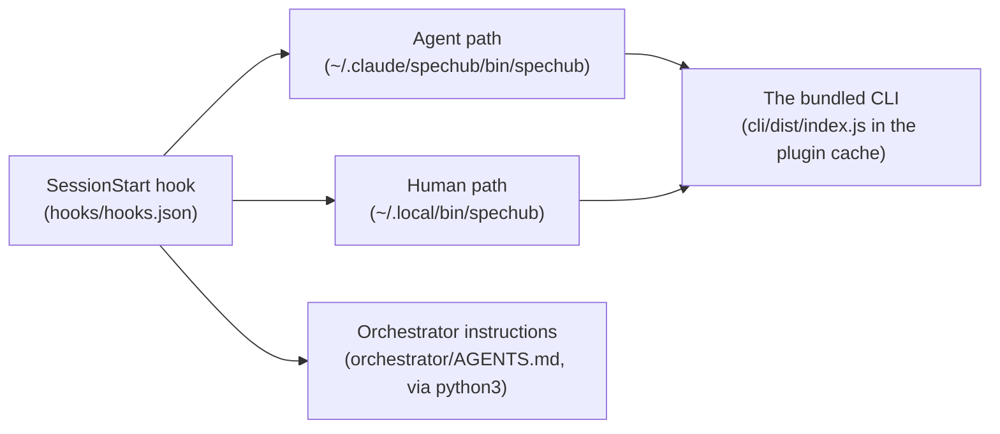

# SpecHub troubleshooting

*Six symptoms, each with a diagnostic command and a fix command. A Claude Code session reads this file and applies the fix directly.*

**Claude Code instances** act on this file. The SessionStart hook maintains everything below, so almost every symptom here is that hook not having run. If you are a Claude Code session and the user reports any of these symptoms, run the diagnostic, then apply the fix.



| The broken link | Sections |
| --- | --- |
| Agent path | 1, 4 |
| Human path | 2 |
| The bundled CLI | 3 |
| SessionStart hook | 5 |
| Orchestrator instructions | 6 |

Where the plugin lives, and what points at it:

- The plugin lives at `${CLAUDE_PLUGIN_ROOT}` once the user installs it via the marketplace
- On most installs that resolves to `~/.claude/plugins/cache/ac-agentic-coding/spechub/<version>/`
- `~/.claude/spechub/bin/spechub` is the **agent-facing** invariant path
    - Every skill and agent in this plugin invokes the CLI through this exact path
    - It does not depend on the user's `PATH`
- `~/.local/bin/spechub` is the **human convenience** symlink
    - It is useful only when `~/.local/bin` is on `PATH`
    - No plugin functionality rests on it
- Both symlinks refresh on every SessionStart and point at the current plugin cache version
- Fix the agent-facing path first, because nothing in the plugin works without it

---

## 1. Agents report `~/.claude/spechub/bin/spechub: No such file or directory`

**Symptom**: a skill or agent fails because it cannot find the CLI at `~/.claude/spechub/bin/spechub`.

**Diagnose**:

```bash
ls -l ~/.claude/spechub/bin/spechub 2>&1
ls -d ~/.claude/plugins/cache/ac-agentic-coding/spechub/*/ 2>&1
```

**Possible causes and fixes**:

- **Symlink missing** (`No such file or directory`): the SessionStart hook never ran
    - The user has not started Claude Code on this device since they installed the plugin, or the hook silently failed
    - Fix: ask the user to restart Claude Code so the SessionStart hook fires
    - The hook creates the symlink and prints `spechub: linked agent CLI at ...`
    - Create it by hand if that does not work:
        ```bash
        SPECHUB_VERSION=$(ls ~/.claude/plugins/cache/ac-agentic-coding/spechub/ | sort -V | tail -1)
        mkdir -p ~/.claude/spechub/bin
        ln -sfn ~/.claude/plugins/cache/ac-agentic-coding/spechub/$SPECHUB_VERSION/cli/bin/spechub.js ~/.claude/spechub/bin/spechub
        ```
- **Plugin cache missing entirely**: the second `ls` returned nothing
    - Fix: the user has not installed the plugin, so run `/plugin install` for `ac8318740/spechub` in Claude Code

---

## 2. `spechub: command not found` (human typed it at a terminal)

**Symptom**: the user runs `spechub --help` at the terminal and the shell reports `command not found`, while agents continue to work.

This is a **human-ergonomics issue, not a plugin issue.** Agents use `~/.claude/spechub/bin/spechub` directly, so this does not affect them. Fix it only if the user types `spechub` at terminals.

**Diagnose**:

```bash
ls -l ~/.local/bin/spechub 2>&1
echo "PATH=$PATH" | tr ':' '\n' | grep -F "$HOME/.local/bin" || echo "MISSING"
```

**Possible causes and fixes**:

- **Symlink missing**: the SessionStart hook never ran, or ran and could not write
    - Fix: ask the user to restart Claude Code, because the hook recreates the human symlink on every session start
- **PATH missing** (the symlink exists but `MISSING` printed): `~/.local/bin` is not on `$PATH`
    - Fix: add this line to the user's shell rc, then ask them to restart their shell:
        ```bash
        export PATH="$HOME/.local/bin:$PATH"
        ```
    - The shell rc by shell:
        - zsh: `~/.zshrc`
        - bash on Linux: `~/.bashrc`
        - bash on macOS: `~/.bash_profile`
        - fish: `~/.config/fish/config.fish`, and use `set -gx PATH $HOME/.local/bin $PATH`

---

## 3. `Error [ERR_MODULE_NOT_FOUND]: Cannot find module '.../cli/dist/index.js'`

**Symptom**: the CLI runs but Node throws `ERR_MODULE_NOT_FOUND` for `dist/index.js`.

**Diagnose**:

```bash
SPECHUB_VERSION=$(ls ~/.claude/plugins/cache/ac-agentic-coding/spechub/ | sort -V | tail -1)
ls ~/.claude/plugins/cache/ac-agentic-coding/spechub/$SPECHUB_VERSION/cli/dist/index.js 2>&1
```

**Cause**: the plugin cache holds a version from before the CLI shipped bundled in the repo, meaning before 0.9.2. This should not happen on 0.9.2 or later.

**Fix**:

- Bump or refresh the plugin cache
    - Run `/plugin` in Claude Code and reinstall the plugin
    - Or delete the cache directory and let Claude Code repull:
        ```bash
        rm -rf ~/.claude/plugins/cache/ac-agentic-coding/spechub/<old-version>
        ```
- Confirm the user is on plugin version 0.9.2 or later:
    ```bash
    cat ~/.claude/plugins/cache/ac-agentic-coding/spechub/*/.claude-plugin/plugin.json | grep version
    ```
- Build the CLI in place as a one-shot, if the user is offline or cannot repull:
    ```bash
    cd ~/.claude/plugins/cache/ac-agentic-coding/spechub/<version>/cli
    npm install
    npm run build
    ```

---

## 4. Stale symlink, pointing at an old version

**Symptom**: `~/.claude/spechub/bin/spechub --version` prints an older number than expected, or commands behave like an older release.

**Diagnose**:

```bash
readlink ~/.claude/spechub/bin/spechub
ls ~/.claude/plugins/cache/ac-agentic-coding/spechub/
```

**Cause**: an older session set the symlink target, the plugin cache now holds a newer version, and the SessionStart hook has not relinked it yet.

**Fix**:

- Start a new Claude Code session
    - The SessionStart hook detects a stale symlink and relinks it, printing `spechub: updated agent CLI at ...`
- Or relink by hand:
    ```bash
    NEW=$(ls ~/.claude/plugins/cache/ac-agentic-coding/spechub/ | sort -V | tail -1)
    ln -sfn ~/.claude/plugins/cache/ac-agentic-coding/spechub/$NEW/cli/bin/spechub.js ~/.claude/spechub/bin/spechub
    ln -sfn ~/.claude/plugins/cache/ac-agentic-coding/spechub/$NEW/cli/bin/spechub.js ~/.local/bin/spechub
    ```

---

## 5. The SessionStart hook did not run

**Symptom**: no `spechub:` lines appear in Claude Code's startup logs, and `~/.claude/spechub/bin/spechub` is missing.

**Diagnose**:

```bash
cat ~/.claude/plugins/cache/ac-agentic-coding/spechub/*/hooks/hooks.json
```

**Cause**: the user has not enabled the plugin, or they have disabled hook execution in their Claude Code settings.

**Fix**:

- Confirm the user has enabled the plugin, with `/plugin list`
- Check that the user has not disabled hooks in `~/.claude/settings.json`, meaning no `"hooks": false` and no per-event suppression
- Install the symlinks by hand as a fallback, using the commands in section 1 and section 4

---

## 6. `python3 not found` warning at session start

**Symptom**: the hook prints `spechub: python3 not found; skipping orchestrator injection`.

**Cause**: the hook uses `python3` to emit `orchestrator/AGENTS.md` as JSON for `additionalContext` injection.

- Without `python3` the orchestrator instructions do not load at all, because nothing else reads that file
- Claude Code does not auto-load instructions from a plugin's own directory, so injection is the only path
- This does not affect the CLI symlinks, so the `spechub` command keeps working

**Fix**: install Python 3, which most systems already have.

```bash
# Debian/Ubuntu
sudo apt install python3
# macOS
brew install python3
```

---

## 7. When none of the above matches

*This section describes the document, not the plugin, so no box in the diagram holds it.*

The CLI is a normal Node.js ESM package. To validate the install end to end:

```bash
SPECHUB_VERSION=$(ls ~/.claude/plugins/cache/ac-agentic-coding/spechub/ | sort -V | tail -1)
node ~/.claude/plugins/cache/ac-agentic-coding/spechub/$SPECHUB_VERSION/cli/bin/spechub.js --help
```

- The CLI is fine and the issue is the symlink, if that prints help
- The issue is the cache contents, if that errors, so jump to section 3
