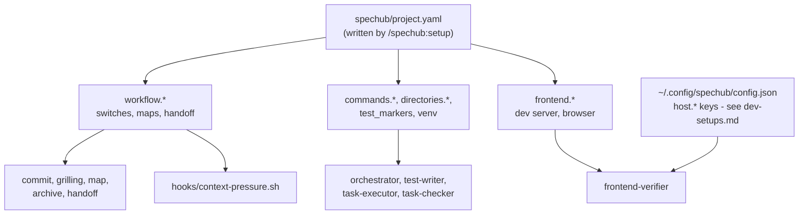

# Project configuration

*Every key in `spechub/project.yaml`, the values it takes, its default, and what changes when you change it.*

One file, `spechub/project.yaml`, holds every setting that belongs to a project.

- **It names what to run**: the test, build, lint, typecheck and format commands
- **It names where to look**: the source and test directories, and the frontend
- **It names how strict to be**: whether tests come first, and whether Claude may write code itself
- **Every skill and every agent reads it** before it runs anything
- **A key you leave out takes the default** this document gives it

Three terms first.

- **A key** is one dotted path into the file, such as `workflow.tdd.strict`
- **A default** is what SpecHub does when the file states no value
- **A rung** is one token count at which the context-pressure hook speaks up, telling the session to consider handing over



| Step in the diagram | Detail |
| --- | --- |
| The file, and what writes it | section 1 |
| `profile` | section 2 |
| `workflow.*` switches | section 3 |
| `workflow.maps` | section 4 |
| `workflow.handoff` | sections 5 and 6 |
| `commands`, `directories`, `test_markers`, `venv` | section 7 |
| `frontend.*` | sections 8 and 9 |
| `host.*`, and what is not a key here | section 10 |
| Every default | section 11 |

## 1. Where the file lives, and what writes it

*The setup skill writes the whole file. To change one key, run `spechub config set`.*

- `spechub/project.yaml` sits in the project root, beside `spechub/domain-map.yaml`
- `/spechub:setup` writes it
    - On a fresh project the skill detects the project type, then writes every key from a profile under `profiles/`
    - On a project that already has the file, the skill leads with the health check and offers a menu of changes
- `spechub config set <key> <value>` changes one key without an interview
- A key the file omits takes the default the tables below give it
    - The `commands`, `directories` and `frontend` keys have no such default
    - The setup skill copies them from a profile
        - An omitted one names nothing at all

Three commands read the file and change nothing.

| Command | What it prints |
| --- | --- |
| `spechub config show` | the profile, the commands, and what the project says about its browser |
| `spechub config check` | an audit of the project and the machine, exiting 2 when a required host axis has no value |
| `spechub config list` | every key the file states |

### 1.1. Which file a write lands in

*The key decides, and the key alone.*

- A `host.*` key describes the machine
    - It goes to the global config at `~/.config/spechub/config.json`
- Every other key in this document describes the project
    - It goes to `spechub/project.yaml`
- Section 10 covers the `host.*` keys
- `spechub config get <key>` and `spechub config unset <key>` read the same key table and route the same way

### 1.2. What a command refuses

*Validation happens before either file opens, so a refusal writes nothing.*

- `spechub config set` refuses a value outside the set a table gives
- It refuses a key neither schema knows, and names the keys it does know
- It refuses a project key outside a SpecHub project
    - No file is there to hold it
- It holds a numeric key to the range its reader honours, not merely to being a number
    - A count of turns or of tokens takes a whole number of 0 or more
    - A CDP port takes a whole number from 1 to 65535
    - A refusal names the range
    - A value the reader would reject otherwise fails somewhere else entirely, long after the command that accepted it exited 0
- `get` and `unset` both refuse a key neither schema knows
- Both refuse a project key outside a SpecHub project

### 1.3. What `get` prints, and what it exits

*One exit code means "no value here", whichever file holds the key.*

- A string prints as written, and anything else prints as JSON
- The command exits 2 when the file states no value
- An unset `host.*` axis already gives that code
    - A caller branches on "no value here" without knowing which file holds the key
- The message names the documented default where a table below gives a literal one
- The message names no default where a table describes the default instead
    - There is none to name

### 1.4. What `unset` leaves behind

*It takes the key out, and it prunes nothing else.*

- Removing a key the file does not state is not an error
    - The command writes nothing at all
        - The file stays byte for byte as it was
- A block the removal emptied keeps its key with nothing after the colon
    - Every reader treats that as the default
- The command prunes nothing
    - Pruning would take any comment on that block with it

### 1.5. How a write preserves the rest of the file

*Two write paths, and the result of the first decides which one runs.*

A write keeps the file as you wrote it. Comments, blank lines, key order and quoting all survive.

- The command first tries to change the key in place, rewriting the bytes of the old value and leaving every other byte alone
- It then checks its own work
    - It parses the file it just built and compares the data, in full, against the data the second path would have written
    - It keeps the in-place change only when the two agree
- The write goes through the YAML document instead, when the two disagree or when the file it built does not parse
    - That path carries every comment across
    - It re-emits the whole file
    - A run of spaces before an inline comment shortens to one
- A collection stated in flow style stays in flow style
- Line endings survive either path
    - The command writes a file that arrived with CRLF back in CRLF
    - Setting one key never rewrites the ending of every line
- `spechub config unset` writes the same two ways and checks itself the same way
    - It splices the whole line out, indentation and trailing comment included, then compares the data before it keeps that

So the result decides which path a write takes, and never the shape of the key.

- A hand-edited file with ordinary one-line values gets the byte-for-byte path
    - That is the common case, and the one such a file needs
- Anything the check cannot vouch for gets re-emitted
    - That is always correct, and it costs only formatting
- Losing the alignment of a comment beats losing the key that follows a block scalar

### 1.6. Four file shapes that get a decision rather than a crash

*A file SpecHub itself produced always reads back.*

- A project that holds `spechub/` and no `project.yaml` gets the file created
- A block stating nothing takes a key underneath it, whether the file spells that block as a bare colon, as `null` or as `~`
    - That is the state `spechub config unset` leaves behind
        - The tool accepts its own output
- A document stating nothing at all takes a key too
    - A file holding only `---` works the way an empty file already does
- The command refuses a key holding a value where the path wants a block
- It names that key
    - Writing there would mean discarding the value already in the file
    - That value is yours rather than the command's
        - The file stays byte for byte as it was

Two refusals protect a file neither command can handle.

- Both `set` and `unset` refuse a file whose bytes are not valid UTF-8
    - Neither one can re-encode a byte it could not decode
    - A write would stand the replacement character in its place and report success
- Both refuse a file the process may not write
- Both name the file and the reason

## 2. profile

*One word naming the defaults the file started from.*

| Key | Values | Default | What changes |
| --- | --- | --- | --- |
| `profile` | `node-typescript`, `python`, `fullstack-python` | none | `/spechub:setup` reads `profiles/<profile>.yaml` for its proposed commands and directories; `spechub config show` prints the name |

- The profile decides nothing after setup has run
- The commands and directories it proposed live in the file as their own keys, and those keys are what every later reader uses

## 3. workflow: the switches

*Four booleans sit in the block, and each one changes how much discipline SpecHub applies. A fifth key decides how grilling asks.*

| Key | Values | Default | What changes |
| --- | --- | --- | --- |
| `workflow.spec_sync` | `true`, `false` | `true` | the `commit` skill runs spec sync before it commits, unless this says `false`; with `false` the living specs under `spechub/specs/` stop tracking the code |
| `workflow.tdd.strict` | `true`, `false` | `true` | `false` runs the task-executor before the test-writer; all three phases still run, and the checker's gate changes with the key |
| `workflow.tdd.orchestrator_strict` | `true`, `false` | `true` | `false` lets the coordinating session read and write code itself for small tasks, instead of handing every piece to a subagent |
| `workflow.frontend_verification` | `true`, `false` | `false` | the frontend-verifier runs only when this is `true`, the file configures a `frontend` block, and the change touched frontend files |

How a boolean reads:

- Every boolean key in this document takes the same six spellings as a `host.*` axis, and case does not matter
    - `true`, `yes` and `on` all read as true
    - `false`, `no` and `off` all read as false
- The tables show `true` and `false`
    - That is what the file holds after `spechub config set` writes one
- `workflow.spec_sync` reads as on unless the file states one of the three false spellings outright
    - The `commit` skill treats a missing key and an explicit `true` the same way
- `workflow.frontend_verification` reads as off unless the file states one of the three true spellings outright
    - The frontend-verifier is the only reader
    - `orchestrator/AGENTS.md` and the `browser-verify` skill both run it on an explicit `true` alone
    - The defaults block in section 11 shows `true` for this key
    - That is what `/spechub:setup` writes for a project with a frontend
    - That is what setup writes, and not what an absent key means

### 3.1. What `workflow.tdd.strict` moves

*It reorders the first two phases, and it drops none of them.*

- The default `true` runs test-writer, then task-executor, then task-checker
- A `false` runs task-executor, then test-writer, then task-checker
- All three agents run either way
- Six files read the key: `orchestrator/AGENTS.md`, `skills/implement/SKILL.md`, `agents/test-writer.md`, `agents/task-executor.md`, `agents/task-checker.md` and `skills/setup/SKILL.md`
- Relaxed TDD, the name for `false`, means nobody writes the tests first
    - It does not mean the work goes unverified
    - The rule of a checker after every executor does not move

Relaxed costs the test-writer part of its independence.

- Under `true` it cannot read an implementation
    - None exists when it runs
- Under `false` the implementation sits in the working tree beside it, and only its instructions keep it from reading that code
- The two settings do not give equal independence, and `agents/test-writer.md` states the weaker guarantee as the cost of relaxed

What the checker gates on moves with the key.

- Under `true` the checker holds the task's new tests to failing before the executor and passing after
- Under `false` the implementation came first
    - Nothing can show those tests failing without it
    - The checker then holds the new tests to existing and passing
    - It holds the full suite to passing
    - The test count to not dropping

### 3.2. How Claude asks you a question

| Key | Values | Default | What changes |
| --- | --- | --- | --- |
| `workflow.grilling.questions` | `tool`, `inline` | `tool` | `tool` asks through the host's question tool, one call per round; `inline` asks in prose |

- `tool` falls back to inline prose for any round it cannot hold
- Two things exceed it: a round of more than four questions, and any question with no discrete options

## 4. workflow.maps

*Two keys record where a map's nodes live, and what happens to them at the end.*

A **map** is a graph of question nodes and work nodes. A **tracker** is the backend that stores those nodes.

| Key | Values | Default | What changes |
| --- | --- | --- | --- |
| `workflow.maps.tracker` | `github`, `files` | none | the `map`, `implement` and `archive` skills read the matching backend document and use its operations |
| `workflow.maps.persist` | `true`, `false` | `false` | `true` moves a cleared map's node files to `spechub/archive/[YYYY-MM-DD]-[name]/nodes/`; `false` deletes `spechub/maps/<name>/` |

- An absent `workflow.maps.tracker` means nobody has chosen yet
    - The `map` skill then picks at the moment it first writes a map's nodes down, confirms the choice with the user, and writes the key
    - It recommends `github` when `gh` holds a login for the repository's GitHub remote, and `files` otherwise
- Anything that resets the `workflow` block to defaults has to keep `workflow.maps` intact
    - The key records where the node records already are
    - Dropping it strands every one of them on a backend no later session looks at
- `workflow.maps.persist` acts on the files tracker only
    - The GitHub tracker has nothing to dispose of
        - A closed issue is already the archive
    - The default deletes, because keeping the nodes leaves a second copy of every decision and the two copies drift apart

## 5. workflow.handoff: launching and acknowledging

*Three keys govern the handoff skill, which moves work from one session to another.*

| Key | Values | Default | What changes |
| --- | --- | --- | --- |
| `workflow.handoff.agent` | a command template | `claude` | the command the `handoff` skill runs to launch a target session when herdr is absent; a template rather than a bare name, so a model flag or a permission-mode flag fits |
| `workflow.handoff.ack_turns` | a whole number, 0 or more | `5` | how many turns after delivery the sender waits before it reports the target as silent; `--fresh` doubles it |
| `workflow.handoff.self_invoke` | `true`, `false` | `true` | `false` stops the agent from invoking the `handoff` skill on its own initiative; it then tells the user a handoff looks warranted and asks first |

- `workflow.handoff.self_invoke` gets a behavioural check at the skill's first step, rather than a frontmatter flag
- Frontmatter model-invocation flags are static
    - No project could turn one off for itself

## 6. workflow.handoff: the context-pressure ladder

*Five keys place the rungs at which `hooks/context-pressure.sh` tells the session to consider handing over.*

How the hook decides to speak:

- The hook runs on every stop
- It reads the last assistant record in the transcript and adds three usage fields: `input_tokens`, `cache_read_input_tokens` and `cache_creation_input_tokens`
- That sum is the context the turn sent to the model
- The hook then finds the highest rung at or below that number
- It speaks when that rung sits above the rung it last spoke for
- It records the new rung
- So a long session gets one nudge per rung, not one per stop

### 6.1 The default thresholds, and the gap above them

| Key | Values | Default | What changes |
| --- | --- | --- | --- |
| `workflow.handoff.nudge_warn` | a whole number of tokens, 0 or more | `200000` | the ladder's first rung, and the wording below the severe mark; a small-context model wants a lower value |
| `workflow.handoff.nudge_severe` | a whole number of tokens, 0 or more | `500000` | the ladder's second rung, and the mark at or above which the wording turns urgent |
| `workflow.handoff.nudge_step` | a whole number of tokens, 0 or more | `100000` | how far apart the rungs sit above the last one, so a session that keeps growing keeps hearing from the hook |

Three guards protect the ladder from a value that would break it.

- The hook raises a `nudge_warn` below 1 to 1
    - A rung of 0 would block every single turn
- It raises `nudge_severe` to `nudge_warn` when the file states a lower one
    - A severe mark below the warn mark could never fire
- It treats a `nudge_step` below 1 as an instruction to stop the ladder at its top rung

What the severe wording changes:

- The severe wording leans harder towards handing over
- It never halts the run
- Both tiers close with the same clause
    - The agent decides for itself
    - It asks the user only when it genuinely cannot tell
    - It hands over without asking when the user already agreed to a handoff earlier in the session

### 6.2 An explicit ladder

| Key | Values | Default | What changes |
| --- | --- | --- | --- |
| `workflow.handoff.context_thresholds` | a list of token counts or percentage strings | none | replaces `nudge_warn` and `nudge_severe` as the ladder's rungs, as in `[150000, 300000]` or `["40%", "70%"]` |

- Two YAML shapes work: flow style on one line, `[150000, 300000]`, and block style with one `- item` per line
- The hook sorts the rungs and drops duplicates
- It drops any entry it cannot read as a number or a percentage, and any entry below 1
- It falls back to the `nudge_warn` and `nudge_severe` rungs with no usable entry left

All three of the other keys still act under an explicit ladder.

- `nudge_step` extends the ladder past the last listed rung, exactly as it does by default
- `nudge_severe` places no rung any more, and only picks the wording
    - A nudge reads as severe once the rung that fired sits at or above it
- `nudge_warn` places no rung either
- It still moves that wording threshold
- The hook raises `nudge_severe` to meet a higher `nudge_warn` before it builds the ladder

### 6.3 What a percentage is a percentage of

| Key | Values | Default | What changes |
| --- | --- | --- | --- |
| `workflow.handoff.context_window` | a whole number of tokens, 1 or more | inferred from the model id | the number a percentage rung resolves against, as in `"40%"` of `200000` |

- A positive `context_window` wins outright
- The hook infers the window from the model id with no value, or one of 0 or less
- That id comes from the same transcript record as the token count

Three rules decide the window, in order.

| The model id | The window |
| --- | --- |
| carries the `[1m]` marker | 1,000,000 |
| names the haiku line, or a 4.x family such as `claude-opus-4-8`, `claude-haiku-4-5-...` or `claude-sonnet-4-5` | 200,000 |
| anything else, including the 5.x families and a record with no model id at all | 1,000,000 |

- The `[1m]` marker outranks the second rule
- A million-token model says so in its own id
    - `claude-sonnet-4-5[1m]` resolves to 1,000,000 rather than 200,000

### 6.4 Why only the session's own stop

*The hook nudges the session that could act on it, and nobody else.*

- `hooks/hooks.json` registers it for two events only
    - A `Stop` event fires when the session's own turn finishes
    - `SessionStart` fires when a session opens
- A `SubagentStop` payload, should one ever arrive, exits silently and creates no state
- Neither a subagent nor an in-process teammate can hand the user's work over
    - A nudge there would only spend a turn
- The measurement follows the same rule
    - The hook skips every transcript record marked `isSidechain`
    - A subagent's tokens are not this session's context

### 6.5 The ladder is per session, and a compaction resets it

*Two files per session hold the state, and a compaction deletes both.*

- The hook keeps both files under `$SPECHUB_CONTEXT_PRESSURE_DIR`
    - That defaults to a `spechub-context-pressure` directory under `TMPDIR`, or under `/tmp`
- The `.last` file holds the rung the hook last spoke for
- The `.quiet` file is a marker
    - The `handoff` and `compact-and-continue` skills leave it behind when they finish
    - The hook stays silent for the rest of the session while it exists
- A compaction deletes both files
    - The ladder starts again at its first rung
    - A compaction throws the session's context away and rebuilds it much smaller
    - The recorded rung then describes context that no longer exists
    - The quiet marker records a handover the fresh context knows nothing about

Two limits are worth knowing.

- The hook reads these five keys with its own small YAML parser
    - pyyaml may not exist on the machine
    - That parser hands each value to Python's `int()` and accepts whatever `int()` accepts
    - A `_` digit separator works
        - `200_000` reads as 200,000
    - Exponent and float notation do not
        - `2e5` and `2.0` fall back to the default
- The hook opens `spechub/project.yaml` relative to the working directory
    - A session running outside the project root therefore gets the defaults, whatever the file says

## 7. commands, directories, test_markers and venv

*What every agent runs, and where it looks.*

| Key | Values | Default | What changes |
| --- | --- | --- | --- |
| `commands.test` | a shell command, or `null` | from the profile | the test-writer, task-executor and task-checker run it; the task-checker fails a task whose tests do not pass |
| `commands.test_collect` | a shell command, or `null` | from the profile | the task-checker counts tests with it and compares the count against `.test-baseline`; `null` skips the baseline check |
| `commands.build` | a shell command, or `null` | from the profile | the task-checker verifies the build with it |
| `commands.lint` | a shell command, or `null` | from the profile | the pipeline lints with it, usually with a fix flag |
| `commands.typecheck` | a shell command, or `null` | from the profile | the pipeline type-checks with it |
| `commands.format` | a shell command, or `null` | from the profile | the pipeline runs it over the files the work touched, immediately before the task-checker; `null` means no format step |
| `directories.source` | a path | `src/` | where `/spechub:setup` explores to propose the domain map, and where the pipeline writes source |
| `directories.tests` | a path | `tests/` | where the test-writer writes tests, and the one tree the task-executor may not touch |
| `test_markers.exclude` | comma-separated markers, or `null` | `null` for Node, `slow,integration` for Python | which markers a default test run leaves out, as in `pytest -m` |
| `venv.activate` | a shell command, or `null` | `null` for Node, `source .venv/bin/activate` for Python | every agent prefixes each command with it when the file states one |

- One rule places the format step under both TDD settings
    - It runs immediately before the task-checker
        - Under relaxed TDD it falls after the test-writer and formats the new tests too
- A non-zero exit from `commands.format` gets reported, and never counts as a failed implementation
    - Formatting is not correctness
    - The task-checker runs afterwards, and its own gate decides whether the work passes
- `spechub config show` lists a `commands` entry only when its value is a non-empty string
    - A `null`, a number or a nested block does not name a command anyone could run
        - The listing leaves it out

## 8. frontend

*The block's presence is itself a setting: with no `frontend` block, this project drives no browser.*

| Key | Values | Default | What changes |
| --- | --- | --- | --- |
| `frontend` | a block, or `null` | absent | a block makes the project a frontend project: the frontend-verifier becomes eligible, and `spechub config check` starts asking for the three browser axes and the frontend files |
| `frontend.directory` | a path | `frontend/` | where the frontend lives |
| `frontend.dev_server_url` | a URL | `http://localhost:3000` | the address the frontend-verifier opens |
| `frontend.dev_server_check` | a shell command | a `curl` of the URL | how the frontend-verifier decides the dev server is up |
| `frontend.helpers_dir` | a path | `<frontend.directory>/tests/helpers/` | where `VERIFICATION-KNOWLEDGE.md` lives; the `verification-knowledge` row of the check fails when the file is missing, and when the key states nothing |
| `frontend.commands.dev` | a shell command | none | how the frontend-verifier starts the dev server; without it the verifier cannot start one itself |
| `frontend.commands.build` | a shell command | from the profile | the frontend build the pipeline runs |
| `frontend.commands.lint` | a shell command | from the profile | the frontend lint the pipeline runs |
| `frontend.commands.test` | a shell command | from the profile | the frontend tests the pipeline runs |

- An explicit `frontend: null` reads the same as no block at all
- The CLI counts a frontend only when the key holds something other than `null`

## 9. frontend.browser and the CDP port

*Three keys state what this project would like. The machine states what it can actually do.*

The Chrome DevTools Protocol (CDP) is the wire protocol the verifier drives a browser over. These three keys state a preference, and the `host.browser.*` axes in the global config say whether the machine can honour it. [dev-setups.md](dev-setups.md) documents those axes.

| Key | Values | Default | What changes |
| --- | --- | --- | --- |
| `frontend.browser.mode` | `remote`, `headless`, `local` | none | the mode `spechub config browser-mode` resolves for the frontend-verifier, weighed against the three host axes; it also picks the `cdp_port` default |
| `frontend.browser.fallback` | `none`, `remote`, `headless`, `local` | none | only `none` acts: it forbids another mode from standing in when the host does not declare the preferred one |
| `frontend.browser.cdp_port` | a whole number from 1 to 65535 | `19988` under `mode: remote`, `9555` otherwise | the port the frontend-verifier dials, and the port the `agent-browser-json` row of the check requires `agent-browser.json` to name |

The two defaults come from two different browsers.

- The mode `remote` means the Playwriter bridge, which hardcodes port 19988 and offers no way to change it
- Every other mode means a browser this machine launched itself, with the usual debug port 9555
- The default is 9555 with no `mode` at all

The port default applies wherever the CLI needs a number.

- `spechub config check` holds a project that states no `cdp_port` to the default its mode implies
- It fails when `agent-browser.json` names a different port
- `spechub config show` behaves the other way, printing only what the project states
    - "What did the project say" and "which port do we dial" are different questions

Only the literal `none` gives `frontend.browser.fallback` any effect.

- Every other value, `headless` included, leaves the host's own order alone: remote first, then headless, then local
- A project that wanted a particular mode would have named it as its `mode`
    - A second mode name here changes nothing
- The reader ignores any word other than `none`, and `spechub config set` still holds the key to the four names above
    - A typo would read as a fallback the project never asked for
        - The command refuses it rather than storing it

## 10. What is not a project.yaml key

*Two sets of settings look like they belong here. Neither one does.*

- The `outputStyle` setting is not a `project.yaml` key
    - Claude Code owns it
    - It lives in three settings files
    - `.claude/settings.local.json` wins over `.claude/settings.json`, which in turn wins over `~/.claude/settings.json`
    - `spechub config check` reads all three and reports which file selects which style
    - No SpecHub command writes it, and `spechub config set` refuses it as a key neither schema knows
    - `/spechub:setup` offers to write it for you, and asks first
- The `host.*` keys are not `project.yaml` keys either
    - They describe the machine rather than the project
    - The same repository opens on several machines with different setups
    - They live in the global config at `~/.config/spechub/config.json`
    - `spechub config set` is what writes them
    - [dev-setups.md](dev-setups.md) documents all eight axes

## 11. Every default in one block

*What SpecHub does with a file that states none of it.*

```yaml
workflow:
  spec_sync: true
  grilling:
    questions: tool
  tdd:
    strict: true
    orchestrator_strict: true
  # /spechub:setup writes true for a project with a frontend.
  # An absent key reads as false. Section 3 says why.
  frontend_verification: true
  maps:
    # tracker has no default: the map skill picks and writes it
    persist: false
  handoff:
    agent: "claude"
    ack_turns: 5
    self_invoke: true
    nudge_warn: 200000
    nudge_severe: 500000
    nudge_step: 100000
    # context_thresholds and context_window have no default
```

- The `commands`, `directories`, `test_markers`, `venv` and `frontend` blocks have no defaults of their own
- `/spechub:setup` copies them from the profile it detects
- Section 7 gives the values each profile proposes
