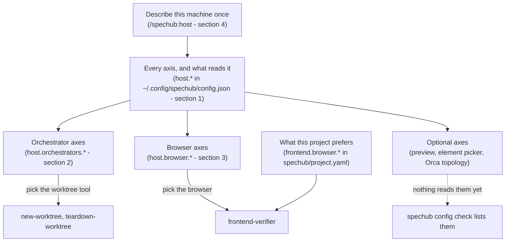

# Dev setups

*One file per machine records what that machine has installed. A skill never has to guess.*

You run SpecHub on more than one machine. Those machines are not the same.

- **One has herdr installed, another has Orca, a third has neither**
- **One can drive a real Chrome window**
- **Another has no display at all**
- **A skill cannot guess which**
    - Each machine answers eight questions once, with `/spechub:host`
- **The answers live in `~/.config/spechub/config.json`** as `host.*` keys
- **The worktree skills and the frontend verifier read them** instead of probing

Four terms first.

- **A dev setup** is the machine-level tools a session runs inside
- **An axis** is one setting of it, recorded as one `host.*` key
- **An orchestrator** owns terminal panes and git worktrees: herdr or Orca
- **A checkout** is one git worktree directory

## 1. Every axis, and what reads it

*Eight `host.*` axes describe the machine. Three `frontend.browser.*` keys state what one project would like.*

| Axis | Values | Required | Stored in | What changes behaviour on it |
| --- | --- | --- | --- | --- |
| `host.orchestrators.herdr` | `true`, `false` | yes | global config | `detect-orchestrator.sh`, so both worktree skills; check 2 runs `herdr api` |
| `host.orchestrators.orca` | `true`, `false` | yes | global config | the same detector; check 2 runs `orca-ide status --json` |
| `host.browser.remote` | `true`, `false` | yes, with a frontend | global config | `spechub config browser-mode`, so `frontend-verifier`; checks 3 and 4 |
| `host.browser.headless` | `true`, `false` | yes, with a frontend | global config | the same |
| `host.browser.local` | `true`, `false` | yes, with a frontend | global config | the same |
| `host.preview.tailscale_serve` | `true`, `false` | no | global config | nothing; check 5 lists it |
| `host.element_picker` | `stagewise`, `orca-design-mode`, `none` | no | global config | nothing; check 5 lists it |
| `host.orca.topology` | `local`, `remote` | no | global config | nothing; check 5 marks it inert unless `host.orchestrators.orca` is `true` |
| `frontend.browser.mode` | `remote`, `headless`, `local` | no | `spechub/project.yaml` | the preference, weighed against the three host axes |
| `frontend.browser.cdp_port` | a port number | no | `spechub/project.yaml` | `frontend-verifier`; defaults to `19988` for `remote` and `9555` otherwise |
| `frontend.browser.fallback` | `none`, or any word | no | `spechub/project.yaml` | only `none` acts: it forbids a stand-in mode |

Where the file lives, and how the CLI reads a value:

- The global config is a JSON file at `~/.config/spechub/config.json`
    - It moves under `$XDG_CONFIG_HOME` when you set that variable
    - Run `~/.claude/spechub/bin/spechub config path` for the real location
- `spechub config show` prints every axis with the project's settings
- The CLI matches an enum value case-sensitively
    - `stagewise` works, and `Stagewise` does not
- The CLI matches a boolean loosely: `true`, `yes`, and `on` all mean true, and `false`, `no`, and `off` all mean false

## 2. Orchestrator axes

*Each orchestrator is its own yes-or-no. Declared means installed. The environment says which one hosts this session.*

- A machine can have both installed, one, or neither
    - An answer about herdr says nothing about Orca
- Answering no to both is a real answer
    - The worktree skills then use plain git under `.claude/worktrees`
- `skills/new-worktree/detect-orchestrator.sh` prints six lines: `declared_herdr`, `declared_orca`, `detected`, `active`, `owner`, and `warning`
    - `detected` reads the markers an orchestrator sets in its terminals
    - `active` always equals it
    - herdr sets `HERDR_ENV` and `HERDR_PANE_ID`
    - orca sets `ORCA_PANE_KEY`
- `owner` comes from the checkout's path root, not from the session
    - orca owns `~/orca/workspaces/<repo>/`
    - herdr owns everything under its worktree root, `~/.herdr/worktrees` by default
    - Any other path is plain git
    - The session's host creates a checkout
    - The checkout's owner removes it

**herdr.**

- `new-worktree` creates the checkout, then moves this pane into the new workspace with `herdr pane move`
- The session then sits in the sidebar row for the worktree it works in
- One limit matters: a herdr server serves one client at a time

**Orca.**

- The Linux executable is `orca-ide`
    - Some installs put it on `PATH` as plain `orca`
- orca runs as a desktop application, or as a headless `orca serve` that the user views through a paired client
- `host.orca.topology` records which one
- Five limits matter
    - No command moves a running terminal into a worktree
        - The session changes directory instead
    - `worktree rm` always deletes the branch, and removes a checkout with live agents in it
        - `teardown-worktree` therefore reads `agents[]` and `liveTerminalCount` from `worktree ps --json` first
    - Nobody has tested Claude Code Agent Teams under `orca serve`
        - Upstream issue 11739 reports that the tmux-compatibility layer can break them
    - Nobody has tested Design Mode either
        - It needs the browser pane on the developer's own machine
    - The Orca web client cannot create terminals behind a reverse proxy
        - Pair a desktop or phone client instead
        - Upstream issue 9047 tracks it

Neither tool sees the other's sessions.

- orca and a paired phone list herdr checkouts only after you turn on one switch per repository
- orca's desktop application holds that switch, named "show in worktree list"
- No command sets it

## 3. Browser axes

*The three modes are not alternatives. A machine can offer any combination. Each one needs something different.*

- **remote** drives a real browser on the developer's own machine, over the Playwriter bridge
    - Something must answer HTTP on the CDP port the project resolves to
    - That is the stated `frontend.browser.cdp_port`, else `19988` when the project's mode is `remote`, else `9555`
    - Check 3 knocks on it
- **headless** launches headless Chromium here and needs no display
    - It needs `chromium`, `chromium-browser`, `google-chrome`, or `google-chrome-stable` on `PATH`
- **local** launches a visible browser here
    - It needs one of those binaries and a graphical display

How the two sides meet:

- The host declares what works
- The project states a preference in `frontend.browser.mode`
- The first mode the host does declare stands in, when the host does not declare that mode
- The order is remote, headless, local
- Setting `frontend.browser.fallback` to `none` refuses any stand-in and fails instead
- `~/.claude/spechub/bin/spechub config browser-mode` applies those rules and prints the answer with its reason
- The frontend verifier runs that command instead of choosing for itself

## 4. Describe this machine once

*Eight steps. Each install plans before it touches anything.*

1. Run `/spechub:host`. It detects what is here, then asks about every axis.
2. Detection never decides a required axis. It only pre-fills the recommended answer.
3. On Linux the skill offers two installs. Each one plans first and waits for approval.
4. `install-orca.sh --plan` lists the steps, and `--apply` runs them. It installs the AppImage, the `orca-ide` and `orca` symlinks, and a systemd user unit.
5. The apply prints the pairing URL only when it started or restarted the server. The journal must already hold the readiness line. Otherwise it prints the `journalctl` command to run by hand.
6. `install-herdr-block.sh --plan` lists the steps, and `--apply` writes the block. The block goes into `~/.config/herdr/config.toml`. It names the directory herdr creates worktrees under.
7. Run `~/.claude/spechub/bin/spechub config check`. It prints five numbered checks.
8. Read its exit code. It exits 2 on an unset required axis, 1 on any other failure, and 0 when everything passes.

Four things stay yours.

- Log in to Tailscale
- Connect the Playwriter bridge
- Pair a client to Orca
- Turn on "show in worktree list" for each repository in Orca's desktop application
