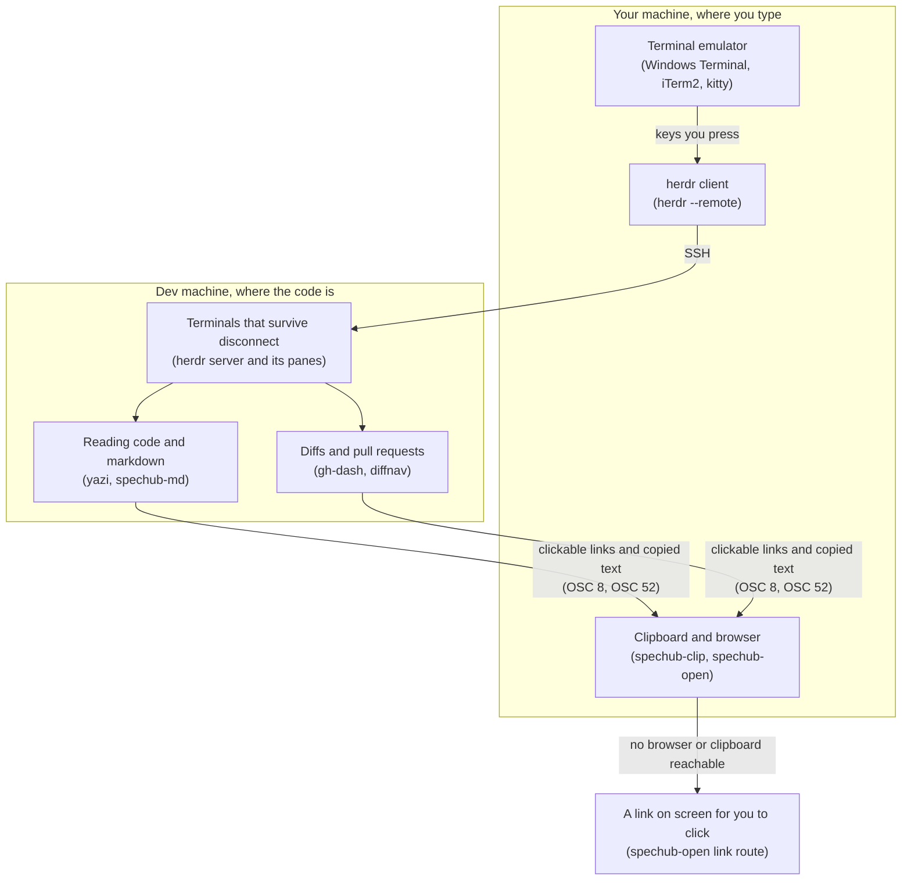

# Terminal workspace: herdr, gh-dash, diffnav

Your code lives on a machine you reach over the network, and you drive coding agents on it. A terminal session dies with its connection. The tools worth reviewing code in assume a desktop, meaning a clipboard, a browser and a display. The dev machine – the remote machine your agents run on, a virtual machine in this setup – has none of them. So how do you run several agents there, keep them alive, and review their work without leaving the terminal?

Run herdr on the dev machine. herdr is a terminal multiplexer, one program that holds many terminal sessions and keeps them running after you disconnect. Attach to it from your own machine with `herdr --remote`. A pane is one terminal window inside herdr, and the server keeps every pane alive when your connection drops. The local client is what lets your own clipboard and browser reach the session at all, which is the part an SSH shell cannot do.

Run `/spechub:terminal-workspace` to install and configure all of it. One file, `~/.config/spechub/terminal-workspace.yaml`, turns each part on or off. The rest of this document explains what that sets up and why. Read it if you would rather configure it by hand or change the defaults.



| Part of the diagram | Section |
| --- | --- |
| herdr client | 4. How you attach |
| herdr server and its panes | 5. The herdr server |
| Terminal emulator | 6. Freeing your emulator's keys |
| Reading code and markdown | 7. Reading code, markdown and diagrams |
| Diffs and pull requests | 8. Diffs and pull requests |
| Clipboard and browser | 9. What crosses back to your machine |
| A link on screen for you to click | 9.2. spechub-open: the browser |

Sections 1 and 2 cover what you get and the loop you run daily. Section 3 installs it. Section 10 explains why the parts work the way they do, and section 11 lists the things that cost real time to find.

## 1. What you get, and its parts

*Three tools you drive day to day. herdr owns the terminals, gh-dash triages pull requests, diffnav reads diffs. Five more tools and SpecHub's own helpers sit behind them. Use this when your code lives on a dev machine, you drive more than one agent at a time, and you want a keyboard-only workflow.*

Skip it if you work locally in a graphical editor. A desktop tool will serve you better.

- **Agents that survive disconnect.** herdr runs a background server. Closing the terminal, dropping the network, or attaching from another machine never stops an agent mid-task
- **One screen that shows who needs you.** herdr marks every pane working, blocked, idle, or done, so you stop hunting for the stuck one
- **Review without a browser.** Pull request triage, diffs with a file tree, and comments, all from the terminal

The three you drive day to day:

| Tool | Role | Why this one |
|---|---|---|
| [herdr](https://herdr.dev) | Terminal multiplexer | Background server, per-pane agent state, one container of tabs and panes per git worktree |
| [gh-dash](https://github.com/dlvhdr/gh-dash) | Pull request dashboard | Saved searches per section, custom actions, `gh` underneath |
| [diffnav](https://github.com/dlvhdr/diffnav) | Diff reader | File tree beside the diff, the blast-radius view a plain pager lacks |

Five more tools do the work those three ask for. You drive one of them yourself, tuicr, from the moment a review starts on gh-dash's `D` key.

| Tool | Role | Why this one |
|---|---|---|
| [delta](https://github.com/dandavison/delta) | Pager | Syntax highlighting for every diff, and gh-dash uses it internally |
| [tuicr](https://github.com/agavra/tuicr) | Code review | Vim keys, and pull request review in the same tool gh-dash hands work to |
| [yazi](https://github.com/sxyazi/yazi) | File manager | Live preview per file type, so markdown renders as the cursor moves |
| [mermaid-ascii](https://github.com/AlexanderGrooff/mermaid-ascii) | Diagram renderer | Draws a mermaid diagram, meaning one written as text inside the file, as box-drawing art |
| [glow](https://github.com/charmbracelet/glow) | Markdown pager | Readable markdown in the terminal |

SpecHub adds two helpers of its own beside those tools. The first, `spechub-md`, reads markdown and draws its mermaid diagrams. The second is a pair, `spechub-clip` and `spechub-open`, which carries your clipboard and your browser back across the link. Section 9 covers that pair.

## 2. The daily loop

*Six steps, from dispatching an agent to tearing its worktree down. Four of them start with one key.*

A workspace is one herdr container of tabs and panes, usually one per repository or worktree. A worktree is a second checkout of the same repository on its own branch. Every key below is one this setup binds, and sections 3 to 9 install them.

1. **Dispatch.** Press `alt+r` to create a worktree workspace. Or ask an agent, and the `new-worktree` skill registers one with herdr for you
2. **Monitor.** Press `alt+s` for the sidebar, the strip listing every workspace and every agent. A blocked agent needs an answer from you. A done agent has finished and you have not looked yet. Leave a working agent alone
3. **Review locally.** Press `alt+f` to see what the agent's branch adds to dev. Press `alt+x` to compare something else. Run the `pre-commit-review` skill in the agent's own pane for a deeper pass
4. **Ship.** The agent commits, pushes, and opens the pull request from its worktree
5. **Review the pull request.** Press `alt+i` for the dashboard. Press `p` then `]` to reach Files Changed. Press `D` to review it in tuicr, or `S` to hand it to an agent
6. **Tear down.** Run `herdr worktree remove --workspace <id>`. Then delete the branch

## 3. Install

*One command installs every tool and writes every config. The rest of this section is the same work done by hand.*

The `/spechub:terminal-workspace` skill runs `assets/terminal-workspace/setup.sh` for you. That script takes four commands.

| Command | What it does |
| --- | --- |
| `setup.sh apply` | installs every enabled tool and writes its config |
| `setup.sh status` | reports what this machine ended up with |
| `setup.sh disable <component>` | removes one component's keys and config |
| `setup.sh uninstall` | removes everything `apply` wrote, in every config it touched |

`uninstall` strips the managed blocks from the herdr, tuicr and yazi configs. It unsets the delta git settings, deletes the helper scripts, and removes the keybindings it wrote into gh-dash. Your own settings in those files survive, and so does every tool binary.

The script reads `~/.config/spechub/terminal-workspace.yaml`, which the skill copies from `assets/terminal-workspace/config.example.yaml`. The config holds eight components, each with its own `enabled` key, so you turn a part off there and run `apply` again. Six components name a tool: `herdr`, `gh_dash`, `diffnav`, `delta`, `tuicr` and `yazi`. The other two name a feature. `markdown` covers `spechub-md` with mermaid-ascii and glow, and `remote` covers the clipboard and browser helpers. Config keys use underscores, so gh-dash's key is `gh_dash`.

Every setting has a default. `apply` therefore works with no config file, and says so when it finds none. The two gh-dash review keys used to be the exception. That writer read `review` and `agent_review` straight from the yaml, with no default of its own. A machine with no config had both pruned and neither written back. `o` already defaulted, so it kept working and the config looked healthy. Both keys now default like everything else. An empty string still turns one off.

A `gh_dash:` heading with nothing under it is what commenting the block out leaves behind. That now falls back to the defaults too. It used to abort the gh-dash step with a traceback.

The script edits between its own marker comments, so hand-written config around it survives. gh-dash is the exception. Python rewrites that config whole, and no comment survives the round trip, so the script tracks its own keybindings there by name.

### 3.1. What `apply` installs, and how to do it by hand

*`apply` installs diffnav and the five supporting tools into `~/.local/bin`, herdr through its own installer, and gh-dash as a `gh` extension. None of it needs root.*

Put `~/.local/bin` on your `PATH` first, and install the `gh` command. Every binary except herdr lands in `~/.local/bin`, or in `$SPECHUB_TW_BIN` when you set that. herdr's own installer always uses `~/.local/bin`. By hand, herdr and gh-dash install like this:

```bash
# herdr
curl -fsSL https://herdr.dev/install.sh | sh

# gh-dash, as a gh extension
gh extension install dlvhdr/gh-dash
```

The other seven are single static binaries. Download each project's Linux x86_64 release, put the binary in `~/.local/bin`, and `chmod +x` it.

| Tool | GitHub repository | Release asset |
|---|---|---|
| delta | `dandavison/delta` | `x86_64-unknown-linux-gnu` |
| diffnav | `dlvhdr/diffnav` | `Linux_x86_64` |
| fzf | `junegunn/fzf` | `linux_amd64` |
| tuicr | `agavra/tuicr` | `x86_64-unknown-linux-gnu` |
| yazi | `sxyazi/yazi` | `x86_64-unknown-linux-gnu`, which also carries `ya` |
| mermaid-ascii | `AlexanderGrooff/mermaid-ascii` | `Linux_x86_64` |
| glow | `charmbracelet/glow` | `Linux_x86_64` |

Three more steps `apply` handles that no release tarball covers:

- `ya pkg add yazi-rs/plugins:piper`, the yazi plugin that lets `spechub-md` draw the preview pane
- `pip install --user markdown`, which `spechub-md --serve` needs
- a copy of `mermaid.min.js` at `~/.local/share/spechub/mermaid.min.js`, so a served page fetches nothing from a content delivery network (CDN)

### 3.2. Let herdr read agent state from the agent

*A hook reports what an agent is doing, rather than herdr guessing from the screen.*

```bash
herdr integration install claude    # also: codex, opencode, copilot, and others
```

Check what is available with `herdr integration status`. The hook applies to sessions that start after you install it. The `herdr.integration` key in the config picks which one `apply` installs.

### 3.3. The tuicr fork build is temporary

*Two of the config keys for tuicr exist only in a fork build, which also carries one bug fix. Leave `build_from_fork: false` unless you want them.*

Two upstream pull requests are still open:

- [agavra/tuicr#607](https://github.com/agavra/tuicr/pull/607) by
  [antonio2368](https://github.com/antonio2368) – configurable per-file
  `+added -removed` counts in the tree, and the `show_file_line_stats` key
- [agavra/tuicr#633](https://github.com/agavra/tuicr/pull/633), opened from SpecHub's own
  fork – move the file list boundary with `<leader>L` / `<leader>H`, and the
  `file_list_width` key

The fork carries a third change of its own, with no upstream pull request yet. It fixes blank `+N -N` counts in pull request review mode (`tuicr pr <N>`). That mode has no version control system (VCS) backend of its own, so it borrowed the `File` type, which `--file <path>` uses, as a stand-in. The fork's whole-file gate hides counts for `--file` and `--all-files`, since every line there counts as added. That gate matched review sessions too, so the counts stayed blank even with `show_file_line_stats` on. The fix gives review sessions their own `PullRequest` VCS type, so the gate no longer matches them.

Leave `build_from_fork: false` unless you want one of those three changes. The default installs the stock release and skips both config keys, so tuicr does not warn about unknown keys. Setting `build_from_fork: true` clones the fork and builds `local/daily` with cargo. It also writes the two keys plus `no_update_check = true`, so `tuicr update` cannot replace the build.

On a machine where you did set it true, `setup.sh status` reports the state of both pull requests. After both merge, check whether anyone has submitted the counts fix above upstream too, then set `build_from_fork: false` again. Stock tuicr 0.23.0 has no counts feature at all, so it never had this bug or the fix. Switching back before that fix lands upstream brings the blank counts back to review mode. Re-run `apply` once you do switch, and check the merged key names first – review can rename them.

## 4. How you attach

*herdr is a background server plus a terminal client. Where you put the client decides what the setup can do, and which key combinations reach herdr at all.*

The server owns the panes and keeps them running whatever happens to your connection. The client draws them. Those are two separate machines in this setup, and which one runs the client is the single decision the rest of this document depends on.

A chord is one key combination, such as `alt+f`. A keymap is the file that says which chord runs which command. The chord family lives in the config as `herdr.chord_modifier`, so changing your mind costs one edit and one `setup.sh apply`, which rewrites the keymap and reloads it.

### 4.1. From your own machine, with `herdr --remote`

*The recommended path. The client runs beside your clipboard and browser, so both can reach the session.*

Install herdr on the machine you type on as well as on the dev machine, then attach:

```bash
herdr --remote dev-box --remote-keybindings server
```

The client connects over SSH, starts or attaches the server on the dev machine, and streams the session back. Panes and agents still run on the dev machine. Only the drawing happens locally. Section 4.4 lists four things worth setting up once, and you can attach without any of them.

### 4.2. By SSH first

*The fallback. Simpler, works from a phone, and gives up the local clipboard route.*

```bash
ssh you@dev-box
herdr
```

Everything runs on the dev machine now, the client included. This is the tmux-shaped path. Detach with `prefix+q`, where `prefix` is `ctrl+b`, the key you press before a herdr command. Then disconnect, SSH back, and run `herdr` again.

Use this path from a phone SSH app, where there is no local herdr to run. Keep it as the fallback for when a remote attach misbehaves. Both paths attach to the same server, so you can move between them freely.

### 4.3. What differs, and why it decides your keymap

*Each attach path can carry a different set of chords, so bind the family that survives both.*

| | `herdr --remote` | `ssh`, then `herdr` |
| --- | --- | --- |
| Where the client runs | your machine | the dev machine |
| Clipboard image paste into an agent | yes | no |
| Which config supplies chords | the client's, unless `--remote-keybindings server` | the server's |
| `alt+<key>` | works | works |
| `ctrl+alt+<key>` | dead | works |
| `ctrl+<digit>` | works | dead |
| Works from a phone SSH app | no | yes |
| Windows as the dev machine | not supported | not applicable |

We measured the three key rows on herdr 0.8.2 with a Windows client rather than inferring them. They are the reason this document binds plain `alt` throughout.

The two paths deliver keys by different routes. Over SSH the emulator encodes a chord as an escape sequence, and herdr decodes it on the far side. Under `herdr --remote` the local client reads native key events instead, and the two routes do not carry the same set. The `ctrl+alt` family survives the escape-sequence route and dies on the native one, and `ctrl+<digit>` does the opposite. Either way herdr accepts the binding and then never sees the key. A chord that does not cross is therefore silently dead, and herdr reports no error.

`alt+<key>` is the only family that crossed both. If you only ever attach one way, test the wider family and use it. If you use both, or expect to, bind `alt` and do not spend the time.

This affects only herdr's own chords. Both gh-dash and diffnav read their own configs on the dev machine, where they run, so their keys behave the same however you attached.

### 4.4. Worth setting up once, after you have attached

*An SSH host block, a loaded key, the server keymap flag, and a shortcut you can tab-complete.*

**An SSH host block**, so the target is a name rather than an address. Anything you put in it carries through, port forwards included, because herdr builds its own SSH config by including yours first:

```text
Host dev-box
  HostName 203.0.113.10
  User you
  LocalForward 6419 localhost:6419
```

**Key authentication through an agent.** herdr's connection reuse is Unix-only, so a Windows client authenticates more than once while it sets the session up. With no key loaded that is a password prompt each time. Load it once per boot with `ssh-add`.

**`--remote-keybindings server`.** By default herdr reads its chords from the config on the machine running the client. It then ignores the keymap on the dev machine, and every chord looks broken. This flag keeps the server config as the single source of truth. Section 4.3 covers why that matters more than it sounds.

**A shortcut, because you will type this many times a day.** On Windows use a PowerShell function rather than an alias or a symlink. Both of those map one name to another. The target then arrives as an argument to herdr itself, and herdr rejects it.

```powershell
function herdr-dev {
  & "$env:LOCALAPPDATA\Programs\Herdr\bin\herdr.exe" `
    --remote dev-box --remote-keybindings server @args
}
```

A hyphenated name tab-completes, where the second word of a two-word command never will. On macOS or Linux the same thing is a shell function in your profile. Add `--handoff` if you like. It asks a running server to pass its live panes to a replacement rather than restarting them. That matters the next time you upgrade herdr and your client meets an older server. It does nothing on an ordinary attach, so it is safe to leave in the shortcut.

## 5. The herdr server

*One config file, one keymap, and a numbering quirk that bites once you use worktrees.*

### 5.1. Every key, and the three lists that answer to 1..9

*Plain `alt` chords for everything you press often, and the prefix for anything that closes a pane.*

Each tool lists its own keys. Press `prefix+?` in herdr, then `/` to filter. Press `?` in gh-dash. Read diffnav's footer.

Prefix is `ctrl+b`. Chords without it are direct and need no prefix. A popup floats over your layout and puts you back where you were when you close it.

| Key | Action |
|---|---|
| `alt+1`..`alt+9` | Focus agent by row |
| `prefix+1`..`prefix+9` | Switch workspace by row |
| `prefix+alt+1`..`prefix+alt+9` | Switch tab by position |
| `alt+n` / `alt+u` | Next / previous agent |
| `alt+left` / `alt+right` | Previous / next tab |
| `alt+up` / `alt+down` | Previous / next workspace |
| `alt+h` `alt+j` `alt+k` `alt+l` | Move between panes |
| `alt+a` | Back to the last pane |
| `alt+s` | Toggle sidebar |
| `alt+g` | Goto picker |
| `alt+z` | Zoom pane |
| `alt+c` | New tab |
| `alt+w` | New workspace |
| `alt+r` | New worktree workspace |
| `alt+e` / `alt+minus` | Split right / down |
| `alt+y` / `alt+shift+y` | File tree in a popup / in a new tab |
| `alt+f` / `alt+shift+f` | Diff of your branch against dev, in a popup / in a new tab |
| `alt+x` / `alt+shift+x` | Pick what to compare, in a popup / in a new tab |
| `alt+i` / `alt+shift+i` | Dashboard in a popup / in a new tab |
| `prefix+q` | Detach, leaving everything running |
| `prefix+x` / `prefix+shift+x` / `prefix+shift+d` | Close pane / tab / workspace |
| `prefix+[` | Copy mode |
| `prefix+w` | Navigate mode, a persistent movement surface |

Three separate lists answer to `1..9`, and they are not the same list. `alt+N`
walks agents, `prefix+N` walks workspaces, `prefix+alt+N` walks the tabs of the
workspace you are in. An agent row and a workspace row that share a number are
a coincidence.

The `ctrl` and `shift` modifiers are not options for a fourth list, and which
one fails depends on how you attached. A `shift+<digit>` chord arrives as
punctuation on both paths. A `ctrl+<digit>` chord reaches herdr under
`herdr --remote` but not over SSH. A binding you make on one path is therefore
silently dead on the other. Section 4.3 has the table. The three chords above, `alt+N`,
`prefix+N` and `prefix+alt+N`, are what both attach paths carry.

### 5.2. One config file, validated without a restart

*Everything above lives in `~/.config/herdr/config.toml`, and two choices in it are worth explaining.*

Validate with `herdr config check`, apply without restarting with `herdr server reload-config`, and undo with `herdr config reset-keys`.

```toml
[keys]
# Jump straight to an agent by its sidebar row.
focus_agent = "alt+1..9"

# Panes, on the same vim letters as the prefix bindings.
focus_pane_left  = ["prefix+h", "alt+h"]
focus_pane_down  = ["prefix+j", "alt+j"]
focus_pane_up    = ["prefix+k", "alt+k"]
focus_pane_right = ["prefix+l", "alt+l"]

# Agents, tabs, workspaces.
next_agent = "alt+n"
previous_agent = "alt+u"
next_tab = ["prefix+n", "alt+right"]
previous_tab = ["prefix+p", "alt+left"]
next_workspace = ["alt+down"]
previous_workspace = ["alt+up"]

# By number. herdr leaves switch_workspace unbound and puts switch_tab on
# prefix+1..9, so without these there is no way to reach a workspace by number.
switch_workspace = "prefix+1..9"
switch_tab = "prefix+alt+1..9"

# Overlays and movement.
toggle_sidebar = ["prefix+b", "alt+s"]
goto = ["prefix+g", "alt+g"]
zoom = ["prefix+z", "alt+z"]
last_pane = "alt+a"

# Creating things. Closing stays on the prefix so a mistyped chord cannot
# kill a pane with an agent running in it.
new_tab = ["prefix+c", "alt+c"]
new_workspace = ["prefix+shift+n", "alt+w"]
new_worktree = ["prefix+shift+g", "alt+r"]
split_vertical = ["prefix+v", "alt+e"]
split_horizontal = ["prefix+minus", "alt+minus"]

# A popup floats over the layout and returns you where you were. Each one has
# a tab variant on the shift chord, which goes through spechub-herdr-tab.
[[keys.command]]
key = "alt+f"
type = "popup"
command = "spechub-diff"
description = "diff: branch vs dev"
width = "90%"
height = "90%"

[[keys.command]]
key = "alt+shift+f"
type = "shell"
command = "spechub-herdr-tab diff spechub-diff"
description = "diff: branch vs dev (tab)"

[[keys.command]]
key = "alt+x"
type = "popup"
command = "spechub-diff pick"
description = "diff: pick what to compare"
width = "90%"
height = "90%"

[[keys.command]]
key = "alt+shift+x"
type = "shell"
command = "spechub-herdr-tab diffpick spechub-diff pick"
description = "diff: pick what to compare (tab)"

[[keys.command]]
key = "alt+i"
type = "popup"
command = "spechub-dash"
description = "PR dashboard"
width = "95%"
height = "95%"

[[keys.command]]
key = "alt+shift+i"
type = "shell"
command = "spechub-herdr-tab dash spechub-dash"
description = "PR dashboard (tab)"

[[keys.command]]
key = "alt+y"
type = "popup"
command = "yazi"
description = "file tree"
width = "95%"
height = "95%"

[[keys.command]]
key = "alt+shift+y"
type = "shell"
command = "spechub-herdr-tab yazi yazi"
description = "file tree (tab)"

[worktrees]
directory = "~/.herdr/worktrees"
```

A `shell` command carries no `width` or `height`, because herdr rejects both on anything that is not a popup.

Two choices worth explaining.

**Plain `alt` chords, not `ctrl+alt`.** herdr's own keyboard page recommends `ctrl+alt`, because it is free across most terminals. Section 4.3 has the measurements showing it dies under `herdr --remote`. Follow herdr's advice only if you attach exactly one way and have tested it.

**Absolute `worktrees.directory`.** A relative value resolves against the herdr session's base directory, not the repository you point at. Worktrees for a second repository then land inside the first. Use an absolute path unless you only ever work in one repository.

### 5.3. When the sidebar numbers stop matching

*Creating a worktree moves the sidebar rows and not the stored order, so one helper realigns them.*

Collapse the sidebar with `alt+s` and each workspace shows a number. That number
is its position in herdr's stored list. The `prefix+N` chord uses something else,
the row's position in the grouped sidebar, where worktrees sit indented under
their parent repo.

They agree until you touch a worktree. A new one appends to the end of the
stored list but appears mid-sidebar under its parent. Everything below it
shifts, so the number you read stops being the number you press.

```bash
spechub-herdr-renumber
```

That rewrites the stored order to match the grouped order, so both agree again.
It prints the result and is safe to run repeatedly.

You rarely have to run it. `apply` links a small herdr plugin,
`spechub.herdr-numbers`, that runs the same helper on every event which can move
a row. Run the helper by hand when you configured herdr yourself, or when
`apply` reported that the plugin link failed. The `herdr.renumber_plugin: false`
key turns the plugin off.

The `spechub-herdr-` prefix is the convention for a helper that only works under
herdr. Plain `spechub-` helpers such as `spechub-diff` and `spechub-md` run in
any terminal, so the name tells you up front what a command depends on. Both
forms are reachable through the CLI, which dispatches an unknown subcommand to
`spechub-<name>` on your PATH.

Two things the helper cannot fix. Only rows 1 to 9 are reachable, so a tenth
workspace needs `alt+g` or `alt+up`/`alt+down`. And `prefix+N` stays positional.
It names a row rather than a workspace, so it still moves when the rows move.

## 6. Freeing your emulator's keys

*You bind the keymap on the dev machine, but the emulator on the machine you type at intercepts the chords. Fix that where the emulator runs.*

Windows Terminal binds `alt+shift+d` to "duplicate pane" by default. It never forwards the key, so a binding on it does nothing at all on the dev machine and the local tab splits instead. That is why both diff keys sit on `f`: `alt+f` and `alt+shift+f`, not `alt+d`. Other emulators claim other chords. This is true on both attach paths. A local herdr client does not rescue you from it, because the emulator sees the key first either way.

To confirm an emulator is eating a chord rather than herdr ignoring it, run `cat -v` in any pane and press the key. A chord that arrives prints an escape sequence such as `^[Z`. One that prints nothing never left your machine.

[assets/terminal-workspace/client-keybindings.md](../assets/terminal-workspace/client-keybindings.md)
lists every chord this setup uses and how to unbind them in the common
emulators. Follow it yourself, or hand it to an agent running on that machine.

Never try to edit a client-side emulator config from the dev machine. Never paste your local config onto the dev machine so that something there can rewrite it.

## 7. Reading code, markdown and diagrams

*A file tree with live preview, and markdown that draws its mermaid diagrams as text.*

### 7.1. The file tree

*yazi opens over your layout on `alt+y`, and every review popup works the same way.*

The file tree is yazi, a keyboard-driven file manager that previews whatever the
cursor sits on. Press `alt+y` for yazi in a popup, which floats and leaves the
tab layout alone. Press `alt+shift+y` for yazi in a new tab instead.

Every popup works this way: `alt+f` / `alt+shift+f` for diffnav, `alt+i` /
`alt+shift+i` for gh-dash. A popup is right for a glance, and a tab is right for
something you will come back to. Both come from the same command, and the tab
variant goes through `spechub-herdr-tab`. That helper creates the tab in the
workspace and directory you pressed the key in. Then it sends the command with
`herdr pane run`. Outside herdr it simply runs the command.

This setup leaves `alt+t` alone on purpose, because it is Claude Code's thinking toggle.

The one collision to know about is your terminal emulator claiming the same
chords, and you fix that where the emulator runs. See section 6.

yazi previews each file type with its own command, and it routes markdown to
`spechub-md`. A document therefore renders **as the cursor moves over it** rather
than needing a keypress. The `Enter` key opens the same renderer full width,
where more of a wide diagram fits than the preview pane allows. The `~` and `F1`
keys both open yazi's help.

Icons come from a Nerd Font. Without one, every icon draws as an empty box.
Install any Nerd Font and select it in your terminal.

tuicr was the file tree before yazi. Then yazi took that job, and tuicr kept the
one it is better at, reading diffs and reviewing pull requests. It gets that work
from gh-dash on the `D` key, which runs `tuicr pr <number>` in the local clone.
The command `tuicr --file .` still browses a tree if you want it.

### 7.2. Reading markdown and mermaid

*`spechub-md` draws a file with its diagrams, and two keys inside the pager change what you are looking at.*

```bash
spechub-md NOTES.md              # terminal, diagrams drawn as text
spechub-md --numbered NOTES.md   # the source instead, with its line numbers
spechub-md --diagram 2 NOTES.md  # one diagram alone, scrollable sideways
spechub-md --serve NOTES.md      # browser, prints a clickable link
spechub-md --browser NOTES.md    # the browser you are sitting at, wherever that is
spechub-md --html NOTES.md       # that same page, as one document on stdout
```

`--numbered` answers the one question a rendering cannot, which is what line of
the file this is. A review comment names a line number, and a rendered heading
has none, so `--numbered` prints the source with a right-aligned gutter instead.
The gutter is as wide as the largest number in it, so the source stays on one
column however long the file. It pages through `less -S`, which chops rather
than wraps. The arrow keys pan across a long line, and the gutter keeps its
column.

Two keys work while you are reading. The `b` key opens the page in the browser
you are sitting at and returns you to where you came from. It uses the routes in
section 7.4, so it is the same key whether you attached over `herdr --remote`,
over SSH, or locally. The `#` key switches the document between the rendered
view and its source with line numbers, and switches it back. That is the moment
you usually want a line number, so you do not have to quit back to the tree.

Both keys move. `SPECHUB_MD_LINE_NUMBERS_KEY` moves `#`, and
`SPECHUB_MD_BROWSER_KEY` moves `b`. In `less`, `b` is back-a-page, so the
binding costs you nothing. Both `Ctrl-B` and `PageUp` still do that. Both
bindings need `less` 582 or newer, and older versions leave the two keys alone.
Section 10.2 explains how they reach a running pager.

A wide diagram cannot fit a narrow pane. So `spechub-md` replaces anything wider
than the terminal with a note, and the note gives its size and the two ways to
see it. The `--diagram N` flag prints that one diagram unwrapped through
`less -S`, where the arrow keys scroll sideways. `SPECHUB_MD_PAD` tunes the spacing passed to
`mermaid-ascii` (default `-x 2 -y 2`). Tighter padding buys roughly a third of
the height back and very little width. Section 10.3 explains why the note exists
at all.

Terminal mode replaces each mermaid fence with a box-drawing rendering.
`mermaid-ascii` handles `graph`, `flowchart`, and `sequenceDiagram`. Anything
else keeps its source visible with a note rather than disappearing.

Two things `spechub-md` normalises first, because `mermaid-ascii` handles
neither:

- `style`, `classDef`, `class`, `linkStyle` and `click` lines, which it would
  otherwise draw as if each were a node
- node shapes other than `[square]` – `{decision}`, `((circle))`, `([stadium])`,
  `[(database)]`, `{{hexagon}}` – whose syntax would otherwise leak into the label

Serve mode renders the file with python-markdown and draws diagrams with a
**locally vendored** mermaid.js, so the page fetches nothing from a CDN. It
binds `127.0.0.1` only, re-reads the file on every request, and prints an
OSC 8 hyperlink. OSC 8 is the escape sequence that marks a piece of text as a
link the terminal draws itself. Then herdr rebuilds that link into the frame it
sends the client. The bare URL prints underneath for terminals without OSC 8.

So ctrl+click opens the page in the browser on your own machine, as long as your
SSH config forwards the port from there. The `spechub-md --serve` command takes
that port from `$SPECHUB_MD_PORT` and falls back to 6419.

Only one server can hold that port at a time. A second `--serve` names the
process holding it and the command to stop it:

```
port 6419 is busy: [Errno 98] Address already in use
  held by pid 680666: spechub-md-serve - /path/to/NOTES.md 6419 serve
  stop it with:  kill 680666
```

Use that pid rather than `pkill -f spechub-md-serve`, which also matches any
shell whose own command line mentions the name, including the one you type it in.

### 7.3. Reading markdown from the file tree

*Move the cursor onto a markdown file and yazi previews it rendered. `Enter` reads it full width.*

The file tree draws markdown twice over. Moving the cursor onto a `.md` file
renders it straight into the preview pane, through the piper plugin running
`spechub-md --preview`. The pane is narrow, so a wide diagram shows a
placeholder there rather than a chopped drawing.

`Enter` on the same file opens `spechub-md` full width, where the diagrams fit.
A rule in yazi's `[opener]` config table puts that ahead of the editor, so
reading is the default. Press `O` to choose from the same menu instead. It offers
**Read (spechub-md)**, **Read with line numbers**, then **Edit**. Nothing shims
`$EDITOR`, and nothing changes your shell environment.

`b` on a file hands it to the browser you are sitting at, by the routes in
section 7.4.
The key is free in yazi's file list. Its only default binding is a word motion
while you are typing into a prompt, which this does not touch. Move it with
`yazi.browser_key`.

`#` switches the preview pane between the rendered markdown and the source with
line numbers, and switches it back. Press it when you are about to quote a line
in a review. The pane redraws as `spechub-md --numbered` would print it, numbers
down the left. Every later `.md` file you move onto previews the same way until
you press `#` again. The key is unbound in yazi's file list. Move it with
`yazi.line_numbers_key`.

The same key does the same job one level in, while you are reading a document
full width after `Enter`. That is the more common moment to want it. The two are
deliberately the same key, so there is nothing to remember about which of the
two places you are standing in. Section 7.2 describes the reader's half. It
is a binding in `lesskey`, the key-binding config file for the `less` pager,
rather than a yazi one. So `yazi.line_numbers_key` does not move it.

The switch is a file on disk, `$XDG_STATE_HOME/spechub/md-line-numbers`.
`spechub-md --toggle-line-numbers` creates and removes it, and that is what the
key runs. Only the preview pane reads it, and section 10.5 says why.

`setup.sh apply` reads a `yazi.toml` you wrote first and leaves alone anything
you have set. Add `spechub-md` to your own `[opener]` table to read markdown
with it. Add `show_hidden = true` to your own `mgr` table if you want hidden
files shown. Section 10.4 says what it concedes and why.

Four keys and a cursor move cover the loop. Press `alt+y` for the tree. Move the
cursor onto a markdown file to preview it. Press `#` to see its source with line numbers.
Press `Enter` to read it full width with its diagrams drawn. Press `q` to go
back to the tree.

### 7.4. Getting the page to the browser you are sitting at

*`--browser` works out where your browser is and picks a delivery that reaches it.*

`--browser` is the one to reach for. The same key works however you attached,
because it asks `spechub-open --why` where the browser is rather than deciding
that a second time.

| Where the browser is | What `--browser` does |
| --- | --- |
| Behind the opener on your laptop | Posts the whole document to it. The opener stores it, serves it, and opens your default browser |
| A desktop on this machine, or the Windows Subsystem for Linux (WSL) | Serves it and opens it |
| The far end of the Playwriter bridge, with no opener | Hands the whole document down the Chrome DevTools Protocol (CDP) link, into the tab the extension is armed on |

The [Playwriter bridge](../skills/bridge/SKILL.md) is the setup that lets a program on the dev machine drive Chrome on your laptop. It works one tab at a time, and arming means clicking the extension's icon on the tab you are willing to hand over.
| Anywhere else, over SSH | Serves it and prints a clickable link |

The opener is the route you want. It is a small service on your laptop that
takes a page and opens it in your default browser. Section 9.5 covers how it
gets installed. What matters here is what it changes. There is nothing to arm
and no extension, and the browser it reaches is your default one rather than a
dedicated Chrome profile.

Read one document after another and each simply appears. Re-render a file you
are already looking at, and the tab you have open updates in place, scroll
position kept. No second tab joins the first.

The page itself decides that last part, rather than the opener remembering it.
Every page the opener serves polls it for its own version, so a tab that is
still open says so by asking. Re-render that file and the opener sees a live
tab and lets it reload itself. Close the tab and the asking stops, so the next
render opens a fresh one. Remembering that it once opened something would get
the closed-tab case wrong every time.

The bridge is the fallback, and it is the one that needs explaining. Under
`herdr --remote` the reverse SSH tunnel to your laptop runs the *other way*. Nothing on the
laptop can open a port on the dev machine. A link to `localhost:6419` names the
laptop's own localhost, where nothing is listening. So there is no link to hand
over, only a document. That is what `--html` is for.

`--html` prints the page `--serve` would have served, once, to stdout, and
starts nothing. A document you can capture in a variable travels, and a port does
not. The `--browser` flag is `--html` plus the delivery, and the two share one
renderer, so the page cannot differ between them. They differ in exactly one
place, which section 10.6 covers.

On the bridge the page replaces what is in the armed tab, and the helper opens
no new tab. Arming the extension is how you nominate the tab this may take over,
so that is the tab it takes over. When the bridge is the route and the push
fails, `--browser` says so and stops rather than falling back to serving. A link
the laptop resolves to its own localhost is a wrong answer dressed as a working
one.

We measured one delivery rather than estimating it. This document, 39KB of
markdown, renders to 50KB of HTML in under 200ms. It reaches a laptop browser,
diagram drawn, in about two seconds.

### 7.5. Why text and not inline images

*No terminal you can reach from Windows or Android draws the graphics herdr emits.*

herdr embeds libghostty and emits the **kitty graphics protocol**, one of the
two ways a terminal draws an inline image. It emits no sixel, the other way.
Windows Terminal renders sixel and has never supported kitty
([microsoft/terminal#8389](https://github.com/microsoft/terminal/issues/8389) is
still open), and no Google Play terminal supports either protocol. The
intersection is empty, so an inline image never arrives no matter which terminal
you pick. Text also suits e-ink, where the fast refresh modes an interactive
terminal needs are the ones that discard the greyscale depth an image needs.

`chafa` is worth adding by hand (`apt install chafa`) if you want images drawn
as text. It ships source-only, so the setup script does not install it.

## 8. Diffs and pull requests

*Diffs with a file tree, pull request triage with saved searches, and the two helpers that make one key always show something useful.*

### 8.1. Five git settings that route every diff through delta

*One pager for `git diff`, `git show`, and gh-dash alike.*

```bash
git config --global core.pager delta
git config --global interactive.diffFilter "delta --color-only"
git config --global delta.navigate true
git config --global delta.line-numbers true
git config --global merge.conflictstyle zdiff3
```

This does not change what agents see. The git command only pages to a terminal, so a caller that pipes or captures the output still gets plain text.

### 8.2. Saved searches become dashboard tabs

*Any GitHub search string is a section, and two keys hand a pull request to tuicr or to an agent.*

`~/.config/gh-dash/config.yml`.

```yaml
prSections:
  - title: Mine
    filters: is:open author:@me
  - title: Needs review
    filters: is:open review-requested:@me
  - title: Failing
    filters: is:open author:@me status:failure

issuesSections:
  - title: Mine
    filters: is:open author:@me
  - title: Assigned
    filters: is:open assignee:@me

# Local clones. Required for checkout and for {{.RepoPath}} in keybindings.
repoPaths:
  <you>/<repo>: ~/code/<repo>

keybindings:
  prs:
    - key: D
      name: review (tuicr)
      command: >
        cd {{.RepoPath}} && tuicr pr {{.PrNumber}}
    - key: S
      name: agent review
      command: >
        cd {{.RepoPath}} && claude "/code-review {{.PrNumber}}"
```

Anything you can type into GitHub's search box becomes a tab. Avoid binding `R`, which is the built-in refresh-all.

### 8.3. The diff and dashboard helpers

*One key shows what your branch adds to dev. Another picks any comparison. A third opens the dashboard, scoped to where you are standing.*

`alt+f` runs `spechub-diff`, which compares the branch you are on against `origin/dev`, committed work only. Repositories with no dev branch fall back to the default branch, read from `origin/HEAD`. The comparison is `git diff <base>...HEAD`, three dots. You see the commits your branch added since the two diverged, never the ones the base picked up meanwhile.

A pane often sits in the parent directory that herdr groups a repository's worktree workspaces under, `<root>/<repo>/`, rather than in a checkout. The helper offers a numbered list of the checkouts it finds there.

Every launch opens with a banner naming both sides, because diffnav renders whatever precedes the first `diff --git` line:

```
COMPARING  origin/dev  ==>  deployment-map
base     origin/dev  a84216b  16 hours ago  Merge pull request #44 from
compare  deployment-map  549e94b  68 minutes ago  chore: integration edits
showing  commits on deployment-map that origin/dev does not have
command  git diff origin/dev...HEAD
```

Base first, then compare, which is the order `git diff` takes its arguments and the order GitHub labels its two compare pickers. The `command` line is real git syntax, so you can paste it into a shell.

The comparison also reaches diffnav's status bar, which stays visible while you walk the file tree. That works because diffnav prints the line following a `commit <sha>` header as the commit subject, so the helper synthesises that header for a plain diff. A single-commit view already carries git's own header and gets no synthetic one.

No banner line may start with a space. diffnav strips leading whitespace, so any indentation collapses and the columns stop lining up.

#### Picking a different comparison

*`alt+x` opens an fzf menu of seven comparisons. Every row reads left to right as base, then compare.*

```
dev          ==>  my-branch                 committed work only
dev          ==>  my-branch + uncommitted   committed work plus what is not committed
main         ==>  my-branch                 committed work only
main         ==>  my-branch + uncommitted   committed work plus what is not committed
HEAD         ==>  my uncommitted changes    staged and unstaged changes only
its parent   ==>  one commit                pick a commit from this branch's history
any branch   ==>  any branch                pick the base, then the branch to compare
```

The dev rows appear only where a dev branch exists, and the branch named is the one you are on. Branch lists come from `git for-each-ref` over local and remote branches, newest commit first, with `git log` in the preview pane. The commit list is the last 300 commits, with `git show --stat` in the preview. Picking "any branch" asks twice, prompting `source (compare against)` and then `change (the new work)`.

`apply` installs fzf alongside diffnav. Without fzf the picker says so and falls back to the automatic diff.

`spechub-dash` adds a section for whichever repository you are standing in, then hands a generated config to gh-dash:

```bash
#!/usr/bin/env bash
set -uo pipefail
BASE="$HOME/.config/gh-dash/config.yml"
REPO="$(gh repo view --json nameWithOwner -q .nameWithOwner 2>/dev/null)"
[ -z "$REPO" ] && exec gh dash "$@"
GEN="$(mktemp)"; trap 'rm -f "$GEN"' EXIT
REPO="$REPO" python3 - "$BASE" "$GEN" <<'PY'
import os, sys, yaml
cfg = yaml.safe_load(open(sys.argv[1])) or {}
repo = os.environ["REPO"]; short = repo.split("/")[-1]
s = [x for x in cfg.get("prSections", []) if x.get("title") != short]
s.insert(0, {"title": short, "filters": f"repo:{repo} is:open"})
cfg["prSections"] = s
yaml.safe_dump(cfg, open(sys.argv[2], "w"), sort_keys=False)
PY
gh dash --config "$GEN" "$@"
```

Because herdr popups inherit the focused pane's directory, `alt+i` from an agent's worktree opens the dashboard already scoped to that repository.

### 8.4. spechub-gh: why an action failed

*gh-dash throws gh's stderr away, so a helper on `$PATH` turns a refusal into a notification.*

gh-dash shells out to `gh` for everything it does to a pull request, and throws the command's stderr away. GitHub refusing one therefore arrives as `exit status 1` in the footer, for two seconds. Approving your own pull request is the case you meet daily, because GitHub always refuses that. The input box closes, nothing else happens, and the dashboard looks like it ignored the key.

`spechub-dash` answers that without patching gh-dash. It links `spechub-gh` into a directory of its own at the front of `$PATH`, under the name `gh`. gh-dash therefore finds it before the real one. The real `gh` still does the work and still decides the exit code. The only thing added is a notification carrying gh's own words when a `pr` or `issue` action fails:

```
gh pr review failed
Can not approve your own pull request.
```

`spechub-gh` passes `gh dash` itself straight through, and every subcommand that is not an action, `repo view` and `api` among them. Those fail for reasons a notification cannot help with.

### 8.5. gh-dash keys

*Vim movement, `[` and `]` for the preview tabs, and `D` or `S` to hand the pull request on.*

| Key | Action |
|---|---|
| `j` / `k` | Move between rows |
| `h` / `l` | Previous / next section |
| `p` | Toggle the preview pane |
| `[` / `]` | Previous / next preview tab: Overview, Activity, Commits, Checks, Files Changed |
| `PageDown` / `PageUp` | Scroll the preview |
| `ctrl+d` / `ctrl+u` | Scroll the preview, vim style |
| `e` | Expand the description |
| `d` | Built-in diff |
| `D` | Open the pull request in tuicr and review it there |
| `S` | Hand the pull request to an agent |
| `C` or `space` | Check the branch out locally |
| `w` | Watch checks |
| `c` / `v` / `m` | Comment / approve / merge |
| `y` / `Y` | Copy number / URL |
| `r` / `R` | Refresh section / all |
| `/` · `?` · `q` | Search · help · quit |

### 8.6. diffnav keys

*Vim movement in the tree, and `Tab` to cross between the tree and the diff.*

| Key | Action |
|---|---|
| `j` / `k` | Move in the file tree |
| `n` / `N` | Next / previous file |
| `ctrl+d` / `ctrl+u` | Scroll the diff half a page |
| `ctrl+e` / `ctrl+y` | Scroll the diff one line |
| `Tab` | Switch focus between tree and diff |
| `t` | Search and jump to a file |
| `e` | Toggle the file tree |
| `s` | Side-by-side or unified |
| `o` | Open the file in `$EDITOR` |
| `q` | Quit |

## 9. What crosses back to your machine

*A dev machine has no display and no clipboard of its own. The `spechub-clip` and `spechub-open` helpers carry each one back across the link.*

Two gaps, and three gh-dash keys fall into them:

- `o`, open on GitHub, fails with `exit status 1`. gh-dash opens URLs through `$BROWSER`, falling back to `xdg-open`, and `xdg-open` with no `$DISPLAY` exits 1
- `y` and `Y`, copy the URL and the number, fail with `Failed copying to clipboard`. The gh-dash tool copies through a Go library that shells out to `xclip`, `xsel`, `wl-copy` or `termux-clipboard-set`. A bare dev machine has none of them installed, and an install would not make them work

Neither is a gh-dash bug. The clipboard and the browser are on the machine you are typing at, several hops away. The two helpers below carry each one back across.

### 9.1. spechub-clip: the clipboard

*OSC 52 crosses SSH for free, so a copy on the dev machine lands on your own clipboard.*

OSC 52 is the escape sequence that asks a terminal to put text on its own clipboard. It is bytes in the terminal stream, so it crosses SSH for free. herdr forwards it from a pane to whatever terminal hosts it. Windows Terminal, iTerm2, kitty and Ghostty all act on it.

```bash
spechub-clip "some text"      # copy the arguments
git rev-parse HEAD | spechub-clip
spechub-clip --out            # print what was copied last
```

Reading back is not symmetrical. Windows Terminal refuses OSC 52 clipboard *reads* on purpose, because a program that can read your clipboard without asking is a security hole. So `--out` replays a local cache, not the real clipboard.

To reach programs that only know how to shell out, `setup.sh apply` also writes an `xclip` onto `$PATH` backed by `spechub-clip`. That is what makes gh-dash's `y` and `Y` work unchanged, with no rebinding and no flicker. The `remote.clipboard_shim` key turns it off, and `setup.sh uninstall` removes it. The script skips it anyway on a machine with a real `xclip`, or with a display for one to talk to.

### 9.2. spechub-open: the browser

*Seven routes, tried in order, ending in a link you can click from any terminal.*

`o` is a gh-dash keybinding rather than a `$BROWSER` setting, and that is deliberate. The dashboard is still on screen when gh-dash runs `$BROWSER`, and it discards that command's output. A route that needs to say anything, or to hand you a link to click, therefore has nowhere to put it. As a keybinding gh-dash steps aside and gives `spechub-open` the terminal.

It tries, in order:

1. `$SPECHUB_OPEN_CMD`, if you set one. The escape hatch
2. `xdg-open`, when this machine has a display after all
3. `wslview` or `explorer.exe`, when the Windows half of the machine holds the browser
4. The opener on your laptop, which puts the page in your default browser with nothing to click. See section 9.5
5. Chrome on your laptop through the [Playwriter bridge](../skills/bridge/SKILL.md), but only after it proves the browser is really reachable that way. See section 10.7
6. A clickable link. The terminal you are sitting at draws the URL as an OSC 8 hyperlink, so ctrl+click reaches your own browser. The URL goes on your clipboard too
7. With no terminal to draw on either, the URL still goes on the clipboard, and the command reports failure

The link route needs nothing installed in between, which is why it is the last one that can still work. A terminal that ignores OSC 8 still shows the bare URL, and its own URL detection can catch that. Route 7 reports failure on purpose, because silent success is what left gh-dash claiming it had opened a page that never opened.

The opener sits ahead of the bridge because the two are not competing for the same job. The bridge exists so an *agent* can drive a browser. It attaches one tab at a time, only after somebody clicks the extension icon, and it does so in a dedicated Chrome profile. The opener exists so it can show a *person* a page, needs no click at all, and reaches the browser you actually use. Both can be up at once, and each keeps its own job.

`setup.sh status` prints which route a machine will take, and the last line of `~/.cache/spechub/open.log` says what the last press actually did.

### 9.3. Under `herdr --remote`

*We wrote both helpers for this shape, and they need no change. The clipboard crosses, and the browser falls to the link route, which is the one built for it.*

`herdr --remote <target>` runs the server, and therefore every pane process, on
the dev machine. The client is a thin attach. It sends input and draws what the
server sends back.

`spechub-clip` works, and we measured that rather than inferring it. A pane's
OSC 52 write reaches the clipboard on the machine you attached from. So
`spechub-clip "some text"` on the dev machine pastes on your own. Nothing in
herdr's own documentation promises this. It mentions OSC 7 and OSC 8, never
OSC 52. We tested it on herdr 0.8.2 and it crossed.

Terminals differ in what they act on, so copy something with `spechub-clip`
after your first attach and check that it pasted.

Clipboard *images* travel the other way, and only on this path. Copy a
screenshot on your machine, focus an agent pane, and herdr stages the image on
the dev machine and pastes its path. An SSH shell cannot do that at all, which
is the single strongest reason to prefer a remote attach.

`spechub-open` runs on the dev machine, which is the honest answer for routes 1
to 5. An override, a display, WSL, the opener or a bridge tunnel all have to be
reachable *from there*. The opener and the bridge are reachable, because the
laptop opens reverse tunnels that carry them back. So on a machine set up for
either, that is the route it takes. With neither, it falls to the link route,
which is the one built for this.

In that route herdr tracks hyperlinks per cell and re-emits them when it renders.
The client therefore draws the link rather than shipping raw bytes, and
ctrl+click opens the browser on the machine you attached from.

The link route also degrades further than the others. Even with no OSC 8 and no
OSC 52 at all, the URL is on screen as plain text, which drag-select copies. That
is why the link is its own text rather than a label over it.

One trap belongs to your SSH config rather than to herdr. The
`spechub-md --serve` command prints the URL it is listening on, and that is the
port *on the dev machine*, meaning `$SPECHUB_MD_PORT` or 6419. If your host
block forwards it to a different local port, the printed link is wrong from
where you are sitting. You want the local number instead. Forwarding `6419` to
`6419` avoids the question entirely.

### 9.4. On a machine with none of this

*The link route needs only a terminal, and one environment variable buys back a real one-key open.*

The link route works over SSH, through herdr, and under `herdr --remote`. If you want a real one-key open instead, give `spechub-open` something that can do it:

```bash
export SPECHUB_OPEN_CMD="ssh laptop open"   # or any command taking a URL
```

### 9.5. The opener: a page in your own browser, with nothing to click

*A small service on your laptop. It takes a page from the dev machine, stores it, serves it back, and opens your default browser on it.*

The dev machine has no browser and no way to reach yours. The bridge solved that for agents, but not for reading. It needs a tab armed by hand before every session. The tab it drives lives in a dedicated Chrome profile rather than your default browser. The opener is the answer for reading, and it is a separate service on purpose – see [ADR 0006](adr/0006-document-opener-service.md).

What it does is deliberately small:

| The dev machine sends | The opener does |
| --- | --- |
| A URL | Hands it to your default browser |
| A rendered document | Stores it, serves it at `http://127.0.0.1:19989/doc/<id>`, opens that |
| A vendored `mermaid.min.js`, once | Keeps it, and answers `/mermaid.js` off it from then on |
| A request to restart the relay or the tunnel | Restarts that scheduled task |

The relay is the process on your laptop that the Playwriter extension connects to. Restarting it, and restarting the tunnel, are the two recovery actions the dev machine could never perform. They now go through the opener instead of arriving as a block for you to paste into PowerShell. Arming the extension is still yours. It is a click inside a third-party extension, and nothing on either machine can press it.

Installing the opener is the same command that registers the bridge, which now registers the opener too:

```powershell
cd $env:USERPROFILE\playwriter-bridge
.\register-tasks.ps1 -VMs @("vm1.example.com")
```

That generates a shared secret and stores it at `%LOCALAPPDATA%\playwriter-bridge\opener.token`. It copies the secret to each dev machine at `~/.config/spechub/opener.token`, over the same ssh the tunnel uses. Every request from the dev machine carries it. Loopback binding alone would not be enough. The reverse tunnel makes the port reachable by anything running on the dev machine, and this is a service that puts pages on your screen.

The opener rides the same machinery as the bridge – a scheduled task from `register-tasks.ps1`, and a supervisor that restarts it. The `sync.ps1` script reconciles the deployment on every Claude Code launch, and your laptop opens a reverse SSH tunnel.

The opener gets its **own** tunnel task, `Playwriter-OpenerTunnel-VM<N>`, which carries port 19989. The bridge keeps port 19988 on a task of its own. Both tasks run the same `tunnel.ps1` script. They stay apart because ssh runs with `ExitOnForwardFailure=yes`, so one wedged port fails the whole connection. Sharing one connection would let a stuck opener port take the bridge down with it.

Documents outlive the session that rendered them, which is what lets a page still work after the dev machine has gone away. The opener prunes them after a week.

## 10. Design notes

*Why the parts work the way they do. Read this when you are changing the setup or debugging it, and skip it otherwise.*

### 10.1. Why the markdown helpers are separate executables

*Node's startup would roughly double the cost of a preview that runs on every cursor move.*

The `spechub-md` and `spechub-clip` helpers are their own executables rather than
subcommands of the `spechub` CLI. The `spechub-md --preview` command runs on
every cursor move in the file manager, and Node's startup would roughly double
it. The CLI dispatches to them anyway, the way git does. So `spechub md` runs
`spechub-md`, either form works, and configs can keep the fast one.

### 10.2. How `b` and `#` reach a running pager

*A `lesskey` binding whose `quit` action carries an exit status, which `spechub-md` reads and acts on.*

The `less` pager has no action that runs a fixed command. Its one shell escape
would hand over the rendered temporary copy rather than the file you asked for.
So each key quits `less` with an exit status of its own, and `spechub-md` reads
that status and does the work. It needs `less` 582 or newer, and older versions
ignore the bindings and leave both keys alone.

`setup.sh apply` writes the `#` binding as `\#` in the `lesskey` file. `lesskey`
reads a line starting with `#` as a comment, so it drops a bare binding without a
word. The key then does nothing but ring the terminal bell. Only a leading `#`
needs the escape. A backslash means something of its own to `lesskey`, and `\b`
would bind backspace rather than the letter.

### 10.3. Why a wide diagram becomes a note

*Nothing can shrink a diagram, and wrapping box-drawing art destroys it.*

A diagram's width comes from its node labels, so nothing can shrink a wide one
into a narrow pane. Wrapping box-drawing art destroys it instead of fitting it.
A note that names the size is the honest answer, and a badly drawn diagram is
not.

Wide diagrams still appear in place when they fit. glow wraps whatever it
renders, so `spechub-md` holds the drawing back. It runs glow on the prose, then
splices the full-width art into the output. The pager is `less -S`. Because glow
already wrapped the prose to the pane, only the diagram lines chop, and the
arrow keys pan across them.

### 10.4. What yazi's config merge concedes

*Declaring anything twice would make yazi reject the whole file, so `apply` gives up whatever you already set.*

`setup.sh apply` reads your `yazi.toml` first and leaves alone anything you have
set. That covers your `mgr` settings, your markdown opener, your
`plugin.prepend_previewers` and your `open.prepend_rules`. Whichever of the four
it skipped, it says so.
Declaring any of them a second time would make yazi reject the whole config and
fall back to presets, so it concedes them instead. What it cannot read is a
`yazi.toml` that does not parse. In that case yazi is already ignoring the file
in favour of presets, so fix the error and re-run `apply`.

The `b` and `#` bindings live in `keymap.toml` rather than `yazi.toml`, and
`apply` writes them as `[[mgr.prepend_keymap]]`. That spelling is an array of
tables, so it stacks with bindings you have already written the same way. The one
spelling it cannot sit beside is the inline `prepend_keymap = [...]` under
`[mgr]`. That is a single key, and TOML forbids declaring it twice. The script
detects that form, gives the bindings up rather than cost you the whole keymap,
and says so.

The `[opener]` templates say `%s` rather than `"$@"`. yazi runs a template as
`sh -c '<template>'` with nothing after it, so `$0` is `sh` and `$@` is empty. A
template written with `"$@"` hands the helper no file at all. `%s` is the
placeholder yazi substitutes, already quoted. Measured on yazi 26.8.15.

The `#` key runs two actions rather than one. It flips the flag, then forces
yazi to draw the pane again. Without the redraw the pane keeps showing whatever
it drew before you pressed the key, and the switch looks broken until you move
the cursor. The flip blocks, though it has nothing to say, because a detached
one races the redraw and loses about half the time.

One collision belongs to herdr rather than yazi. herdr hosts a
`type = "shell"` command in a real pane for as long as the process runs. So
`spechub-herdr-tab` creates the tab and then hands the wait to a detached child.
It returns in about 100ms rather than three and a half seconds. Without that a
stray pane sits in the current tab.

### 10.5. Why the line-number switch lives in a file

*The key and the preview pane are two processes that never meet, so the switch has to sit on disk between them.*

The state file is `$XDG_STATE_HOME/spechub/md-line-numbers`, or
`~/.local/state/spechub/md-line-numbers` when that variable is unset. Its
presence is the whole setting, so `spechub-md --toggle-line-numbers` only has to
create or remove it.

Only the preview pane reads that file, because every other route asks for a view
by name. The full-width read has **Read with line numbers** as its own entry
under `O`. The `--diagram N` flag outranks the file too, since asking for one
drawing is a different question from which view the pane is on.

### 10.6. Why `--html` names a CDN and `--serve` does not

*A document standing on its own has no server behind it to answer for `/mermaid.js`.*

`--serve` answers for `/mermaid.js` off the vendored copy, so its page fetches
nothing from a CDN. A document standing on its own has no server behind it, so
`--html` names the CDN instead. The vendored file is 3.5MB, and inlining it
would make the page offline-proof and far too big to hand anywhere.

A document bound for the opener is the third case. Here `--browser` hands it over
once, like `--html`. But the document does end up behind a server, the opener's,
so it asks for `/mermaid.js` too. The 3.5MB goes up once, the first time the
opener admits it has no copy. Every document after that draws its diagrams
without reaching a CDN at all.

### 10.7. Why the bridge and the opener must prove themselves

*`agent-browser` launches a headless Chrome when it cannot attach, and reports success to nobody.*

`agent-browser` launches a headless Chrome on the dev machine when it cannot
attach to the endpoint you gave it. That Chrome navigates perfectly happily,
reports success, and shows nobody anything. The page opens on the dev machine,
several hops from the screen you are looking at.

Nothing about the relay answering on port 19988 rules that out either. Ours
answered `/json/version` while refusing every CDP connection with
`Multiple extensions connected. Specify extensionId.`, so every open landed in a
headless Chrome for hours without one error message.

So the bridge route asks the relay's `/json/list` what is on the far end, and
takes the route only when something answers. The Playwriter extension attaches
per tab, and `/json/list` is its own answer to that question. An empty `[]` means
nobody has armed it on a tab, so there is no browser to drive however healthy the
tunnel underneath looks.

The opener proves itself the same way and for the same reason. The
`spechub-open` helper asks it for `/health`, carrying the shared token, and takes
the route only if the opener answers. A token sitting on disk proves nothing
about a service being up. A service being up proves nothing without the token it
is going to demand.

Success on the bridge is likewise not an exit status. The pushed script ends with
the page title, so the browser answers with what it is now holding. The
`--browser` flag only reports success when that answer is the file you asked for.
A command that exited 0 is not a page that arrived.

The helper opens no new tab either, and that is the second thing we measured
rather than assumed. CDP creates a tab in the **background**, and nothing on the
dev machine can bring it to the front. The document would land in it, the helper
would report success, and you would never see it.

## 11. Traps

*Each of these cost real time to find.*

- **`ctrl+b` is both herdr's prefix and Claude Code's "background this task".** Press it twice inside a Claude pane to reach Claude, or rebind herdr's prefix
- **Never submit a prompt to a blocked agent.** A blocked agent waits on a permission prompt. Injected text answers that prompt instead of giving an instruction. Wait for idle
- **`--cwd` for `herdr worktree create` must be the main checkout**, never a nested worktree
  - herdr stores it as the workspace's repository root
  - It also groups worktree workspaces under it in the sidebar
- **Read the created path from the command output.** Never assume where a worktree landed, because the configured root decides
- **Worktree workspaces nest, plain workspaces do not.** A workspace made with `alt+w` always sits at the top level, whatever directory it points at
- **Sidebar actions act on the selected workspace**, not the focused pane. Open the sidebar and select before creating a worktree or closing a workspace
- **In-process teammates are invisible to herdr.** A Claude teammate shares its parent's pane and session, so it never appears as its own agent. Two agents in one worktree means two real sessions
- **gh-dash never says why an action failed.** It discards gh's stderr, so a refusal shows as `exit status 1` for two seconds
  - `spechub-gh`, which `spechub-dash` puts on `$PATH` as `gh`, turns that into a notification quoting gh
  - Approving your own pull request is the one you will hit
- **A dev machine has no clipboard and no browser.** The `o`, `y` and `Y` keys in gh-dash all fail there until `apply` installs `spechub-clip` and `spechub-open`
  - The `setup.sh status` command says which browser route a machine ended up with
