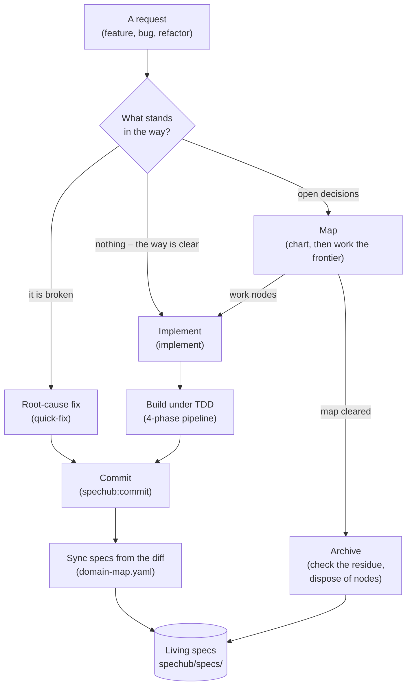
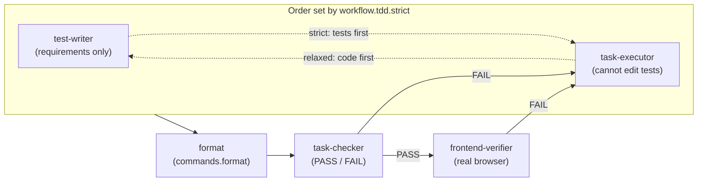

# SpecHub workflows

*Every request ends by updating the living specs. The requests differ only in how much fog stood in the way – fog being whatever nobody can state precisely yet.*

SpecHub is a workflow orchestrator. Planning structure grows only as far as the unknowns demand. A clear request goes straight to implementation. A broken thing gets root-cause discipline. Open decisions become a map, and you work that map frontier by frontier. The frontier is whatever part of the map is ready to work right now.

Archiving a map checks its residue first – the durable output an effort leaves behind, meaning spec updates, decision records and glossary entries. Everything else in this document is detail behind one of the boxes below.

| Step in the diagram   | Detail    |
| --------------------- | --------- |
| Map                   | section 1 |
| Implement             | section 2 |
| Grilling and records  | section 3 |
| Build under TDD       | section 4 |
| Commit **and** sync   | section 5 |
| Archive               | section 6 |
| Living specs          | section 7 |

The request box is a terminal, not a step. Section 5 covers two boxes because one command does both.

## 1. The map

*One node primitive replaces the fixed proposal / design / tasks ladder – the three-document pipeline earlier versions used. Nothing stores the map – it is queries over the nodes.*

A map is a set of small records called nodes. Each node is one question to settle or one piece of work to do.

`/spechub:map` is the entry point for planned work. If no map exists, it charts one. It opens with a grill – a round of questions – that fixes the destination and surfaces the fog. The destination is what finished looks like. If a map exists, `/spechub:map` works the frontier instead.

SpecHub never sorts requests into sizes, and nothing picks a different process for a big one. There is one path, and only the node count varies with the fog.

A node carries one of five statuses: `fog` (nobody can state it precisely yet), `open` (ready to settle), `claimed` (someone is working it), `resolved` (settled), `out-of-scope` (deliberately dropped). A node also carries a `mode`. `hitl` means a human settles it, and `afk` means an agent settles it alone. Two link types connect the nodes:

- `answers` – one provenance parent: the node whose resolution raised this one. The parent links form a tree. They give reading order, and let an agent package a handoff by walking that tree.
- `blocked-by` – any number of blocking edges: nodes that must resolve before this one can start. They form a directed acyclic graph, meaning the edges never loop back. These edges tell you what you can work right now.

SpecHub derives depth from `answers`, and nobody declares it. The map itself is five queries. The destination is the root node. Decisions so far are the `resolved` nodes in provenance order. The frontier is the `open` nodes with no unresolved blockers. Not-yet-specified is `fog`, and out-of-scope is `out-of-scope`.

Nodes live in a tracker – the storage layer, swappable, and required to provide only four operations: create, read, update, list. GitHub issues are first-class – its sub-issues carry the provenance parent, and its dependencies carry the blocking edges. Files under `spechub/maps/<name>/` are the fallback. Frontier, claim and resolve build on those four operations, so no tracker has to implement them.

**Progressive materialisation**: structure appears only when it has to persist, so you create a map only when the fog will outlive the session. You grill one question in conversation, and it leaves an architecture decision record (ADR), not a map.

## 2. Implement

*A unit of work carries its own size. One node is a quick change, forty is a long effort, and nothing declares which.*

`/spechub:implement` claims `afk` work nodes from the frontier when a map exists, and treats the request itself as the work item when none does. Either way, parallel explorer subagents run over the relevant code before anyone writes anything. The command resolves paths at claim time, because a node describes behaviour and can sit on the frontier for weeks.

The test-driven development (TDD) pipeline of section 4 runs to completion inside each claim. The node only ever moves `open -> claimed -> resolved`. If work stalls, the agent releases the claim, and the node is plainly open again. Progress is a frontier query, not a checkbox file – resuming never means re-reading an effort end to end.

`/spechub:quick-fix` stays separate. Broken is a different axis from foggy. A bug has a root cause to find, not a decision to settle, so `/spechub:quick-fix` never creates a node.

## 3. Grilling and durable records

*Three model-invoked primitives – skills the agent reaches for itself, not commands you type – carry the interviewing, the remembering and the writing.*

**`grilling`** works decisions in rounds. A round asks the whole frontier – every question whose prerequisites have resolved – numbered, each with a recommended answer, then recomputes and repeats. Facts are the agent's job, never the user's. The agent sends a question an environment fact would answer to explorer subagents instead. Presentation follows `workflow.grilling.questions` – the host's question tool by default, inline prose past 4 questions or for open questions. There is no question cap, because the frontier bounds itself.

**`record-context`** fires when a decision lands. It writes an ADR (`docs/adr/`) only when the decision is hard to reverse *and* surprising *and* a real trade-off. It writes a glossary term when a term got settled – root `CONTEXT.md` for cross-domain vocabulary, `spechub/specs/<domain>/CONTEXT.md` for domain terms. It can write both, or neither. SpecHub generates the ADR index from the files, and nobody hand-edits it.

**`writing`** holds the standard every durable artifact follows – node answers, ADRs, glossary entries, specs and handoffs – with the words to avoid in `skills/writing/vocabulary.md`.

## 4. Build under TDD

*Four phases with hard walls between them. The wall between phase 1 and phase 2 is the one that does the work.*

The separation is the mechanism, not a formality:

- **test-writer** sees requirements and acceptance criteria, and never the implementation plan. Tests encode what should happen, so the implementation cannot shape them.
- **task-executor** receives the failing tests and cannot modify anything in the test directory. It has to make the specification pass rather than edit it.
- **task-checker** is a binary gate. It runs the task's tests, then the full suite for regressions. It checks the test count against `.test-baseline` and audits mocks for circular assertions. It confirms the executor left the tests alone.
- **frontend-verifier** drives a real browser over the Chrome DevTools Protocol (CDP), takes before and after screenshots, and reports on the evidence.

A FAIL routes back to the executor with the reason. Phases 1 and 4 are conditional. You can skip test-writer for config or docs changes with no testable behaviour. The frontend-verifier runs only under three conditions: `spechub/project.yaml` configures a frontend, frontend files changed, and verification is on.

`workflow.tdd.strict: false` reverses phase 1 and phase 2. The order becomes task-executor, then test-writer, then task-checker. It drops no phase, and all three agents run. Relaxed TDD means nobody writes the tests first, never that the work goes unverified.

Relaxed weakens one wall, the one this section calls the important one. Under `false` the test-writer works beside an implementation it must not read, rather than one that does not exist yet. Its independence then rests on its instructions instead of on context isolation. That is the cost of relaxed TDD. The checker pays for it too. No run can show the new tests failing without the implementation, so it holds them to existing and passing instead.

Immediately before phase 3 the pipeline runs `commands.format` over the files the work touched. Under relaxed that puts the format step after the test-writer, so the new tests get formatted too. A project whose `commands.format` is `null` gets no format step. A non-zero exit gets reported, and never counts as a failed implementation.

## 5. Commit and sync specs

*Spec sync runs on every commit on every path. It reads the diff, so specs describe what you built rather than what you planned.*

`/spechub:commit` groups changes into MECE commits – mutually exclusive, collectively exhaustive, so no change appears twice and no change goes missing – then before writing them:

1. Reads `spechub/domain-map.yaml` to map each changed file to a domain.
2. For each affected domain that already has a `spec.md`, works out what the diff adds, modifies or removes.
3. Writes those entries into the domain's spec and stages them in the same commit.
4. Flags source files that match no domain.
5. Checks the glossaries. If the diff renames or deletes an identifier matching a glossary term, it says so. It never edits the glossary. For specs the code wins, and for the glossary the human wins.

Four cases stop sync: `workflow.spec_sync` set to `false`, no domain map, no file matching a domain, and a change that touches only docs and config.

**Without `spechub/domain-map.yaml` this step does nothing, silently.** `/spechub:setup` generates that file, and `spechub config check` reports it as missing on projects set up before that existed.

## 6. Archive

*A map is scaffolding. Archive checks that someone extracted the residue – the durable output, meaning spec updates, decision records and glossary entries – then disposes of the nodes.*

`/spechub:archive` checks for a cleared map – empty frontier, no fog, no claims. It spot-checks that living specs, ADRs and glossary entries captured what the effort settled. It then disposes of the nodes: it deletes them by default, or moves them to `spechub/archive/<date>-<name>/nodes/` when `workflow.maps.persist` is `true`. Keeping nodes is off by default, because a kept map is a second copy of every decision, and the two drift. On the GitHub tracker there is nothing to dispose – closed issues are already the archive.

Archive runs either way – the user types `/spechub:archive`, or `/spechub:map` hands off to it once the frontier empties. The disposal step asks first when the agent got there on its own.

Legacy `spechub/changes/` directories from the pre-map workflow still archive the old way, so an upgrade never strands work.

## 7. Living specs

*The durable output. Maps are scaffolding; `spechub/specs/` is what the project keeps.*

Specs live at `spechub/specs/<domain>/spec.md`, organised by the domains in `domain-map.yaml`, written as numbered functional requirements (`FR-NNN`) in Given/When/Then form. They are cumulative, and they describe only what the code already does. A roadmap item in a living spec is a bug in the spec.

Two rules keep them honest:

- **Two writers, one target**. Commit-time sync handles incremental change. Archive verifies a completed map left nothing behind. Both converge on the same files.
- **Fix it when you see it**. Any agent that finds a spec contradicting the code corrects the spec immediately. It rewrites wrong behaviour, appends missing requirements, and deletes stale references.

`/spechub:bootstrap` generates the first set from an existing codebase, so a project does not have to start from an empty directory.

## Design record

The reasoning behind this design – why one node type, why four tracker operations, why no tiers – lives in the issues labelled `wayfinder` on this repository. Each issue is one decision with the reasoning that produced it.
