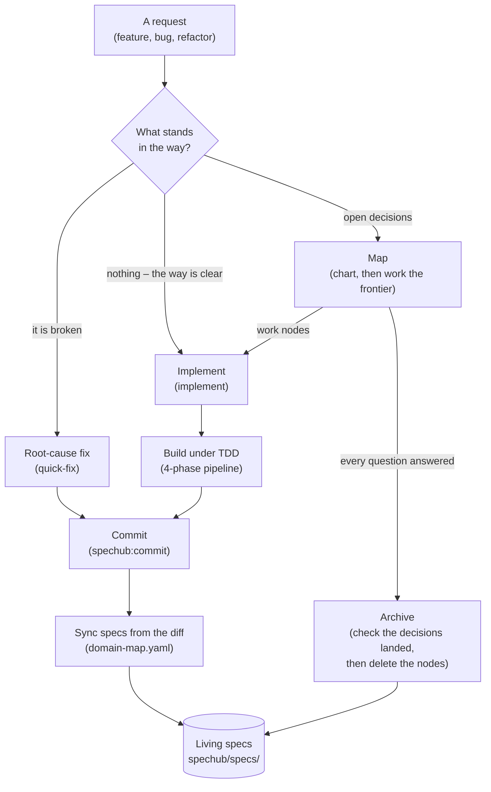
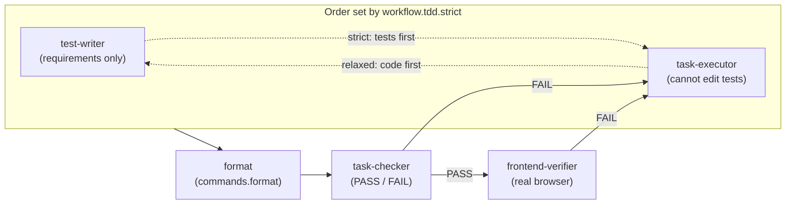

# SpecHub workflows

*Every request ends the same way, with your specs updated from the diff. What changes is how many questions you settle first.*

SpecHub routes a request down one of three paths. Every path ends at a commit that updates your specs.

- **The path depends on what is in your way**: nothing, a bug, or an unanswered question
- **A clear request goes straight to the four TDD agents** (see section 4)
- **A bug goes to root-cause analysis first** (see section 2)
- **A request with open questions becomes a to-do graph** you work through (see section 1)
- **The rest of this document** is the detail behind one box of the diagram below

| Step in the diagram   | Detail    |
| --------------------- | --------- |
| Map, the to-do graph  | section 1 |
| Implement             | section 2 |
| Asking and recording  | section 3 |
| Build under TDD       | section 4 |
| Commit **and** sync   | section 5 |
| Archive               | section 6 |
| Living specs          | section 7 |

The request box is a terminal, not a step. Section 5 covers two boxes because one command does both.

Section 8 describes this document. No box holds it.

## 1. The map, meaning the to-do graph

*One kind of record replaces the fixed proposal, design, and tasks pipeline earlier versions used. Nothing stores the map itself. It is queries over the nodes.*

- **A map** is a set of small records called nodes
- **A node** is one question to settle or one piece of work to do
- `/spechub:map` is the entry point for planned work
    - It charts a map when none exists, opening with a grill, a round of questions that fixes the destination and surfaces the fog
    - The destination is what finished looks like
    - It works the frontier instead when a map exists
- SpecHub never sorts requests into sizes
    - Nothing picks a different process for a big one
    - There is one path, and only the node count changes

A node carries one of five statuses.

| Status | What it means |
| --- | --- |
| `fog` | nobody can state it precisely yet |
| `open` | ready to settle |
| `claimed` | someone is working it |
| `resolved` | settled |
| `out-of-scope` | deliberately dropped |

A node carries a `mode` too. Two link types connect the nodes.

- **`mode`** says who settles the node: `hitl` for a human, `afk` for an agent alone
- **`answers`** names the one node whose answer raised this one
    - The parent links form a tree, which gives you a reading order
    - An agent packages a handoff by walking that tree
- **`blocked-by`** names any number of nodes that must resolve before this one starts
    - The blocking edges form a directed acyclic graph, meaning the edges never loop back
    - These edges tell you what you can work right now

SpecHub works depth out from `answers`. Nobody declares it. The map itself is five queries.

| The question | The query |
| --- | --- |
| Where are we going? | the root node |
| What have we decided? | the `resolved` nodes, in the order the decisions happened |
| What can we work now? | the `open` nodes with no unresolved blockers |
| What is not yet specified? | the `fog` nodes |
| What did we drop? | the `out-of-scope` nodes |

Nodes live in a tracker. That is the storage layer, and you can swap it.

- A tracker provides four operations and nothing more: create, read, update, list
- GitHub issues are the default
    - A sub-issue records what raised a node
    - A dependency records what must finish first
- Files under `spechub/maps/<name>/` are the fallback
- Frontier, claim, and resolve build on those four operations
    - No tracker implements them itself

**Build no more process than the job needs.**

- You create a map only when the fog will outlive the session
- You settle one question in conversation
    - That leaves an architecture decision record (ADR), not a map

## 2. Implement

*A unit of work carries its own size. One node is a quick change.*

*Forty is a long effort. Nothing declares which.*

- `/spechub:implement` claims `afk` work nodes from the frontier when a map exists
    - It treats the request itself as the work item when none does
    - Either way, parallel explorer subagents run over the relevant code before anyone writes anything
- The command resolves paths at claim time
    - A node describes behaviour
    - It can sit unstarted for weeks
- The test-driven development (TDD) pipeline of section 4 runs to completion inside each claim
- A node only ever moves `open -> claimed -> resolved`
    - The agent releases the claim when work stalls
    - The node is plainly open again
- Progress is a query, not a checkbox file
    - Resuming never means re-reading an effort end to end

`/spechub:quick-fix` stays separate. A broken thing is a different problem from an unanswered question.

- A bug has a root cause to find, not a decision to settle
- `/spechub:quick-fix` therefore never creates a node

## 3. Asking the questions, and writing the answers down

*Three skills Claude reaches for itself, without you typing a command, carry the interviewing, the recording, and the writing.*

- **`grilling`** is the interview
    - It works through your decisions one round at a time
    - A round asks the whole frontier, every question whose prerequisites have resolved, numbered, each with a recommended answer
    - It then recomputes the frontier and repeats
    - Facts are the agent's job, never yours
    - It sends any question a look at the environment would answer to a subagent instead
    - Presentation follows `workflow.grilling.questions`, the host's question tool by default
    - It falls back to inline prose past 4 questions, or for a question with no discrete options
    - There is no question cap
    - The set of answerable questions bounds itself
- **`record-context`** fires when a decision lands
    - It writes an ADR under `docs/adr/` only when the decision is hard to reverse *and* surprising *and* a real trade-off
    - It writes a glossary term when a term got settled, in root `CONTEXT.md` for cross-domain vocabulary
    - It writes a domain term in `spechub/specs/<domain>/CONTEXT.md` instead
    - It can write both, or neither
    - SpecHub generates the ADR index from the files
    - Nobody hand-edits it
- **`writing`** holds the standard every durable artifact follows: node answers, ADRs, glossary entries, specs and handoffs
    - The words to avoid live in `skills/writing/vocabulary.md`

## 4. Build under TDD

*Four agents run in order. The rule that does the work: the test-writer never sees the implementation.*

The separation is the mechanism, not a formality.

- **test-writer** sees requirements and acceptance criteria, never the implementation plan
    - Tests then encode what should happen
    - The implementation cannot shape them
- **task-executor** receives the failing tests and cannot modify anything in the test directory
    - It has to make the specification pass instead of editing it
- **task-checker** is a binary gate
    - It runs the task's tests, then the full suite for regressions
    - It checks the test count against `.test-baseline` and audits mocks for circular assertions
    - It confirms the executor left the tests alone
- **frontend-verifier** drives a real browser over the Chrome DevTools Protocol (CDP)
    - It takes before and after screenshots
    - It reports on that evidence

Which phases run, and in what order:

- A FAIL routes back to the executor with the reason
- Phases 1 and 4 are conditional
    - You can skip test-writer for a config or docs change with no testable behaviour
    - The frontend-verifier runs under three conditions: `spechub/project.yaml` configures a frontend, frontend files changed, and verification is on
- `workflow.tdd.strict: false` reverses phase 1 and phase 2
    - The order becomes task-executor, then test-writer, then task-checker
    - It drops no phase
    - All three agents run
    - Relaxed TDD means nobody writes the tests first, never that the work goes unverified

Relaxed weakens one wall, the one this section calls the important one.

- Under `false` the test-writer works beside an implementation it must not read, instead of one that does not exist yet
- Its independence then rests on its instructions rather than on context isolation
- That is the cost of relaxed TDD
- The checker pays for it too
    - No run can show the new tests failing without the implementation
    - It holds them to existing and passing instead

The format step sits immediately before phase 3.

- The pipeline runs `commands.format` over the files the work touched
- Under relaxed that puts the format step after the test-writer
    - The new tests get formatted too
- A project whose `commands.format` is `null` gets no format step
- A non-zero exit gets reported
    - It never counts as a failed implementation

## 5. Commit and sync specs

*Spec sync runs on every commit on every path. It reads the diff. Your specs therefore describe what you built, not what you planned.*

`/spechub:commit` groups changes into MECE commits. MECE means mutually exclusive and collectively exhaustive: no change appears twice, and no change goes missing. Before writing them it does five things.

1. Reads `spechub/domain-map.yaml` to map each changed file to a domain.
2. Works out what the diff adds, modifies or removes, for each affected domain with a `spec.md`.
3. Writes those entries into the domain's spec and stages them in the same commit.
4. Flags source files that match no domain.
5. Checks the glossaries.

On the glossary check:

- It says so when the diff renames or deletes an identifier matching a glossary term
- It never edits the glossary
- For specs the code wins
- For the glossary the human wins

Four cases stop sync.

- `workflow.spec_sync` set to `false`
- no domain map
- no file matching a domain
- a change that touches only docs and config

**Without `spechub/domain-map.yaml` this step does nothing, silently.**

- `/spechub:setup` generates that file
- `spechub config check` reports it as missing on a project set up before that existed

## 6. Archive

*A map is working state, not a record you keep. Archive checks the decisions reached your specs, your decision notes, and your glossary, then deletes the nodes.*

- `/spechub:archive` checks for a cleared map: empty frontier, no fog, no claims
- It spot-checks that the specs, the decision notes and the glossary captured what the effort settled
- It then disposes of the nodes
    - It deletes them by default
    - It moves them to `spechub/archive/<date>-<name>/nodes/` when `workflow.maps.persist` is `true`
    - Keeping nodes is off by default
    - A kept map is a second copy of every decision
    - The two drift apart
    - On the GitHub tracker there is nothing to dispose
    - A closed issue is already the archive
- Archive runs either way
    - The user types `/spechub:archive`
    - `/spechub:map` hands off to it once every node resolves
    - The disposal step then asks you first
- Legacy `spechub/changes/` directories from the pre-map workflow still archive the old way
    - An upgrade therefore never strands work

## 7. Living specs

*What the project keeps. SpecHub deletes a map once every question resolves. `spechub/specs/` outlives it.*

- Specs live at `spechub/specs/<domain>/spec.md`, organised by the domains in `domain-map.yaml`
- Each spec states numbered functional requirements (`FR-NNN`) in Given, When, Then form
- They are cumulative
- They describe only what the code already does
- A roadmap item in a living spec is a bug in the spec

Two rules keep them honest.

- **Two writers, one target**
    - Commit-time sync handles incremental change
    - Archive verifies a completed map left nothing behind
    - Both converge on the same files
- **Fix it when you see it**
    - Any agent that finds a spec contradicting the code corrects the spec immediately
    - It rewrites wrong behaviour, appends missing requirements, and deletes stale references

`/spechub:bootstrap` generates the first set from an existing codebase. A project never starts from an empty directory.

## 8. Where the design record lives

*This section describes the document, not the system. No diagram box holds it.*

- The reasoning behind this design lives in the issues labelled `wayfinder` on this repository
- That covers why one node type, why four tracker operations, and why no tiers
- Each issue is one decision with the reasoning that produced it
