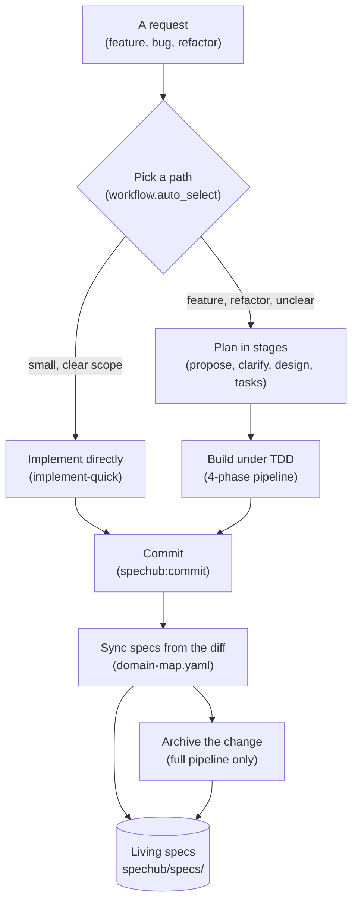
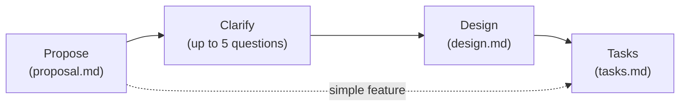
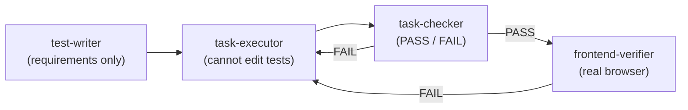

# SpecHub workflows

*Every request takes one of two paths, and both end by updating the living specs – the difference is only how much planning happens first.*

SpecHub is a workflow orchestrator: it decides how much ceremony a change deserves, then delegates the work to specialised agents. The cost of getting that decision wrong is real in both directions, so the routing rule and the two paths are the first thing to understand. Everything else in this document is detail behind one of the boxes below.

| Step in the diagram          | Detail    |
| ---------------------------- | --------- |
| Pick a path                  | section 1 |
| Implement directly           | section 2 |
| Plan in stages               | section 3 |
| Build under TDD              | section 4 |
| Commit **and** sync specs    | section 5 |
| Archive                      | section 6 |
| Living specs                 | section 7 |

The request box is a terminal, not a step. Section 8 is about this document rather
than the system. Section 5 covers two boxes because one command does both.

## 1. Pick a path

*Two paths exist because planning a typo wastes a day and building a feature blind wastes a week. The router is one config flag.*

When `workflow.auto_select` is `true` in `spechub/project.yaml`, the orchestrator judges the request and says which path it picked and why. When `false`, everything takes the full pipeline.

| Path          | Use for                                                       |
| ------------- | ------------------------------------------------------------- |
| Quick         | bug fixes, typos, config tweaks, small isolated changes        |
| Full pipeline | features, refactors, multi-file changes, unclear requirements  |

The deciding question is whether the scope is unambiguous. A one-line fix with a clear cause is quick; a one-line fix nobody can explain is not.

## 2. Implement directly

*The quick path skips planning artifacts and the TDD pipeline, but never skips spec sync.*

`/spechub:implement-quick` analyses before it writes. Three explorer subagents run in parallel over the relevant code, and only then does implementation start – the point is that a short path is not an unresearched one.

Nothing is written to `spechub/changes/`. There is no proposal, no task list, and no archive step. Specs still update, because that happens at commit time for every path (section 5).

`/spechub:quick-fix` is the variant for something broken rather than something small. It forces root-cause analysis before any edit, on the grounds that a fix for a misunderstood cause is a new bug.

## 3. Plan in stages

*Four skills, each producing one artifact, each able to stop the sequence when it exposes a problem.*

| Skill                | Produces                                                    |
| -------------------- | ----------------------------------------------------------- |
| `/spechub:propose`   | `proposal.md` – user stories at P1/P2/P3, after codebase exploration |
| `/spechub:clarify`   | a `## Clarifications` section, one question at a time, each with a recommended answer |
| `/spechub:design`    | `design.md` – architecture and technical approach            |
| `/spechub:tasks`     | `tasks.md` – dependency-ordered, checkbox tracked            |

All four write into `spechub/changes/<change-name>/`. `design` is skippable for a simple feature – `tasks` can follow `propose` directly. `clarify` is the one to add when requirements are vague rather than merely large.

The orchestrator is told planning and verification should take roughly four times the effort of implementation, on the reasoning that subagents lack full context and are confidently wrong more often than they are stuck.

## 4. Build under TDD

*Four phases with hard walls between them. The wall between phase 1 and phase 2 is the one that does the work.*

The separation is the mechanism, not a formality:

- **test-writer** sees requirements and acceptance criteria, and never the implementation plan. Tests encode what should happen, so they cannot be shaped by how it was built
- **task-executor** receives the failing tests and cannot modify anything in the test directory. It has to make the specification pass rather than edit it
- **task-checker** is a binary gate. It runs the task's tests, the full suite for regressions, checks the test count against `.test-baseline`, audits mocks for circular assertions, and confirms the executor left the tests alone
- **frontend-verifier** drives a real browser over CDP, takes before and after screenshots, and reports on the evidence

A FAIL routes back to the executor with the reason. Phases 1 and 4 are conditional: test-writer is skippable for config or docs changes with no testable behaviour, and frontend-verifier runs only when a frontend is configured, frontend files changed, and verification is enabled.

## 5. Commit and sync specs

*Spec sync runs on every commit on every path. It reads the diff, so specs describe what was built rather than what was planned.*

`/spechub:commit` groups changes into MECE commits, then before writing them:

1. Reads `spechub/domain-map.yaml` to map each changed file to a domain
2. For each affected domain that already has a `spec.md`, works out what the diff adds, modifies or removes
3. Writes those entries into the domain's spec and stages them in the same commit
4. Flags source files that match no domain

Sync is skipped when `workflow.spec_sync` is `false`, when no domain map exists, when nothing matches a domain, or when the change is docs and config only.

**Without `spechub/domain-map.yaml` this step does nothing, silently.** That file is generated by `/spechub:init`, and `/spechub:config check` reports it as missing on projects initialised before that existed.

## 6. Archive

*Full pipeline only. Folds the change's deltas into the living specs and clears the working directory.*

`/spechub:archive` reads the completed change, applies its ADDED, MODIFIED and REMOVED entries to each affected domain spec, writes a `delta.md` into `spechub/archive/<date>-<change-name>/`, and removes the change from `spechub/changes/`.

The quick path has no archive step because it produced no change directory. Its specs were already updated at commit time.

## 7. Living specs

*The durable output. Everything in `spechub/changes/` is scaffolding; `spechub/specs/` is what the project keeps.*

Specs live at `spechub/specs/<domain>/spec.md`, organised by the domains in `domain-map.yaml`, written as `FR-NNN` requirements in Given/When/Then form. They are cumulative and describe only what is implemented – a roadmap item in a living spec is a bug in the spec.

Two rules keep them honest:

- **Two writers, one target.** Commit-time sync handles incremental change; archive handles a completed pipeline. Both write the same files
- **Fix it when you see it.** Any agent that finds a spec contradicting the code corrects the spec immediately – wrong behaviour gets rewritten, missing requirements get appended, stale references get deleted

`/spechub:bootstrap` generates the first set from an existing codebase, so a project does not have to start from an empty directory.

## 8. Where this document goes next

*This describes what ships today. A redesign in progress replaces sections 1 through 3.*

The design record under `docs/maps/wayfinder-unification/` replaces the fixed proposal, design and tasks sequence with a single node type, and removes the path decision in section 1 entirely. Sections 4 through 7 are largely unaffected – the TDD pipeline, spec sync and living specs survive.

This document deliberately describes current behaviour rather than the plan, on the same principle the living specs follow: document what is implemented, never the roadmap.
