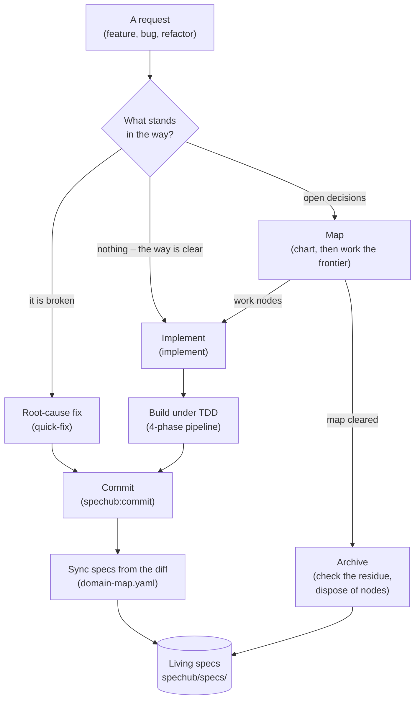
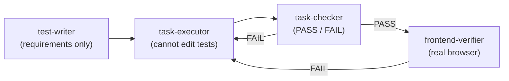

# SpecHub workflows

*Every request ends by updating the living specs – the difference is only how much fog (what cannot yet be stated precisely) stood in the way.*

SpecHub is a workflow orchestrator. Planning structure grows only as far as the unknowns demand: a clear request is implemented directly, a broken thing gets root-cause discipline, and open decisions become a map that is worked frontier by frontier – the frontier being whatever part of the map is ready to work right now. Archiving a map checks its residue first: the durable output an effort leaves behind, meaning spec updates, decision records and glossary entries. Everything else in this document is detail behind one of the boxes below.

| Step in the diagram   | Detail    |
| --------------------- | --------- |
| Map                   | section 1 |
| Implement             | section 2 |
| Grilling and records  | section 3 |
| Build under TDD       | section 4 |
| Commit **and** sync   | section 5 |
| Archive               | section 6 |
| Living specs          | section 7 |

The request box is a terminal, not a step. Section 5 covers two boxes because one command does both.

## 1. The map

*One node primitive replaces the fixed proposal / design / tasks ladder – the three-document pipeline earlier versions used. The map is never stored – it is queries over the nodes.*

A map is a set of small records called nodes. Each node is one question to settle or one piece of work to do.

`/spechub:map` is the entry point for planned work. If no map exists it charts one: an opening grill – a round of questions – that fixes the destination (what finished looks like) and surfaces the fog. If a map exists, it works the frontier instead. Requests are never sorted into sizes, and there is nothing that picks a different process for a big one. There is one path, and the only thing that varies is how many nodes the fog produced.

A node carries five statuses – `fog` (cannot be stated precisely yet), `open` (ready to settle), `claimed` (being worked), `resolved` (settled), `out-of-scope` (deliberately dropped) – a `mode` (`hitl` – a human settles it – or `afk` – an agent alone), and two link types:

- `answers` – one provenance parent: the node whose resolution raised this one. The parent links form a tree. They give reading order, and let a handoff be packaged by walking that tree.
- `blocked-by` – any number of blocking edges: nodes that must resolve before this one can start. They form a directed acyclic graph, meaning the edges never loop back. These edges tell you what can be worked right now.

Depth is derived from `answers`, never declared. The map itself is five queries: the destination is the root node, decisions so far are `resolved` in provenance order, the frontier is `open` with no unresolved blockers, not-yet-specified is `fog`, and out-of-scope is `out-of-scope`.

Nodes live in a tracker – the storage layer, swappable, and required to provide only four operations: create, read, update, list. GitHub issues are first-class (its sub-issues carry the provenance parent, its dependencies carry the blocking edges); files under `spechub/maps/<name>/` are the fallback. Frontier, claim and resolve are built on those four operations, so no tracker has to implement them.

**Progressive materialisation**: structure appears only when it has to persist, so a map is created only when the fog will outlive the session. One question is grilled in conversation and leaves an architecture decision record (ADR), not a map.

## 2. Implement

*A unit of work carries its own size. One node is a quick change, forty is a long effort, and nothing declares which.*

`/spechub:implement` claims `afk` work nodes from the frontier when a map exists, and treats the request itself as the work item when none does. Either way, parallel explorer subagents run over the relevant code before anything is written – paths are resolved at claim time, because a node describes behaviour and can sit on the frontier for weeks.

The TDD pipeline (section 4) runs to completion inside each claim. The node only ever moves `open -> claimed -> resolved`; if work stalls, the claim is released and the node is plainly open again. Progress is a frontier query, not a checkbox file – resuming never means re-reading an effort end to end.

`/spechub:quick-fix` stays separate. Broken is a different axis from foggy: a bug has a root cause to find, not a decision to settle, so it never creates a node.

## 3. Grilling and durable records

*Three model-invoked primitives – skills the agent reaches for itself, not commands you type – carry the interviewing, the remembering and the writing.*

**`grilling`** works decisions in rounds. A round asks the whole frontier – every question whose prerequisites are settled – numbered, each with a recommended answer, then recomputes and repeats. Facts are the agent's job, never the user's: a question an environment fact would answer is dispatched to explorer subagents instead. Presentation follows `workflow.grilling.questions` (the host's question tool by default, inline prose past 4 questions or for open questions), and there is no question cap – the frontier bounds itself.

**`record-context`** fires when a decision lands. It writes an ADR (`docs/adr/`) only when the decision is hard to reverse *and* surprising *and* a real trade-off; a glossary term (root `CONTEXT.md` for cross-domain vocabulary, `spechub/specs/<domain>/CONTEXT.md` for domain terms) when a term got settled; both, or neither. The ADR index is generated from the files, never hand-edited.

**`writing`** holds the standard every durable artifact follows – node answers, ADRs, glossary entries, specs and handoffs – with the words to avoid in `skills/writing/vocabulary.md`.

## 4. Build under TDD

*Four phases with hard walls between them. The wall between phase 1 and phase 2 is the one that does the work.*

The separation is the mechanism, not a formality:

- **test-writer** sees requirements and acceptance criteria, and never the implementation plan. Tests encode what should happen, so they cannot be shaped by how it was built
- **task-executor** receives the failing tests and cannot modify anything in the test directory. It has to make the specification pass rather than edit it
- **task-checker** is a binary gate. It runs the task's tests, the full suite for regressions, checks the test count against `.test-baseline`, audits mocks for circular assertions, and confirms the executor left the tests alone
- **frontend-verifier** drives a real browser over CDP, takes before and after screenshots, and reports on the evidence

A FAIL routes back to the executor with the reason. Phases 1 and 4 are conditional: test-writer is skippable for config or docs changes with no testable behaviour, and frontend-verifier runs only when a frontend is configured, frontend files changed, and verification is enabled.

## 5. Commit and sync specs

*Spec sync runs on every commit on every path. It reads the diff, so specs describe what was built rather than what was planned.*

`/spechub:commit` groups changes into MECE commits – mutually exclusive, collectively exhaustive, so no change appears twice and none is left out – then before writing them:

1. Reads `spechub/domain-map.yaml` to map each changed file to a domain
2. For each affected domain that already has a `spec.md`, works out what the diff adds, modifies or removes
3. Writes those entries into the domain's spec and stages them in the same commit
4. Flags source files that match no domain
5. Checks the glossaries: if the diff renames or deletes an identifier matching a glossary term, it says so – and never edits the glossary. For specs the code wins; for the glossary the human wins

Sync is skipped when `workflow.spec_sync` is `false`, when no domain map exists, when nothing matches a domain, or when the change is docs and config only.

**Without `spechub/domain-map.yaml` this step does nothing, silently.** That file is generated by `/spechub:init`, and `/spechub:config check` reports it as missing on projects initialised before that existed.

## 6. Archive

*A map is scaffolding. Archive verifies the residue – the durable output: spec updates, decision records, glossary entries – was extracted, then disposes of the nodes.*

`/spechub:archive` checks the map is cleared (empty frontier, no fog, no claims), spot-checks that living specs, ADRs and glossary entries captured what the effort settled, then disposes of the nodes: deleted by default, or moved to `spechub/archive/<date>-<name>/nodes/` when `workflow.maps.persist` is `true`. Keeping nodes is off by default because a kept map is a second copy of every decision, and the two drift. On the GitHub tracker there is nothing to dispose – closed issues are already the archive.

Archive runs either way – the user types `/spechub:archive`, or `/spechub:map` hands off to it once the frontier empties. The disposal step asks first when the agent got there on its own.

Legacy `spechub/changes/` directories from the pre-map workflow still archive the old way, so an upgrade never strands work.

## 7. Living specs

*The durable output. Maps are scaffolding; `spechub/specs/` is what the project keeps.*

Specs live at `spechub/specs/<domain>/spec.md`, organised by the domains in `domain-map.yaml`, written as numbered functional requirements (`FR-NNN`) in Given/When/Then form. They are cumulative and describe only what is implemented – a roadmap item in a living spec is a bug in the spec.

Two rules keep them honest:

- **Two writers, one target.** Commit-time sync handles incremental change; archive verifies a completed map left nothing behind. Both converge on the same files
- **Fix it when you see it.** Any agent that finds a spec contradicting the code corrects the spec immediately – wrong behaviour gets rewritten, missing requirements get appended, stale references get deleted

`/spechub:bootstrap` generates the first set from an existing codebase, so a project does not have to start from an empty directory.

## Design record

The reasoning behind this design – why one node type, why four tracker operations, why no tiers – lives in the issues labelled `wayfinder` on this repository. Each issue is one decision with the reasoning that produced it.
