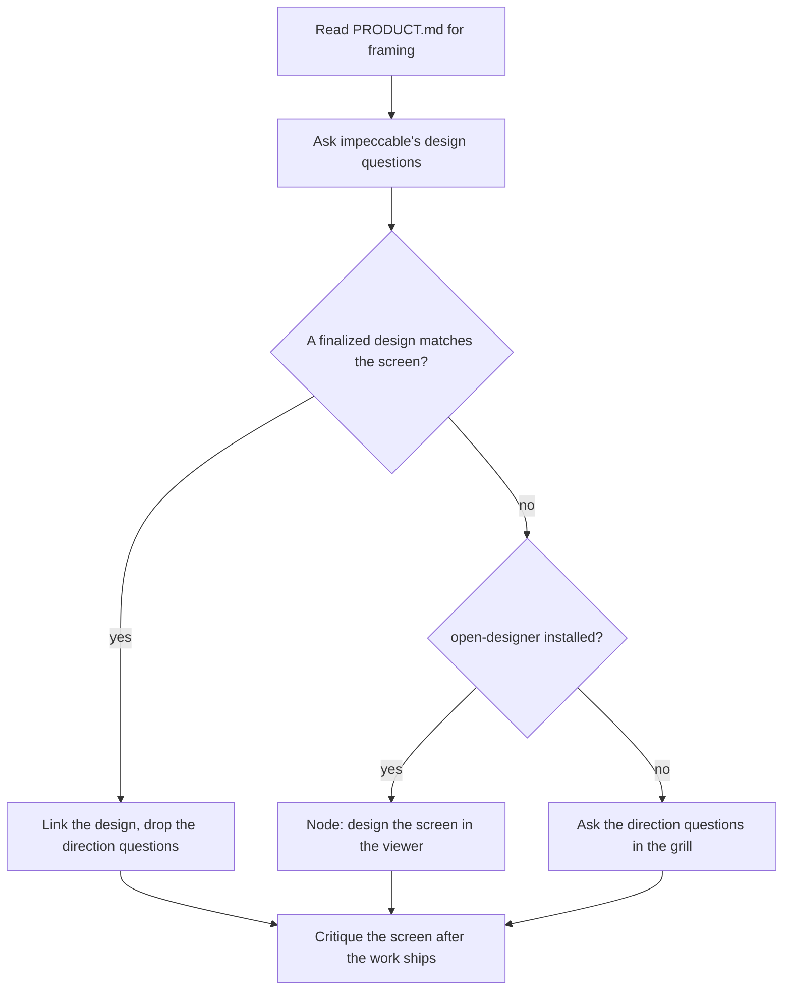

# Frontend destinations

A map whose destination changes the frontend carries five rules that no other
map loads, and this file holds all five.

`SKILL.md` decides when to read this file. The destination has to touch
`frontend.directory`, the path in `spechub/project.yaml` where the frontend
lives.

Two plugins appear in the rules below.

- **impeccable** reviews a shipped user interface against the product's own
  design rules
- **open-designer** writes a design a human can look at before anyone builds it

SpecHub needs neither. Each rule below says which plugin it needs, and what
happens when that plugin is absent.

The diagram names the direction questions, meaning the ones a finished design
answers by existing.



## Read PRODUCT.md before the opening grill

`PRODUCT.md` is impeccable's product brief. It states the product's users, its
purpose, and its positioning. impeccable's `init` playbook writes it, and
SpecHub never writes it.

- **Read it before the opening grill** when the file exists, and read it for
  framing alone
- **Never ask the user anything the file already states**
- **Look in impeccable's own resolution order** – `PRODUCT.md`, then
  `Product.md`, then `product.md`, at the project root
    - When the root holds none, impeccable also checks `.agents/context/` and
      `docs/`
- **Ask the map's own questions when no `PRODUCT.md` exists**, and carry on
- **This rule needs no plugin installed**, because reading a file needs nothing
  running

The resolution order comes from impeccable 4.2.0.

## Ask impeccable's design questions

Every frontend destination surfaces the same questions, and impeccable already
wrote them. Charting copies them into `hitl` question nodes during the opening
grill. A `hitl` node is one a human answers.

**SpecHub never runs `/impeccable shape`.** It copies the questions. That is
what keeps the map working when impeccable is absent. This rule needs no
plugin installed.

The questions come from impeccable's `shape` playbook, version 4.2.0, at
`reference/shape.md` inside the impeccable plugin.

**Purpose, people, outcome** is impeccable's first shape round.

- "What is this surface or feature for, and what problem must it solve?"
- "Who specifically reaches it, in what situation and state of mind?"
- "What is the primary thing they must understand or do? What would success look like?"
- "What is uniquely true here that a neighboring product or generic template could not claim?"

**Material, behavior, boundaries** is impeccable's second shape round.
impeccable asks it only when a material decision is still open.

- "What real content, evidence, data, and assets must the experience carry? What are realistic minimum, typical, and maximum ranges?"
- "Which states and transitions matter: first-run, empty, loading, error, success, permissions, overflow, or expert use?"
- "What is the intended fidelity, breadth, and interactivity: exploration, production-ready screen, full flow, or broader surface?"
- "What must remain untouched? What would make the result feel wrong even if it looked polished?"
- "Which platform, framework, performance, accessibility, localization, or delivery constraints are binding?"

**The visual world** adds one more question. It comes from impeccable's
`new-work.md` rather than from `shape.md`, because impeccable resolves the
design direction in a later phase. SpecHub words the question itself, since
impeccable does not state it as one line.

- Does this screen inherit the product's existing visual world, extend it, or
  replace it?

### Two groups of questions

Two rules below act on these groups.

- **The direction questions** are the visual world question, and "What is the
  intended fidelity, breadth, and interactivity"
    - A design answers both by existing
- **The states questions** are "Which states and transitions matter" and the
  content-and-ranges question
    - A design answers neither

Two rules govern how you ask.

- **Skip any question `PRODUCT.md` already answers**, since the file states the
  users, the purpose, and the positioning
- **Ask 2 to 3 related questions per round**, which is impeccable's own cadence
    - Never dump the whole set at once

## Link a finalized design instead of asking direction

An open-designer design is a set of standalone HTML pages a human picks
between. A finalized page is one the human chose.

Designs live under `.open-designer/designs/<name>/`, one directory per design,
each holding an `index.json`. `index.json` finalizes a page by holding an
entry at `chosen.pages[<page id>]`. Nothing else marks it – there is no status
field and no finalized flag.

```bash
jq -r '.chosen.pages // {} | keys[]' .open-designer/designs/<name>/index.json
```

- **`chosen.pages` is an object keyed by page id**, and each value is an object
  holding `variantId`, `tweaks`, and an optional `state`
- **A design finalizes one page at a time**, so each finalized page needs its
  own key in `chosen.pages`
- **An `index.json` carrying `chosen.variantId` and no `chosen.pages` is the old
  single-page shape**, which finalizes that design's one page

`index.json` gives a page two names. `id` is the name the design's author typed,
and `label` is an optional human-readable name.

- **Match the destination against both**, since every page carries an `id` and
  only some carry a `label`
- **Ask in the grill when the match is unclear**, and offer the finalized pages
  as the options
- **Ask when two pages match**, and never pick one
- **Treat no match as no finalized design**, which sends charting to the viewer
  rule below

A match changes two things about the destination.

- **Drop the direction questions**, since the chosen page already answers them
- **Name the design in the destination node** by its `index.json` path and its
  page id

Keep the states questions either way. A finalized page shows one state of one
screen, and the map still needs the rest.

This rule needs no plugin installed, because a finalized design is a file on
disk. The layout comes from open-designer 0.7.4.

## Send the human to the viewer when no design exists

With no finalized design and open-designer installed, charting creates one
`hitl` node that sends a human to the viewer.

open-designer registers a key in `~/.claude/plugins/installed_plugins.json`
that starts with `open-designer@`. Check for that key.

```bash
grep -q '"open-designer@' ~/.claude/plugins/installed_plugins.json
```

The registry key is `<plugin>@<marketplace>`. The marketplace half is wherever
the user installed from, so match the half before the `@` alone.

Four rules shape the viewer node.

- **Its `kind` is `work` and its `mode` is `hitl`**, so it carries no `afk`
  label
- **Its title says what the human does** – design the screen in the viewer
- **Its body names the command**, `/open-designer:design`
- **Every direction question is `blocked-by` that node**, since the design
  answers them
    - `trackers/github.md` and `trackers/files.md` hold how each backend writes
      `blocked-by`

The states questions carry no blocker, because a human can answer them while the
design is still open.

With open-designer absent, create no viewer node. The direction questions stay
open and the grill asks them.

## Critique the screen after the work ships

Every resolved work node that changed the frontend gets one `hitl` node that
critiques the shipped screen.

**This rule needs the design gate on.** The design gate is the set of design
checks impeccable adds to SpecHub's pipeline. One command answers whether it is
on.

```bash
~/.claude/spechub/bin/spechub design-gate
```

It prints `on` and exits 0, or prints `off: <reason>` and exits 1. On `off`,
create no critique node.

Three rules shape the critique node.

- **Its `kind` is `research` and its `mode` is `hitl`**, because its output is
  findings and a human runs it
- **Its body names the command**, `/impeccable critique <the screen>`
- **It `answers` the work node that shipped the screen**

The round after the critique resolves runs on the report.

- **`/impeccable critique` closes its report with recommended `/impeccable
  <verb>` commands**, and those commands become the options in the next grill
  round
- **impeccable's critique recommends only from its own list**
    - `adapt`, `animate`, `audit`, `bolder`, `clarify`, `colorize`, `critique`,
      `delight`, `distill`, `document`, `harden`, `layout`, `onboard`,
      `optimize`, `overdrive`, `polish`, `quieter`, `shape`, and `typeset`
- **A human picks the command, never an agent** – every command that changes
  what the screen is trying to be waits for a grill round
    - Those commands are `adapt`, `animate`, `bolder`, `clarify`, `colorize`,
      `delight`, `distill`, `harden`, `live`, `onboard`, `overdrive`, and
      `quieter`
    - `live` is one critique never recommends, and a human can still pick it
- **A chosen command becomes one work node that runs it**
- **That node is `afk`**, meaning an agent settles it alone, because the human
  already made the decision

The command list comes from impeccable 4.2.0.
