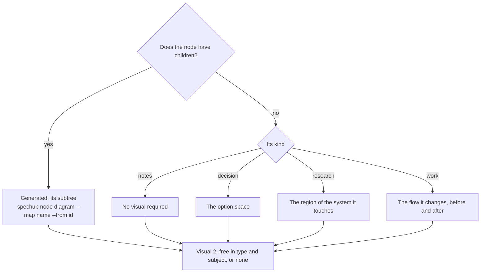
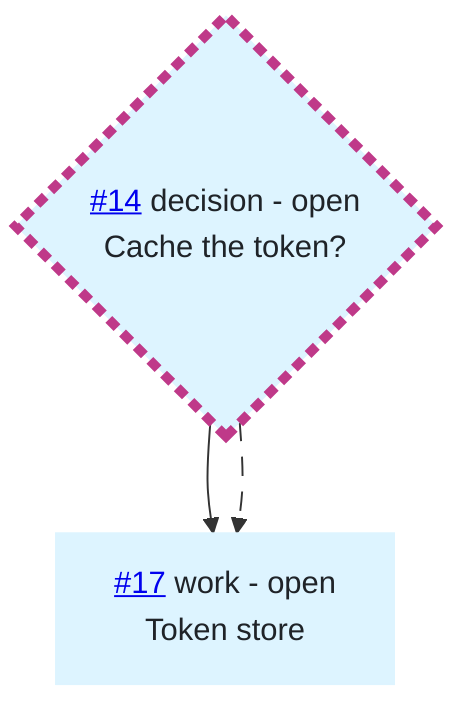
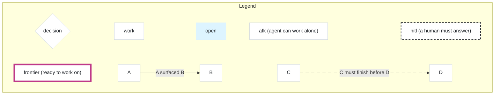
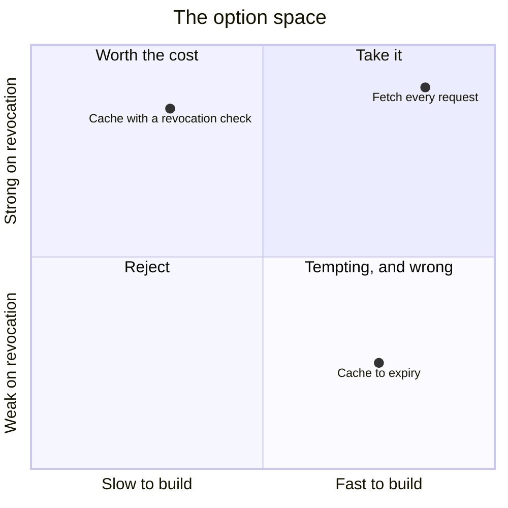

# Visuals

Every map node explains itself with a diagram, two at most. A childless
`notes` node is the one exception.

Read this file at three moments: when you materialise a map, when a `fog` node
graduates to `open`, and at every resolution. `SKILL.md` owns the map. This file
owns what sits in a node body below the node's statement.

## Which visual a node gets



Visual 1 is the node's own explanation of itself. Read the diagram top down to
find it.

| kind | Visual 1 | Author |
| --- | --- | --- |
| `destination` | the whole map, resolved subtrees collapsed | generated |
| `notes` | exempt | none |
| `decision` | the option space, often a `quadrantChart` | you |
| `research` | the region of the system the question touches | you |
| `work` | the flow the change alters, before and after | you |

Four rules sit on top of that table:

- **A node with children leads with its subtree**, whatever its kind, so
  `spechub node diagram --map <name> --from <id>` writes visual 1 and your own
  diagram moves to slot 2
    - The github backend pipes `gh issue list` in and passes `--stdin` instead
    - `SKILL.md` holds both commands in full
- **Two visuals is the cap**, so a node that gains a child can lose its second
  visual
- **A `notes` node is exempt**, since a standing preference such as "en dashes,
  never em dashes" has no shape
- **Draw one on a `notes` node anyway** where it genuinely helps, in any diagram
  type

A `fog` node is not exempt. It is the node a reader can least read, so its
diagram carries the most: draw the region you cannot yet state a question about.

## Where visuals sit in the body

A node body has five parts, in this order:

1. The header line, on GitHub only
2. The node's statement, in prose
3. The generated block, wrapped in its two markers
4. Your hand-drawn visual
5. `## Answer`, appended when the node resolves

```
<!-- spechub:diagram -->
...two mermaid fences...
<!-- /spechub:diagram -->
```

- **The markers hold generated content only**, so a regeneration never touches a
  word a human wrote
- **The generated block sits above everything a resolution writes**, because
  `--append-body` writes `## Answer` to the end and can then never collide with
  it
- **The files backend body starts at part 2**, since the CLI owns the
  frontmatter and the title heading
    - `--body` and `--append-body` never reach either one
    - Writing the fields into the body duplicates what every query reads
- **A node with no generated diagram carries no markers**, since an empty marker
  block is noise
- **A marker inside a code fence is an example, never a diagram**, so match
  only a top-level pair
    - A body that documents the markers carries a second pair inside a fence
    - A naive search-and-replace corrupts that body
    - Insert a fresh pair directly below the statement when the body holds no
      top-level pair

## The four channels a diagram draws with

| Channel | Carries | Values |
| --- | --- | --- |
| shape | `kind` | `{{destination}}`, `[[notes]]`, `{decision}`, `([research])`, `[work]` |
| fill | `status` | fog `#f6f8fa`, open `#ddf4ff`, claimed `#fff8c5`, resolved `#dafbe1`, out-of-scope `#ffebe9` |
| stroke | the frontier and `hitl` | see the precedence below |
| label text | id, kind, status, and the node's `label` | `#14 decision - open<br/>Cache the token?` |

The label repeats the id, the kind, and the status as plain text. A renderer
that drops the styling still leaves every fact readable.

`cli/src/lib/diagram.ts` implements this table. Read it when the two disagree.

### The stroke is a precedence, not a conflict

Two cues want the same stroke, so they rank:

| Node | Stroke |
| --- | --- |
| on the frontier | `stroke:#bf3989` at `stroke-width:5px` |
| unresolved `hitl`, not on the frontier | `stroke:#1f2328` at `stroke-width:2px`, dashed `6 4` |
| everything else | its own fill, so no border shows |

A node that is both on the frontier and unresolved `hitl` draws magenta, 5px,
**and** dashed. The frontier wins `stroke` and `stroke-width`, and the dash
survives because nothing else claims it.

Keep that combination visible. A node ready to work that also needs a human is
the most important node on the map.

### Mark the exception, never the common case

A cue that lands on nine nodes out of eleven carries no information.

- **The border marks `hitl`, never `afk`**, since a human answering is the
  scarce case
- **A resolved or out-of-scope node draws no mode cue**, because mode says who
  will settle a node and nobody will settle a settled one
- **A map with no unresolved `hitl` node draws no mode cue and no mode legend
  item**

### Edges point forward in time

| Edge | Means | Direction |
| --- | --- | --- |
| solid arrow | `answers` | from the node that surfaced the question, to the question |
| dotted arrow, `stroke-dasharray:10 8` | `blocked-by` | from the blocker, to the node that waits |

Both arrows read the same way: the source comes first in time, the target comes
second. Nothing on a map diagram ever points backwards.

Mermaid's own `-.->` dash reads as a solid line at a glance, so a `linkStyle`
line widens every blocking edge.

## What the generated diagram leaves out

- **A resolved subtree collapses to one node** carrying a `+N more` count, since
  a diagram past roughly nine nodes stops being readable
- **A subtree counts as resolved only when the node and every descendant carry
  `resolved`**, so one open leaf keeps its whole chain drawn
- **The start node never collapses**, however settled it is
- **An `out-of-scope` node draws in full**, with its own fill and never
  collapsed, because the map has to keep pointing at what it ruled out
- **`--from <id>` draws that node and its descendants only**, which is how a
  parent gets its subtree instead of the whole map
- **The waiting node's label names any blocker outside the drawn subtree**,
  since there is no box to draw the arrow against

## Every unexplained cue earns a legend

A diagram carries a legend fence when it uses a cue whose meaning the diagram
does not spell out.

- **A generated diagram always carries one**, because shape, fill, and stroke
  each mean something a reader cannot guess
- **A `quadrantChart` carries none**, since it labels its own axes
- **A hand-drawn flowchart that fills its nodes by status carries one**

The legend is a second mermaid fence directly below the diagram it explains, and
never a subgraph inside that diagram.

- **Its own fence**, so it is a separate layout and can collide with nothing
- **`flowchart LR`**, with the whole legend wrapped in `subgraph Legend["Legend"]`
  and `direction LR`
- **Items chained by invisible `~~~` links**, which is what forces one row
- **Six boxes per row at most, and three rows at most**, counting boxes rather
  than items, since an edge item draws two
- **Rows balanced**, so the largest row holds at most one box more than the
  smallest, and no row is ever left orphaned
- **An edge item never splits across a row break**
- **Only the cues that diagram actually uses**, so a map with no `research` node
  draws no `research` shape
    - The two mode items are the exception, and draw as a pair
    - A diagram with any unresolved `hitl` node gets both `afk` and `hitl`
- **Every cue drawn, never described**, which is the whole reason it is a diagram
- **No hyperlink anywhere in the legend**, since its items point at nothing

Three terms get a plain-words gloss in parentheses, because the term alone
explains nothing:

- `afk (agent can work alone)`
- `hitl (a human must answer)`
- `frontier (ready to work on)`

Shape and fill items need no gloss, since `work` and `resolved` say what they
are.

A legend edge carries its meaning on the edge, never in its boxes:

```
lg7["A"] -->|"A surfaced B"| lg8["B"]
lg9["C"] -.->|"C must finish before D"| lg10["D"]
```

A reader takes the left box as the subject. Boxes reading `blocked-by` and
`waits on` therefore reverse the sentence, putting the waiting node first.

## Rules a hand-drawn diagram must follow

- **Mermaid only**, in a fence marked `mermaid`, so GitHub renders it in place
- **Not every diagram is a flowchart**, and `quadrantChart`, `stateDiagram-v2`,
  `erDiagram`, `sequenceDiagram`, `timeline`, and `mindmap` all render on GitHub
- **Render any type outside that list once before you rely on it**
- **Cap it at roughly nine nodes**, the same cap the generated diagram works to
- **Anchor every map node id you name**, exactly the way the renderer does
- **Write the anchor around the id alone**, never the whole label
- **Single-quote the `href`**, because the mermaid label is already
  double-quoted

```
n14{"<a href='https://github.com/o/r/issues/14'>#14</a> decision - open<br/>Cache the token?"}
```

The mermaid `click` directive does not work here. GitHub renders at
`securityLevel: strict` and its Content Security Policy blocks the `frame-src`
that directive needs.

Escape a label with HTML entities, and never with a numeric or hash-bearing one:

- **Write `&amp;` first**, or the entities the others produce get escaped twice
- **Then `&lt;`, `&gt;`, and `&quot;`**
- **Never `&#39;` or `#quot;`**, since one of them kills the whole fence
    - Mermaid rewrites anything matching `/#\w+;/` into a private sentinel above
      codepoint 255
    - It then calls `btoa` on that sentinel, which throws
- **`&apos;` is safe**

The files backend emits plain ids, since a node on disk has no URL.

## When a diagram is redrawn

| Moment | What changes |
| --- | --- |
| a node gains its first child | the generated subtree takes slot 1, your visual moves to slot 2 |
| a `fog` node graduates | one update rewrites the title, the body, and the diagram together |
| a node resolves | you redraw the hand-drawn visual to mark the path you chose |
| any descendant changes status | every ancestor's generated subtree is stale |

- **A graduating fog node rewrites its diagram**, since the old one drew the
  region you could not yet state a question about
- **Mark a chosen path by renaming the item**, since every diagram type carries
  labels and only some carry classes
- **Mark the hand-drawn visual, never the generated block**
    - The renderer knows nothing about a chosen path
    - Its next run overwrites any mark you leave inside the markers
- **Resolving a `decision` node is two writes**: the hand-drawn diagram, then
  the answer appended after it
- **Skip the write when the rendered block matches the body byte for byte**, so
  a quiet round costs no API call

## A worked body

A `decision` node that has already surfaced one child, so the generated subtree
holds slot 1 and the hand-drawn option space holds slot 2.

````markdown
map: demo · root: #12 · answers: #12 · label: Cache the token?

Should the client hold the auth token between requests, or fetch a new one each
time?

<!-- spechub:diagram -->





<!-- /spechub:diagram -->



## Answer

...
````

The generated block came out of the renderer, so its shape is exact. Node #14
sits on the frontier and is `hitl`, which is why its outline is magenta at 5px
**and** dashed.
