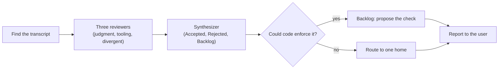

## User input

```text
$ARGUMENTS
```

Treat the argument as the focus for all three reviewers.

# Reflect

A lesson is something the next session should do differently. Reflect finds
the lessons in this session and puts each one where the next session will
meet it.

- A one-off is not a lesson
    - A typo, a flaky retry, or a fact about one file does not change what the next session does
- Each lesson goes to exactly one home
    - Two copies drift, and the next session trusts the wrong one
- Finding nothing is a valid outcome
    - Say so in one line and stop



## Only the lead session runs this

A teammate shares the lead's `CLAUDE_CODE_SESSION_ID`, so it would review the
lead's transcript instead of its own. One Bash call tells you whether you are
one. Replace `<nonce>` with eight random hex characters, picked fresh, and never
with a value already used in this session:

<!-- lead-check: tests/test-skill-gates.sh extracts and runs the block below -->

```bash
n=spechub-whoami-<nonce>
s="${CLAUDE_CODE_SESSION_ID:-none}"
p="$HOME/.claude/projects"
for _ in $(seq 1 20); do
  m=$(grep -lF "$n" "$p"/*/"$s"/subagents/agent-*.jsonl 2>/dev/null </dev/null | head -1)
  [ -n "$m" ] && { echo "child: $m"; exit 0; }
  grep -qF "$n" "$p"/*/"$s".jsonl 2>/dev/null </dev/null && { echo "lead"; exit 0; }
  sleep 0.5
done
echo "lead"
```

- `lead` means carry on
- `child: <path>` means stop
    - Report the lesson to the lead in your final message, or by `SendMessage`
- The `handoff` skill explains why the block polls, and why the nonce must be fresh
- Skip the check under Codex

## 1. Decide whether to run now

- **The user asked** – run now
- **`archive` suggested it** – run once the user accepts the suggestion
- **You noticed a trigger yourself** – finish the current task first, then run
    - Reflect starts four subagents, and it must never stall work in progress
    - The triggers are the ones in this skill's description
    - Run on your own at most once per session
    - Run again only when the user asks

## 2. Find the transcript

Read only this session's own transcript. Never read transcripts from another
project's folder – they hold private conversations the user never offered.

### Claude Code

- Each project has one folder: `${CLAUDE_CONFIG_DIR:-$HOME/.claude}/projects/<slug>/`
    - The slug is the directory the session started in, with every character other than a letter, digit or hyphen turned into `-`
    - `/home/me/.work/app` becomes `-home-me--work-app`
- Each session is one file in that folder: `<session id>.jsonl`
- `CLAUDE_CODE_SESSION_ID` holds the session id

```bash
projects="${CLAUDE_CONFIG_DIR:-$HOME/.claude}/projects"
slug=$(printf %s "$PWD" | sed 's/[^A-Za-z0-9-]/-/g')
ls "$projects/$slug/$CLAUDE_CODE_SESSION_ID.jsonl"
```

- The session may have changed directory since it started, so the slug misses
    - Then look the file up by id: `ls "$projects"/*/"$CLAUDE_CODE_SESSION_ID".jsonl`
    - The id is unique, so only this session's file can match
- `CLAUDE_CODE_SESSION_ID` may be empty on an older Claude Code
    - Take the newest `*.jsonl` files in the folder, newest first
    - Pick the one whose typed prompts include this conversation's opening prompt
    - `jq -r 'select(.type=="user" and (.isMeta|not) and (.message.content|type)=="string" and (.message.content|test("^\\s*(<|Another Claude session)")|not)) | .message.content' <file>` prints the typed prompts

### Codex

- All projects share one tree: `${CODEX_HOME:-$HOME/.codex}/sessions/YYYY/MM/DD/rollout-<time>-<session id>.jsonl`
- The first line of each file is a `session_meta` record
    - `payload.cwd` is the directory the session started in
    - `payload.id` is the session id
- Read the first line only, until the `cwd` matches this project

```bash
ls -t "${CODEX_HOME:-$HOME/.codex}"/sessions/*/*/*/rollout-*.jsonl | head -50 |
  while read -r f; do
    [ "$(head -1 "$f" | jq -r .payload.cwd)" = "$PWD" ] && echo "$f"
  done | head -5
```

- Pick the newest match whose typed prompts include this conversation's opening prompt
    - `jq -r 'select(.type=="event_msg" and .payload.type=="user_message") | .payload.message' <file>` prints the typed prompts

### No file resolves

Write a digest of the session and pass it in place of the path.

- The user's corrections and stated preferences, quoted
- Each skill, subagent and command you ran, and how each one went
- Each redo, and what caused it

## 3. Run three reviewers in parallel

Launch three subagents in one message, so they run at the same time.

- Use a general-purpose subagent on the `opus` model for each
    - Under Codex, use Codex's own subagents with the same prompts
    - A harness with no subagents runs the three lenses itself, one after another
- Each reads the same transcript through a different lens
- Each prompt is `reviewer.md` in this skill's directory, plus four values

| Value | What to pass |
|---|---|
| Lens | `judgment`, `tooling`, or `divergent` |
| Harness | `claude-code` or `codex`, which decides how to read the file |
| Transcript | the absolute path, or the digest |
| Focus | the user input above, or "none" |

The three lenses cover different ground.

- **Judgment** – what the user corrected or preferred, and where your judgment was off
- **Tooling** – which SpecHub skills, hooks, agents or CLI commands misfired, the agent skipped, or SpecHub lacks
- **Divergent** – what a different approach would have saved

## 4. Synthesize

Launch one more `opus` subagent with `synthesizer.md` from this skill's
directory. Pass it the transcript and all three reviewers' output in full.

- It merges findings that describe the same lesson
- It checks each finding against the target file, so no rule lands twice
- It spot-checks the cited transcript evidence
- It returns three lists, each item with a reason and cited evidence
    - **Accepted** – a lesson with its one home
    - **Rejected** – a finding that failed a test, with the test it failed
    - **Backlog** – a lesson that code could enforce, with the check it proposes

## 5. Move enforceable lessons to Backlog

Read the Accepted list once more yourself. Move any lesson a lint, script, hook
or CI check could enforce into Backlog, as a proposed check.

- Skill text asks an agent to remember a rule
- A check enforces the rule on every run
    - "Every bullet ends without a period" belongs in `lint-prose`, not in another skill paragraph

## 6. Route each lesson to one home

| The lesson is | Its home |
|---|---|
| A decision, or a settled term | the `record-context` skill |
| A rule code could check | a Backlog item proposing the check |
| A habit of this project or this user | the project's `CLAUDE.md` or `AGENTS.md`, or your memory |
| A flaw in SpecHub itself | the SpecHub skill, or a SpecHub issue |

Delegate every file edit to a subagent, including `CLAUDE.md`, `AGENTS.md` and
SpecHub files. Give it the file and the exact change. Review its diff yourself.

### A decision or a settled term

- Invoke `record-context` with the decision and its reason
- `record-context` applies its own bar, so it may write nothing
    - Report that as rejected, with its reason

### A rule code could check

- A check on SpecHub itself goes in a SpecHub issue, like a flaw (below)
- A check on this project goes in the report as a proposal
    - Name the rule, the mechanism, and the moment in the transcript that showed the need
    - The user decides whether to build it

### A habit of this project or this user

- A habit every agent on this project should follow goes in the project's instruction file
    - Edit whichever of `CLAUDE.md` and `AGENTS.md` the project already uses
    - Add one line beside the rules it relates to
- A preference of this user across projects goes in your memory, if your harness has one
    - Update an existing memory before you add a new one

### A flaw in SpecHub itself

First check whether the current repository is SpecHub. It is when
`.claude-plugin/plugin.json` at the repository root has `"name": "spechub"`.

- **In the SpecHub repository** – have a subagent edit the skill, agent or hook
    - Follow `CONTRIBUTING.md` for the version bump and the writing standard
- **In any other project** – open an issue on `ac8318740/spechub`
    - SpecHub's skills load from the plugin cache there, and the next update overwrites a local edit
    - Ask the user first, unless `gh api user -q .login` prints `ac8318740`
    - Search first with `gh issue list -R ac8318740/spechub --search "<keywords>"`
    - Comment on a matching open issue instead of opening a second one

```bash
gh issue create -R ac8318740/spechub --title "<skill>: <the flaw in a few words>" --body-file <file>
```

The body holds three sections.

1. **Problem** – what went wrong, and which skill, hook, agent or command caused it
2. **Proposed change** – the edit, as exact as you can make it
3. **Evidence** – the moments in the transcript, paraphrased

The SpecHub repository is public. Redact the issue before you open it.

- Paraphrase the evidence, and quote only SpecHub's own text
- Leave out project names, client names, code, file paths, credentials and personal data

## 7. Report

Tell the user what went where, in one short list.

- Edits made – the file, and one line on what changed
- Records written – the ADR or glossary entry, by path
- Issues opened or commented on – the link
- Backlog – each proposed check, one line each
- Rejected – one line each, with the reason
