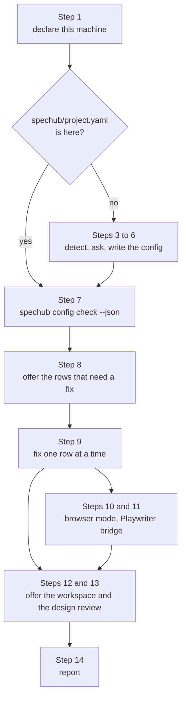

## User input

```text
$ARGUMENTS
```

# Setup

One skill, two paths. What the project already has picks the path. Both paths
join at the health check, so this skill states every fix once.



Three terms, before they get used:

- A **health check** is one run of `spechub config check`. It audits the machine
  and the project. It changes nothing.

- A **row** is one line of that report. It carries an `id`, a `status` and a
  `message`.

- An **axis** is one setting of the machine, recorded as one `host.*` key in the
  global config.

The command line tool audits. This skill interviews and writes. Neither one does
the other's job.

See `docs/adr/0008-cli-audits-skill-interviews.md`.

## Step 1: Declare this machine

The dev setup of the machine is per machine, not per project. It covers which
orchestrator hosts terminal panes and git worktrees. It also covers which
browser-verification modes work here.

Those answers live in the global config under the `host.*` keys.

Read what this machine declares:

```bash
~/.claude/spechub/bin/spechub config get host
```

On exit 0 the command prints the declared axes, and Step 2 follows. Exit code 2
means this machine declares nothing yet.

On exit 2, invoke the `host` skill and run its whole interview here. Do not tell
the user to go and run it later.

Host setup is per machine and safe to re-run, and a half-finished machine leaves
axes unset. The health check in Step 7 then fails on those axes and blocks
everything after it.

Do not restate the host skill's questions. It owns them, and it writes its own
answers. Come back to Step 2 when it finishes.

## Step 2: Choose the path

```bash
test -f spechub/project.yaml && echo present || echo absent
```

- **absent** – take the first-run path. Go to Step 3.
- **present** – take the re-run path. Go straight to Step 7.

The file keeps its schema on both paths, so nothing migrates. `docs/config-reference.md`
lists every key it can hold.

## Step 3: Detect the project type and propose defaults

Scan the project root for `pyproject.toml`, `package.json`, `go.mod` and
`Cargo.toml`. If the root gives nothing away, infer the type from `$ARGUMENTS`.
Read the matching profile from the plugin's `profiles/` directory.

Show a summary:

```
Profile:      [detected]
Directories:  src/, tests/
Commands:     [from profile]
Frontend:     [if applicable]
Workflow:     strict TDD, strict orchestrator, spec sync on, grilling via question tool
```

## Step 4: Ask what to customise

Call AskUserQuestion with EXACTLY this JSON. It holds two questions in one call:

```json
{
  "questions": [
    {
      "question": "Customize project setup? Select items to change, or skip to keep defaults.",
      "header": "Setup",
      "multiSelect": true,
      "options": [
        {"label": "Profile & paths", "description": "Change language/framework, source dir, test dir"},
        {"label": "Commands", "description": "Adjust test, build, lint, typecheck, format commands"},
        {"label": "Frontend", "description": "Change directory, dev server, commands"}
      ]
    },
    {
      "question": "Customize workflow? Select items to change, or skip to keep defaults.",
      "header": "Workflow",
      "multiSelect": true,
      "options": [
        {"label": "Grilling", "description": "How grilling asks its questions – a question tool (default) or plain prose"},
        {"label": "TDD strictness", "description": "Relaxed writes the tests after the code; all three phases still run"},
        {"label": "Orchestrator", "description": "Allow direct code work instead of subagent delegation"},
        {"label": "Spec sync", "description": "Disable automatic spec sync on commit"}
      ]
    }
  ]
}
```

Read `answers["0"]` as the setup selections and `answers["1"]` as the workflow
selections. An empty selection means the defaults stand.

## Step 5: Customise the selected sections

Ask one follow-up question at a time through AskUserQuestion. Skip every item the
user did not select.

- **Profile & paths** – ask the language or framework, then the source and test
  directories.

- **Commands** – show the proposed commands and ask what to adjust.
- **Frontend** – show the proposed frontend settings and ask what to adjust.
- **Grilling** – ask `tool`, the host's question tool, against `inline` prose.
  Recommend `tool`. It writes `workflow.grilling.questions`.

- **TDD strictness** – ask strict against relaxed, and write
  `workflow.tdd.strict`.

    Strict runs the test-writer first, so the tests exist before the code.
    Relaxed runs the task-executor first and the test-writer after it. Relaxed
    drops no phase, and all three agents run under both.

    Recommend strict, because the relaxed test-writer works beside an
    implementation it must not read.

- **Orchestrator** – ask strict against relaxed.
- **Spec sync** – ask enabled against disabled.
- **Python venv** – ask the activation command. Ask it only for a Python profile.

Leave the whole `frontend.browser` block out here. Step 10 owns it, and both
paths reach Step 10 through the health check.

## Step 6: Write the config

1. Create the `spechub/` directory.
2. Write `spechub/project.yaml` from the profile and the answers.
3. Leave the project CLAUDE.md alone. The SessionStart hook loads the
   orchestrator instructions.

4. Remove a legacy `@import` line from the project CLAUDE.md, if one is there.
   It points at `.../plugins/cache/ac8318740-plugins/spechub/<version>/CLAUDE.md`.

Then go to Step 7. Everything a fresh project still lacks shows up there as a
failing row.

## Step 7: Run the health check

Both paths arrive here. Run the check and read its JSON:

```bash
~/.claude/spechub/bin/spechub config check --json
```

That path is a symlink into the released plugin cache, so it carries the shipped
CLI. An agent testing this branch before the release runs
`node cli/dist/index.js config check --json` from the repo instead.

It prints one object to standard output and nothing else:

```json
{"checks": [{"id": "domain-map", "status": "pass", "message": "spechub/domain-map.yaml maps 4 domains"}]}
```

Each `status` is `pass`, `fail` or `info`. The exit codes carry the same news:

| Exit code | What it means |
| --- | --- |
| 0 | nothing failed, though rows still report info |
| 1 | at least one row failed |
| 2 | a required host axis has no value |

Branch on the `id` of a row. Never branch on its `message`. The identifiers are
an interface and the messages get reworded.

On exit 2, go back to Step 1 and run the host interview. Nothing else can be
trusted until every required axis has a value.

A `no-project` row means Step 6 wrote no config. Go back to Step 3 and write it.

Print the failing rows to the user before you ask anything. A project set up
months ago deserves to hear what fails first.

## Step 8: Offer the rows that need a fix

Build one AskUserQuestion with `multiSelect` set to true. Put one option in it
per row you are going to offer, and say in each description what the row
reported. This is the pre-selection the user sees: only real gaps reach the menu.

Offer a row when any of these holds:

- Its `status` is `fail`.
- Its `id` is `preferred-browser-mode`, its `status` is `info`, and
  `spechub/project.yaml` configures a `frontend` block. The project has a
  frontend and has named no browser mode for it.

- Its `id` is `output-style` and its `status` is `info`. The row passes when the
  settings files select `spechub:ac-writing-style`, so `info` means they select
  some other style, or select none.

- Its `id` is `frontend-verification` and its `status` is `info`. The project
  configures a frontend and `workflow.frontend_verification` is not `true`.

Each of those rules reads the `status` and the `id`. Read neither row's message
to decide, for the reason Step 7 gives: the message is prose and it gets
reworded.

Add three options at the end of the list, whatever the check reported:

- **Re-declare this machine** – invoke the `host` skill. It re-asks every axis,
  required and optional, and starts from the current answers.

    The check reports an `optional-axis:<key>` row as `info`, never as `fail`.
    So this option is the only way one of them reaches a question.

- **Change one setting** – for a key the check has no opinion about, such as
  `workflow.tdd.strict`. Point the user at `docs/config-reference.md`, which
  lists every key, its values and its default. Then write the key:

  ```bash
  ~/.claude/spechub/bin/spechub config set workflow.tdd.strict false
  ```

  Do not restate the reference here.

- **Skip** – leave everything as it is.

On a first run the menu carries several rows, and only one of them failed. A
fresh project has no domain map, so `domain-map` fails. It selects no output
style, so `output-style` reports `info`.

A fresh project that configures a frontend adds `preferred-browser-mode` and
`frontend-verification`, both `info` as well, because it has named no browser
mode and turned no verification on.

## Step 9: Fix one row at a time

Each `id` maps to one fix. Work the selected rows in this order:

| Row id | The fix |
| --- | --- |
| `no-project` | there is no project here, so go to Step 3 |
| `required-axis:<key>` | invoke the `host` skill |
| `orchestrator:<name>` | invoke the `host` skill |
| `browser-mode:<mode>` | invoke the `host` skill, or the second fix below for the mode that failed |
| `preferred-browser-mode` | invoke the `host` skill on a `fail`, Step 10 on an `info` |
| `optional-axis:host.terminal_workspace` | Step 12 |
| `optional-axis:<key>` | invoke the `host` skill, through the menu option in Step 8 |
| `domain-map` | Step 9a |
| `agent-browser` | Step 9b |
| `agent-browser-json` | Step 9c |
| `verification-knowledge` | Step 9d |
| `frontend-verification` | run `spechub config set workflow.frontend_verification true` |
| `output-style` | Step 9e |

Five rows describe the machine: `required-axis`, `orchestrator`, `browser-mode`,
`preferred-browser-mode` and `optional-axis`. Invoke the `host` skill for each of
them, with one exception: `optional-axis:host.terminal_workspace` is Step 12's
question, and the `host` skill never asks it. It is safe to re-run, and it starts from the current answers.

A `preferred-browser-mode` row is the exception. It goes to the `host` skill only
on a `fail`, and to Step 10 on an `info`.

One row has second fixes: `browser-mode:<mode>`. Which one applies depends on the
mode, and for two of the three modes the `host` skill is no fix at all.

A `browser-mode:remote` failure says the machine declares the remote mode and
nothing answered on the port. If the machine really does drive a browser that
way, the bridge is down, so run Step 11. If it does not, the axis is wrong, so
run the `host` skill.

A `browser-mode:headless` or `browser-mode:local` failure says one thing and
nothing else: the machine declares the mode and no Chromium or Chrome binary sits
on PATH. The axis is right and the machine is short a browser. Re-running the
host interview changes nothing here, and answering the axis false records a lie
about what this machine can do.

Offer to install the browser instead:

```bash
sudo apt install chromium-browser   # Ubuntu/Debian
sudo dnf install chromium           # Fedora
```

Then re-run the health check from Step 7. The row passes once the binary is on
PATH.

A `frontend-verification` row needs no step of its own. The project configures a
frontend and has not turned browser verification on. Turn it on:

```bash
~/.claude/spechub/bin/spechub config set workflow.frontend_verification true
```

`docs/config-reference.md` documents the key.

### 9a. Generate the domain map

`spechub/domain-map.yaml` maps source paths to spec domains. Spec sync,
`/spechub:archive`, `/spechub:bootstrap` and `/spechub:pre-commit-review` all
read it. Without it, every path through spec sync skips in silence, and the
living specs never update.

Launch an **Explore subagent** over `directories.source` to propose domains. Ask
it for the top-level functional areas. Ask for a kebab-case name, the paths that
belong to it, and one line saying what it owns.

Guidance for the subagent:

- Group by responsibility, not by layer. Use `auth`, `billing` and `search`,
  never `models`, `controllers` and `utils`.

- Prefer a directory prefix over a file list. Consumers match a path as a prefix.
- Aim for 3 to 10 domains. Fewer, and spec sync cannot tell two changes apart.
  More, and every commit touches several.

- Leave tests, config, build files and docs unmapped. Consumers skip a path that
  no domain covers.

If `spechub/specs/` already holds domain directories, propose those names first
and map the paths onto them. Renaming a domain here orphans its `spec.md`.

Print the proposal and confirm it with AskUserQuestion. Ask "Use this domain map,
or adjust it?" and offer "Use it" against "Adjust (I'll give feedback)".

Then write the file:

```yaml
# Domain Map: maps source paths to spec domains
# Read by spec sync, /spechub:archive, /spechub:bootstrap

domains:
  <domain-name>:
    paths:
      - <path prefix>
    description: <what this domain owns>
```

A greenfield project has no code to group. Say so, write the header with one
commented example under `domains:`, and invent nothing. Tell the user to fill it
in, or to run `/spechub:setup` again once there is code to map.

### 9b. Install the browser driver

`agent-browser` is the command line tool the frontend verifier drives a browser
with. Offer to install it:

```bash
npm install -g agent-browser
```

### 9c. Write agent-browser.json

This file tells `agent-browser` which port to dial. Write it in the project root:

```json
{"cdp": "<cdp_port>"}
```

Take `<cdp_port>` from `frontend.browser.cdp_port` in `spechub/project.yaml`. With
no value there, the default is `19988` under `mode: remote` and `9555` otherwise.
The row fails when the two files name different ports, so change one of them.

### 9d. Create the knowledge base for verification

The frontend verifier keeps what it learns in `VERIFICATION-KNOWLEDGE.md`, under
the directory `frontend.helpers_dir` names. If that key states nothing, ask for a
directory and write the key first. Then create the file:

```markdown
# Verification Knowledge Base

Evolving reference for browser-based verification. Updated by the frontend-verifier agent after each run.

## URL Patterns

<!-- Add URL patterns and routing rules here -->

## Element Patterns

<!-- Add stable element identifiers discovered during testing.
     Prefer data-testid attributes – they survive refactors.
     Record the accessible name/role from agent-browser snapshots. -->

## Gotchas & Lessons Learned

<!-- Add issues and workarounds discovered during testing -->

## Proven Verification Sequences

<!-- Add step sequences that work reliably.
     Example: "To verify login: open /login, snapshot, fill @username, fill @password, click @submit, wait 2s, snapshot again, check for dashboard heading" -->
```

### 9e. Offer the writing output style

The plugin ships an output style. Claude Code names it `spechub:ac-writing-style`.
It applies the `writing` skill's plain-language rules to every chat reply.

Offer it. Never set it without asking.

The row's message names which of the three settings files selects a style, and
which style it selects. `.claude/settings.local.json` wins over
`.claude/settings.json`, which wins over `~/.claude/settings.json`.

Ask once:

```json
{
  "question": "Apply the spechub:ac-writing-style output style?",
  "options": [
    {"label": "Global (recommended)", "description": "Write outputStyle into ~/.claude/settings.json, so it applies in every project"},
    {"label": "This project only", "description": "Write outputStyle into .claude/settings.local.json, which overrides the global value here"},
    {"label": "Skip", "description": "Leave the output style as it is"}
  ]
}
```

Load the chosen file as JSON, set the one key, then write it back. Use `python3`
or `jq`. Never edit the file with a regular expression, because that corrupts the
other keys.

Stop and report a file holding malformed JSON. Do not overwrite it.

```bash
python3 - <<'PY'
import json, pathlib, sys
f = pathlib.Path("~/.claude/settings.json").expanduser()   # or .claude/settings.local.json
f.parent.mkdir(parents=True, exist_ok=True)
try:
    data = json.loads(f.read_text()) if f.exists() else {}
except json.JSONDecodeError:
    sys.exit(f"{f}: malformed JSON, aborting")
data["outputStyle"] = "spechub:ac-writing-style"
f.write_text(json.dumps(data, indent=2) + "\n")
PY
```

If the user chose global and a project file also sets `outputStyle`, say so. The
project value overrides the global one, so offer to remove that key.

Tell the user the style applies after `/clear`, or in a new session. Say that
`/config` -> Output style writes project scope only, which is why this step
offers the global path. Source: https://code.claude.com/docs/en/output-styles.md.

Claude Code has no command line flag for this. `claude config` does not exist,
and Claude Code dropped the `/output-style` command. Do not invent either.

## Step 10: Ask the project's browser mode

Both paths reach this step. The first run reaches it because a fresh frontend
project states no preference. A re-run reaches it because the user picked that
row from the menu.

The machine says what it can do, in the `host.browser.*` axes. This question asks
a different thing: which of those modes this project would like to use.

Offer only the modes the machine declares available. When the machine declares
none, offer all three and run the `host` skill first.

The block below is the full menu, not the question to ask word for word. Drop the
entry for any mode the machine declares unavailable, then ask the rest.

```json
{
  "question": "How will you connect a browser for frontend verification?",
  "options": [
    {"label": "Remote browser (Playwriter bridge)", "description": "Best experience – drive Chrome on your desktop/laptop via the Playwriter extension over SSH. Choose this if you develop on a remote VM."},
    {"label": "Headless (automatic)", "description": "The frontend-verifier launches headless Chromium when needed. No setup required. Choose this for CI or if you don't need to see the browser."},
    {"label": "Local with display", "description": "Launch a visible browser on this machine. Choose this for desktop Linux, macOS, or WSL with display access."},
    {"label": "Skip for now", "description": "I'll set this up later – /spechub:host to declare what this machine can do, /spechub:setup for the project's preference"}
  ]
}
```

Write the answer as `remote`, `headless` or `local`. Write the port beside it:
`19988` for `remote`, and `9555` for the other two.

```bash
~/.claude/spechub/bin/spechub config set frontend.browser.mode remote
~/.claude/spechub/bin/spechub config set frontend.browser.cdp_port 19988
```

Then write `agent-browser.json` with the same port, the way Step 9c does.

On **Skip for now**, leave `frontend.browser` unset and write no
`agent-browser.json`. Say that `docs/config-reference.md` documents the three
keys for later.

On **Headless**, no setup follows. Tell the user the frontend verifier launches
headless Chromium when it needs one.

On **Local with display**, look for a Chromium binary. Tell the user the frontend
verifier launches it when it needs one.

On **Remote browser**, ask what the verifier does when the browser answers nothing:

```json
{
  "question": "When the remote browser isn't connected, what should the frontend-verifier do?",
  "options": [
    {"label": "Fall back to headless", "description": "Launch headless Chromium automatically. Verification still runs, just without your real browser."},
    {"label": "Fail", "description": "Report FAIL so you know the bridge is down. Choose this if headless results aren't useful for your app."}
  ]
}
```

Write `frontend.browser.fallback` as `headless` for the first answer, and as
`none` for the second. Only `none` acts. It forbids another mode from standing
in.

Then go to Step 11.

## Step 11: Connect the Playwriter bridge

This step is the one copy of the bridge setup. Step 10 reaches it on a `remote`
answer. Step 9 reaches it on a `browser-mode:remote` failure.

Remote mode drives Chrome through the Playwriter extension, which uses the
`chrome.debugger` API. Chrome itself opens no CDP listener. Show these steps:

```
To connect your browser via the Playwriter bridge:

1. On the browser machine, install Node 18+ and Playwriter:

   npm install -g playwriter

2. In Chrome on the browser machine (preferably a dedicated profile), install the Playwriter extension and pin it:

   https://chromewebstore.google.com/detail/playwriter-mcp/jfeammnjpkecdekppnclgkkffahnhfhe

3. Run two long-running processes on the browser machine:

   Relay:         playwriter serve --host 127.0.0.1
   Reverse tunnel: ssh -N -R 19988:127.0.0.1:19988 <user>@<dev-machine>

4. In Chrome, click the Playwriter toolbar icon on each tab you want automated.

5. Verify from this (dev) machine:

   curl -s http://localhost:19988/json/version
```

Show these gotchas after the steps:

- Playwriter hardcodes port `19988`. Nobody can change it.
- The relay runs on the same host as Chrome. The extension rejects any
  `/extension` client that is not `127.0.0.1`.

- Each tab needs the extension icon clicked once. Playwriter cannot attach to a
  `chrome://` or `about:` page.

- A stale relay holds port 19988 on the browser machine. Run
  `playwriter serve --host 127.0.0.1 --replace` to kick the previous one.

For a Windows laptop setup that opens no window, see
`plugins/spechub/docs/playwriter-bridge-windows.md`. It covers auto-reconnecting
scheduled tasks, ssh-agent key persistence and one-time admin registration. It
ships `relay.ps1`, `tunnel.ps1` and `register-tasks.ps1` under
`plugins/spechub/assets/playwriter-bridge/`.

Then re-run the health check from Step 7 and read the `browser-mode:remote` row.
It passes once something answers on the port.

Do not curl the port yourself. The check is the one place that probes the
machine.

## Step 12: Offer the terminal workspace

The terminal workspace runs several coding agents side by side in one terminal,
on a machine the user reaches over the network. It installs herdr and the tools
that read diffs, pull requests and files around it.

SpecHub needs none of it, so this step offers and never assumes.

Read what this machine already decided:

```bash
~/.claude/spechub/bin/spechub config get host.terminal_workspace
```

On exit 0 the user has already answered. Say nothing and go to Step 13.

On any exit other than 0 or 2 the CLI is older than this skill and does not know
the key. Do not ask, and do not try to write the key. Say this instead, then go
to Step 13:

```
The spechub CLI on this machine predates host.terminal_workspace, so I cannot
record an answer. Restart Claude Code to relink the CLI, then run
/spechub:setup again.
```

The SessionStart hook repoints `~/.claude/spechub/bin/spechub` at every start,
so a restart is the whole fix. This only happens when a plugin update lands
mid-session.

On exit 2 nobody has answered yet. Ask once:

```json
{
  "question": "Set up the terminal workspace on this machine?",
  "header": "Workspace",
  "options": [
    {"label": "Yes", "description": "You then run /spechub:terminal-workspace, which installs herdr and the tools around it: several agents side by side in one terminal, sessions that survive a disconnect, and diffs, pull requests and files on one key each. Ten components, every one reversible."},
    {"label": "No", "description": "Leave this machine as it is. Nothing in SpecHub needs the workspace, and /spechub:terminal-workspace installs it any time later."}
  ]
}
```

Write the answer, whichever way it went:

```bash
~/.claude/spechub/bin/spechub config set host.terminal_workspace true   # or false
```

Write it before doing anything else. The answer is the user's, and an installer
they never get round to running must not bring the question back on the next
project.

On **Yes**, hand the install to the user. The `terminal-workspace` skill sets
`disable-model-invocation: true`, so the Skill tool refuses every attempt to
call it from here. Print this line, then go to Step 13:

```
Recorded. Run /spechub:terminal-workspace to install it – the installer is
reserved for you to start.
```

Never replicate that skill's steps by hand. It installs binaries and writes one
config file, and a second writer of those files collides with it.

On **No**, go straight to Step 13. Name `/spechub:terminal-workspace` once, and
do not ask again.

This step is the only place that asks the axis. The `host` skill owns every
other `host.*` question, and leaves this one here. The workspace installs
binaries, so the offer belongs after the project works.

## Step 13: Offer the design review

The design review is two plugins working on the frontend:

- **open-designer** writes a design you can look at before anyone builds it
- **impeccable** reviews a UI change against the product's own design rules

SpecHub needs neither, so this step offers and never assumes.

Ask it only of a project with a frontend. The health check in Step 7 reports a
`frontend-verification` row for those projects and for no others, so no such row
means no frontend. Go to Step 14.

Read what this project already decided:

```bash
~/.claude/spechub/bin/spechub config get workflow.design_review
```

On exit 0 the user has already answered, either way. Say nothing and go to
Step 14.

On any exit other than 0 or 2 the CLI is older than this skill and does not know
the key. Do not ask, and do not try to write the key. Say this instead, then go
to Step 14:

```
The spechub CLI on this machine predates workflow.design_review, so I cannot
record an answer. Restart Claude Code to relink the CLI, then run
/spechub:setup again.
```

The SessionStart hook repoints `~/.claude/spechub/bin/spechub` at every start,
so a restart is the whole fix.

On exit 2 nobody has answered yet. Ask once:

```json
{
  "question": "Turn on design review for this project's frontend?",
  "header": "Design",
  "options": [
    {"label": "Yes", "description": "You then install two plugins: open-designer, which writes a design you can look at before anyone builds it, and impeccable, which reviews a UI change against the product's design rules. Both are reversible."},
    {"label": "No", "description": "Leave this project as it is. Nothing in SpecHub needs either plugin, and setup never asks again."}
  ]
}
```

Write the answer, whichever way it went:

```bash
~/.claude/spechub/bin/spechub config set workflow.design_review true   # or false
```

Write it before doing anything else. The answer is the user's, and two plugins
they never get round to installing must not bring the question back on the next
run.

On **Yes**, hand the install to the user. Print these lines, then go to Step 14:

```
Recorded. Install the two plugins yourself – the installer is reserved for you
to start:

  /plugin marketplace add ac8318740/ac-agentic-coding
  /plugin install open-designer@ac-agentic-coding

  /plugin marketplace add pbakaus/impeccable
  /plugin install impeccable@impeccable

Then run /impeccable init once. It writes PRODUCT.md, the file the design
review reads.
```

Three things this step never does:

- It never runs an install. Both plugins change what Claude Code loads, so the
  user starts them.

- It never writes `PRODUCT.md`. `/impeccable init` owns that file, and a second
  writer collides with it.

- It never copies a file out of impeccable. Setup names the plugin and stops
  there.

`spechub config check` grows an `impeccable` row once the user installs the
plugin, so a later `/spechub:setup` run confirms the install landed.

On **No**, go straight to Step 14. Name neither plugin again, and do not ask
again.

The key records the answer, never the install. Setup writes it before the user
installs anything, so `true` never claims either plugin is here.

## Step 14: Report

Run the health check one last time, then report what stands:

```
## SpecHub setup

Profile:      [profile]
Source:       [source dir]
Tests:        [tests dir]
Grilling:     [question tool/inline prose]
TDD:          [strict/relaxed]
Orchestrator: [strict/relaxed]
Spec sync:    [enabled/disabled]
Frontend:     [configured/not configured]
Browser:      [project's preferred mode / not configured]
Design:       [on / off / not asked]
Host:         [orchestrators + browser modes declared / not declared]
Workspace:    [yes / declined / not asked]
Config:       spechub/project.yaml
Domain map:   spechub/domain-map.yaml ([n] domains / starter – fill in)
Output style: spechub:ac-writing-style (global) | (project) | not set

Health check: [n] pass, [n] fail, [n] info

Next: describe what you want to build, or run /spechub:bootstrap for existing code.
```

Fill the `Host:` line and the `Orchestrator:` line from two different sources.
`Orchestrator:` is this project's delegation policy, read from
`workflow.tdd.orchestrator_strict` in `spechub/project.yaml`. It says whether
the coordinator may write code itself. `Host:` is about the machine. It names
which tool owns terminal panes and git worktrees, and which browser modes work
here.

The `host` skill declares both, and the global config holds them.

Fill `Workspace:` from `host.terminal_workspace`: `yes` on `true`, `declined` on
`false`, and `not asked` when it is unset.

The key records the answer, never the install. Setup writes it before anyone
runs the installer, so `yes` never claims this machine has the workspace. When
Step 12 asked in this run and the user said Yes, write `yes – run
/spechub:terminal-workspace` so the owed command stays on screen.

Fill `Design:` from `workflow.design_review` and the `impeccable` row together:

- `on` when the key is `true` and the row is there
- `on – install open-designer and impeccable` when the key is `true` and no row
  is there

- `off` when the key is `false`
- `not asked` when the key states nothing, or the project has no frontend

That key records the answer too, never the install. The `impeccable` row is the
only thing here that reports what the machine has, so `on` alone never claims a
plugin the user has yet to install.

List every row still failing under the summary. Name the row and what it needs.

## What this skill leaves to others

- `spechub config check` owns every audit rule. Do not re-probe the machine with
  shell commands of your own.

- `spechub config show` owns printing the current setup. It reports the profile,
  the commands, the directories and what the project says about its browser. This
  skill never re-prints those itself.

- `docs/config-reference.md` owns the key reference. It lists each key, its
  values, its default, and what changes when you change it.

- `spechub config set <key> <value>` owns the single-key change, in both files.
  It reads the key to decide which one.

    A `host.*` key goes to the global config at `~/.config/spechub/config.json`.
    Every other key it knows goes to `spechub/project.yaml`, and the write keeps
    the comments and the key order. It refuses a key neither schema knows, so
    never fall back to editing the file.

- The `host` skill owns the machine interview and every `host.*` question, with
  one exception. Step 12 of this skill asks `host.terminal_workspace`. The
  workspace installs binaries, so the offer belongs after the project works.

- The `impeccable` plugin owns its own install and its own `PRODUCT.md`.
  `/impeccable init` writes that file. Step 13 names the command and copies
  nothing out of the plugin.

- `docs/dev-setups.md` documents the nine `host.*` axes.
