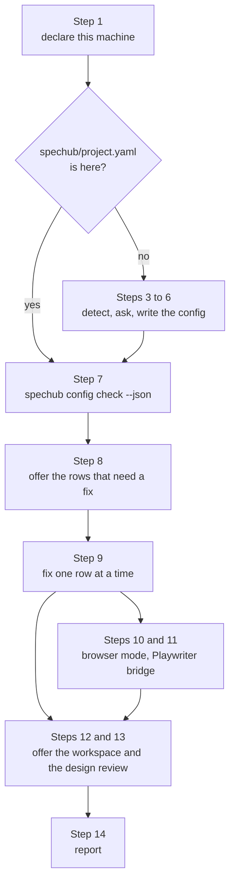

## User input

```text
$ARGUMENTS
```

# Setup

One skill, two paths. What the project already has picks the path. Both paths
join at the health check, so this skill states every fix once.


```mermaid
flowchart TD
    HOST["Step 1<br/>declare this machine"] --> FORK{"spechub/project.yaml<br/>is here?"}
    FORK -- no --> FIRST["Steps 3 to 6<br/>detect, ask, write the config"]
    FORK -- yes --> CHECK
    FIRST --> CHECK["Step 7<br/>spechub config check --json"]
    CHECK --> MENU["Step 8<br/>offer the rows that need a fix"]
    MENU --> FIX["Step 9<br/>fix one row at a time"]
    FIX --> BROWSER["Steps 10 and 11<br/>browser mode, Playwriter bridge"]
    FIX --> OFFERS["Steps 12 and 13<br/>offer the workspace and the design review"]
    OFFERS --> REPORT["Step 14<br/>report"]
    BROWSER --> OFFERS
```

Three terms, before they get used:

- A **health check** is one run of `spechub config check`. It audits the machine
  and the project. It changes nothing.

- A **row** is one line of that report. It carries an `id`, a `status` and a
  `message`.

- An **axis** is one setting of the machine, recorded as one `host.*` key in the
  global config.

The command line tool audits. This skill interviews and writes. Neither one does
the other's job.

See `docs/adr/0008-cli-audits-skill-interviews.md`.

## Step 1: Declare this machine

The dev setup of the machine is per machine, not per project. It covers which
orchestrator hosts terminal panes and git worktrees. It also covers which
browser-verification modes work here.

Those answers live in the global config under the `host.*` keys.

Read what this machine declares:

```bash
~/.claude/spechub/bin/spechub config get host
```

On exit 0 the command prints the declared axes, and Step 2 follows. Exit code 2
means this machine declares nothing yet.

On exit 2, invoke the `host` skill and run its whole interview here. Do not tell
the user to go and run it later.

Host setup is per machine and safe to re-run, and a half-finished machine leaves
axes unset. The health check in Step 7 then fails on those axes and blocks
everything after it.

Do not restate the host skill's questions. It owns them, and it writes its own
answers. Come back to Step 2 when it finishes.

## Step 2: Choose the path

```bash
test -f spechub/project.yaml && echo present || echo absent
```

- **absent** – take the first-run path. Go to Step 3.
- **present** – take the re-run path. Go straight to Step 7.

## Step 3: Detect the project type and propose defaults

Read [`first-run.md`](first-run.md) on the first-run path, and run Steps 3 to 6 from it.

## Step 4: Ask what to customise

In [`first-run.md`](first-run.md).

## Step 5: Customise the selected sections

In [`first-run.md`](first-run.md).

## Step 6: Write the config

In [`first-run.md`](first-run.md). Then go to Step 7.

## Step 7: Run the health check

Both paths arrive here. Run the check and read its JSON:

```bash
~/.claude/spechub/bin/spechub config check --json
```

That path is a symlink into the released plugin cache, so it carries the shipped
CLI. An agent testing this branch before the release runs
`node cli/dist/index.js config check --json` from the repo instead.

It prints one object to standard output and nothing else:

```json
{"checks": [{"id": "domain-map", "status": "pass", "message": "spechub/domain-map.yaml maps 4 domains"}]}
```

Each `status` is `pass`, `fail` or `info`. The exit codes carry the same news:

| Exit code | What it means |
| --- | --- |
| 0 | nothing failed, though rows still report info |
| 1 | at least one row failed |
| 2 | a required host axis has no value |

Branch on the `id` of a row. Never branch on its `message`. The identifiers are
an interface and the messages get reworded.

On exit 2, go back to Step 1 and run the host interview. Nothing else can be
trusted until every required axis has a value.

Print the failing rows to the user before you ask anything. A project set up
months ago deserves to hear what fails first.

## Step 8: Offer the rows that need a fix

Build one AskUserQuestion with `multiSelect` set to true. Put one option in it
per row you are going to offer, and say in each description what the row
reported. This is the pre-selection the user sees: only real gaps reach the menu.

Offer a row when any of these holds:

- Its `status` is `fail`.
- Its `id` is `preferred-browser-mode`, its `status` is `info`, and
  `spechub/project.yaml` configures a `frontend` block. The project has a
  frontend and has named no browser mode for it.

- Its `id` is `output-style` and its `status` is `info`. The row passes when the
  settings files select `spechub:ac-writing-style`, so `info` means they select
  some other style, or select none.

- Its `id` is `frontend-verification` and its `status` is `info`. The project
  configures a frontend and `workflow.frontend_verification` is not `true`.

Each of those rules reads the `status` and the `id`. Read neither row's message
to decide, for the reason Step 7 gives: the message is prose and it gets
reworded.

Add three options at the end of the list, whatever the check reported:

- **Re-declare this machine** – invoke the `host` skill. It re-asks every axis,
  required and optional, and starts from the current answers.

    The check reports an `optional-axis:<key>` row as `info`, never as `fail`.
    So this option is the only way one of them reaches a question.

- **Change one setting** – for a key the check has no opinion about, such as
  `workflow.tdd.strict`. Point the user at `docs/config-reference.md`, which
  lists every key, its values and its default. Then write the key:

  ```bash
  ~/.claude/spechub/bin/spechub config set workflow.tdd.strict false
  ```

  Do not restate the reference here.

- **Skip** – leave everything as it is.

## Step 9: Fix one row at a time

Each `id` maps to one fix. Work the selected rows in this order:

| Row id | The fix |
| --- | --- |
| `no-project` | there is no project here, so go to Step 3 |
| `required-axis:<key>` | invoke the `host` skill |
| `orchestrator:<name>` | invoke the `host` skill |
| `browser-mode:<mode>` | invoke the `host` skill, or the second fix in `row-fixes.md` for the mode that failed |
| `preferred-browser-mode` | invoke the `host` skill on a `fail`, Step 10 on an `info` |
| `optional-axis:host.terminal_workspace` | Step 12 |
| `optional-axis:<key>` | invoke the `host` skill, through the menu option in Step 8 |
| `domain-map` | Step 9a in `row-fixes.md` |
| `agent-browser` | Step 9b in `row-fixes.md` |
| `agent-browser-json` | Step 9c in `row-fixes.md` |
| `verification-knowledge` | Step 9d in `row-fixes.md` |
| `frontend-verification` | run `spechub config set workflow.frontend_verification true` |
| `output-style` | Step 9e in `row-fixes.md` |

Read [`row-fixes.md`](row-fixes.md) when a selected row is `browser-mode:<mode>`, `frontend-verification`, `domain-map`, `agent-browser`, `agent-browser-json`, `verification-knowledge` or `output-style`. It holds the second fixes and Steps 9a to 9e.

## Step 10: Ask the project's browser mode

Read [`browser.md`](browser.md) when a `preferred-browser-mode` row reports `info`.

## Step 11: Connect the Playwriter bridge

Read [`browser.md`](browser.md) when the user picks the remote mode in Step 10, or a `browser-mode:remote` row fails.

## Step 12: Offer the terminal workspace

Read [`terminal-workspace.md`](terminal-workspace.md) on every run, after the rows are fixed.

## Step 13: Offer the design review

Read [`design-review.md`](design-review.md) when Step 7 reported a `frontend-verification` row. With no such row the project has no frontend, so go to Step 14.

## Step 14: Report

Read [`report.md`](report.md) on every run, as the last step.

## What this skill leaves to others

- `spechub config check` owns every audit rule. Do not re-probe the machine with
  shell commands of your own.

- `spechub config show` owns printing the current setup. It reports the profile,
  the commands, the directories and what the project says about its browser. This
  skill never re-prints those itself.

- `docs/config-reference.md` owns the key reference. It lists each key, its
  values, its default, and what changes when you change it.

- `spechub config set <key> <value>` owns the single-key change, in both files.
  It reads the key to decide which one.

    A `host.*` key goes to the global config at `~/.config/spechub/config.json`.
    Every other key it knows goes to `spechub/project.yaml`, and the write keeps
    the comments and the key order. It refuses a key neither schema knows, so
    never fall back to editing the file.

- The `host` skill owns the machine interview and every `host.*` question, with
  one exception. Step 12 of this skill asks `host.terminal_workspace`. The
  workspace installs binaries, so the offer belongs after the project works.

- The `impeccable` plugin owns its own install and its own `PRODUCT.md`.
  `/impeccable init` writes that file. Step 13 names the command and copies
  nothing out of the plugin.

- `docs/dev-setups.md` documents the nine `host.*` axes.
