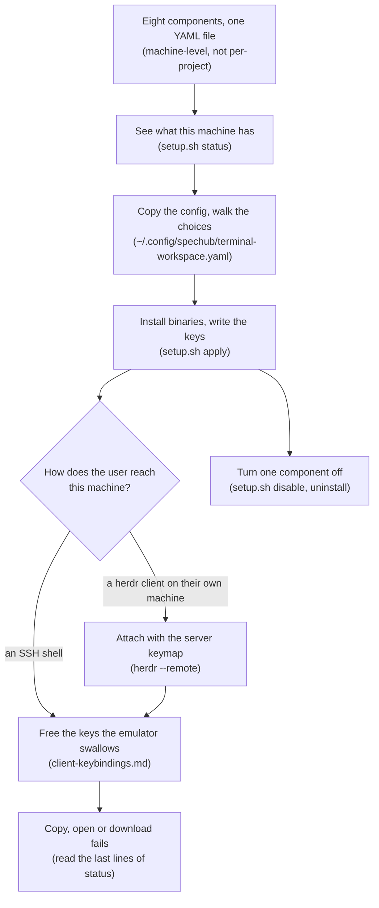

## User input

```text
$ARGUMENTS
```

# Terminal workspace

The user drives several coding agents from one terminal, on a machine they
reach over the network. Every agent dies when the connection drops, and the
tools that read diffs and pull requests expect a desktop that machine does not
have. What does that machine need? This skill installs herdr, a terminal
multiplexer that keeps sessions alive after a disconnect. It adds the tools
that read diffs, pull requests and files around it, and writes every config
from one YAML file.

SpecHub does not need any of this. Offer it, do not assume it.



| Step in the diagram                   | Detail    |
| ------------------------------------- | --------- |
| Eight components, one YAML file       | section 1 |
| See what this machine has             | section 2 |
| Copy the config, walk the choices     | section 3 |
| Install binaries, write the keys      | section 4 |
| How does the user reach this machine? | section 5 |
| Attach with the server keymap         | section 5 |
| Free the keys the emulator swallows   | section 6 |
| Copy, open or download fails          | section 7 |
| Turn one component off                | section 8 |

## 1. Nine components, installed for a user account and not for a project

*Nine config components install eleven tools. herdr holds the terminals, and the rest read diffs, pull requests and files, and commit the result.*

This is **machine-level, not per-project**. It installs binaries and writes
keybindings for the user account, so it does not belong in
`spechub/project.yaml`.

Count components when you mean config keys, and tools when you mean binaries.
The config holds nine component sections, plus an `enabled` master switch
above them. Those nine sections install eleven tools between them:

- Four tools the user drives day to day: herdr, gh-dash, diffnav and lazygit. tuicr joins them once a review starts
- Five tools that support those three: delta, tuicr, yazi, mermaid-ascii and glow
- Two helpers of SpecHub's own: spechub-md, and the spechub-clip and spechub-open pair

| Component | What it gives the user | Config key |
|---|---|---|
| herdr | A terminal multiplexer. It holds many terminal sessions and keeps them running after the user disconnects. | `herdr.enabled` |
| gh-dash | A pull request dashboard, in the terminal. | `gh_dash.enabled` |
| diffnav | A diff viewer with a file tree, on one key. | `diffnav.enabled` |
| delta | The diff renderer git pages through. | `delta.enabled` |
| tuicr | Reviews a pull request inside the terminal. | `tuicr.enabled` |
| lazygit | Stages, commits, amends and pushes, on one key. | `lazygit.enabled` |
| yazi | A file manager, with markdown drawn live by spechub-md. One key sends the hovered file to the machine the user sits at. | `yazi.enabled` |
| markdown | Markdown with its mermaid diagrams drawn as text, or served to a browser. Installs spechub-md, mermaid-ascii and glow. | `markdown.enabled` |
| remote | Copy and open, on a machine with no display of its own. Installs spechub-clip and spechub-open. | `remote.enabled` |

A config key never carries a hyphen, so gh-dash is `gh_dash`. The last two rows
name a feature rather than a binary, so each of those cells names its tools.

The two files this skill works with:

- **Config**: `~/.config/spechub/terminal-workspace.yaml`, copied from `assets/terminal-workspace/config.example.yaml`
- **Script**: `assets/terminal-workspace/setup.sh` in this plugin

The keys, on one page: [docs/terminal-workspace-keys.md](../../docs/terminal-workspace-keys.md).

Background and why each piece is there:
[docs/terminal-workspace.md](../../docs/terminal-workspace.md).

### 1.1. `g` belongs to git, and `e` means edit

The setup reserves two letters across the whole workspace, so the same key does
the same thing wherever the user is standing:

- `alt+g` opens lazygit and `alt+shift+g` opens it in a tab, so herdr's `goto` sits on `prefix+t` and `new_worktree` keeps only its chord
- `e` opens `$EDITOR` in yazi and in both of tuicr's panels, which is why tuicr's file tree filters are `x` and `X`
- diffnav is the exception, because it spends `e` on its file tree and puts the editor on `o`

## 2. Run `status` first, always

*`status` reports what this machine already has, before anything changes it.*

The script takes four commands, and this skill uses all of them. Section 2
runs `status` to report. Section 4 runs `apply` to install. Section 8 runs
`disable <component>` and `uninstall` to undo.

Run the script from the plugin directory. Resolve the path rather than
guessing it:

```bash
SETUP="$(dirname "$(find ~/.claude/plugins -path '*spechub*/assets/terminal-workspace/setup.sh' | head -1)")/setup.sh"
bash "$SETUP" status
```

It reports three things. Which binaries this machine has. Which components the
config enables. Whether the herdr config still holds the managed block, meaning
the region between the `# >>> spechub terminal-workspace >>>` and
`# <<< spechub terminal-workspace <<<` comment lines that `apply` writes.

Its last lines say where a copy and an open will land on this machine. Section
7 reads them.

## 3. Copy the config, then walk the user through the choices

*The config exposes far more keys than this. Eight of them are worth raising with the user, and the two that need no new vocabulary come first.*

Copy the example config before the first `apply`:

```bash
cp "$(dirname "$SETUP")/config.example.yaml" ~/.config/spechub/terminal-workspace.yaml
```

Then ask about these settings, in this order:

- **`herdr.integration`**: which agent reports its state to herdr. Set it to the agent the user actually runs, or `none`. Without it, herdr infers state by reading the screen
- **`gh_dash.repo_paths`**: map each repository to its local clone. Without it, checkout fails. So does any keybinding using `{{.RepoPath}}`, the placeholder gh-dash fills in with that clone's path
- **`herdr.chord_modifier`**: `alt` (default), `ctrl+alt`, or `none`. A chord is one key combination, such as `alt+f`
  - Recommend `alt`. It is the only family measured to work whichever way the user connects
  - The herdr documentation recommends `ctrl+alt`. That does reach herdr over a plain SSH shell
  - A Windows client attaching with `herdr --remote` never delivers `ctrl+alt`. Every such chord goes silently dead
  - Suggest `ctrl+alt` only to a user who attaches exactly one way and has tested it
  - `none` keeps herdr's prefix-only keymap. The user presses a prefix key first
- **`herdr.worktrees_directory`**: keep it absolute. A worktree is a second checkout of the same repository on its own branch. A relative value resolves against the herdr session's base directory, not the repository you point at. Worktrees for a second repository then land inside the first
- **`tuicr.build_from_fork`**: leave it `false`
  - Set it `true` for the two unmerged upstream pull requests, #607 stats and #633 resize
  - Set it `true` also for the fork's own fix for blank `+N -N` counts in pull request review mode
  - `true` needs cargo, the Rust build tool, and takes a few minutes to build
  - Tell the user it is temporary. `status` tracks the two upstream pull requests, not the local fix
- **`gh_dash.keybindings.agent_review`**: hands the selected pull request to an agent. Leave it empty if the user does not want that key. Avoid `R`, which is gh-dash's built-in refresh-all
- **`yazi.download_target`**: the Tailscale node name of the machine the user sits at. Setting it puts a download key in yazi. Leave it empty for a user who does not run Tailscale, and `apply` writes no key
  - Ask for the name `tailscale status` prints on **this** machine, not the name the user calls their laptop
  - Taildrop sends only between devices one Tailscale account owns on one tailnet, so confirm both ends match before setting it
  - Tell them to run `sudo tailscale set --operator=$USER` once on this machine, because `tailscale file cp` refuses a non-root caller without it
- **`remote.clipboard_shim`**: leave it `true` on any machine reached over SSH. It puts an `xclip` on `$PATH`, backed by `spechub-clip`. That stand-in is the only reason gh-dash's `y` and `Y` work there. `apply` skips it when the machine has a real `xclip` or a display

One setting sits outside the config. `spechub-md --serve` takes its port from
`$SPECHUB_MD_PORT` and falls back to 6419. Tell the user to forward whichever
port they serve on, or the link `--serve` prints is unreachable from their
laptop.

## 4. `apply` installs the binaries and writes the keys

*One command, safe to repeat. Run it again after every config edit.*

```bash
bash "$SETUP" apply
```

`apply` installs any missing binary for an enabled component. It writes the
helper scripts and the herdr keymap. It writes the gh-dash sections and
keybindings. It sets delta as the git pager. Running it again after a config
edit updates every managed region in place.

The master switch comes first. With `enabled: false` at the top of the config,
`apply` exits without installing anything.

### 4.1. What `apply` never overwrites

*Marked regions only. Whatever the user wrote outside them survives every re-apply.*

- Every edit sits between `# >>> spechub terminal-workspace >>>` and `# <<< spechub terminal-workspace <<<` markers. Hand-written config around them survives, and re-applying replaces only the managed region
- `apply` merges the gh-dash config rather than overwriting it. It keeps the sections, themes and keybindings the user added
- Never edit the user's herdr or gh-dash config outside the managed markers

### 4.2. Confirm the config still loads

*Two commands prove the install took. Stop if the second one does not print `config: ok`.*

```bash
bash "$SETUP" status          # components installed and enabled
herdr config check            # config: ok
```

`herdr config check` must print `config: ok` after `apply`. If it prints
anything else, report the error and stop rather than reloading.

Then tell the user where each key list lives. In herdr, press `prefix+?`. In
gh-dash, press `?`. diffnav lists its keys in its footer.

## 5. How the user attaches, and why `--remote-keybindings server` is not optional

*The keymap lives on this machine. Only that flag makes herdr read it.*

The keymap this skill writes lives on the machine it runs on. How the user
reaches that machine is theirs to choose, and that choice changes what the
setup can do. Raise it once during `apply` rather than leaving them to find
out.

Recommend attaching from their own machine:

```bash
herdr --remote <host> --remote-keybindings server
```

Say what it buys and what it costs. Three points cover it:

- The client runs beside their clipboard and browser. Pasting a clipboard image into an agent pane works only on this path, and an SSH shell cannot do it at all
- `--remote-keybindings server` is not optional
  - Without it herdr resolves chords from the client's config. It then ignores everything `apply` just wrote, and every chord looks broken
  - This is the first thing they will report as a bug
  - The gh-dash keybindings still work, because gh-dash reads its own config where it runs
- It needs herdr on their own machine too, and key authentication through an agent. That is because herdr reuses one connection only on Unix, and a Windows client authenticates more than once per attach

Then offer the shortcut, because the command is long and they will run it many
times a day. On Windows it has to be a function, not an alias or a symlink.
Both map one name to another, so the target would arrive as an argument to
`herdr` itself, and `herdr` would reject it.

```powershell
function herdr-dev {
  & "$env:LOCALAPPDATA\Programs\Herdr\bin\herdr.exe" `
    --remote <host> --remote-keybindings server @args
}
```

A hyphenated name tab-completes where the second word of a two-word command
never will. On macOS or Linux the same thing is a shell function in their
profile.

Do not write any of this for them. The profile and the SSH config live on the
machine they type at, which this skill cannot reach. Hand them the lines, the
same way section 6 hands them a prompt.

## 6. Free the keys the user's terminal emulator swallows

*`apply` binds keys on this machine. The emulator the user types in may claim the same ones first.*

`apply` binds the keymap on **this** machine. The terminal emulator on the
machine the user types on intercepts the chords first. Windows Terminal binds
`alt+shift+d` to "duplicate pane" by default and never forwards it, so a
binding on that chord does nothing here. The diff keys avoid it by sitting on
`alt+f` and `alt+shift+f`. Other emulators claim other chords.

When the user reports a key doing nothing, have them run `cat -v` in any pane
and press it. A chord that arrives prints an escape sequence. One that prints
nothing never left their machine, so the fix belongs in the emulator.

After `apply`, work out which case you are in.

**Running on the user's own desktop**, meaning macOS, or Linux with a desktop
session. The terminal emulator is right here. Read
[assets/terminal-workspace/client-keybindings.md](../../assets/terminal-workspace/client-keybindings.md)
and do the work yourself. Find the emulator's config, and back it up. Unbind
only the chords the emulator actually holds. Show the diff, and verify.

**Running on a remote or headless host**, meaning no `DISPLAY`, or an
`SSH_CONNECTION` in the environment. You cannot reach the emulator from here.
Ask first:

> Do you SSH into this machine from a Windows, macOS, or Linux desktop? If so
> I can give you a prompt to hand to an agent there, which frees the keys their
> terminal is swallowing.

Only if they say yes, print the contents of `client-keybindings.md` verbatim
for them to paste. Do not summarise it. Do not rewrite it for their emulator.
It already covers the common ones. The agent on that machine can see which
emulator the user actually runs.

If they say no, or the terminal is on this machine, say nothing further about
it. A user on a plain Linux console has nothing to fix.

**Never** try to edit a client-side terminal config from a remote host. Never
ask the user to paste their local config here so you can rewrite it.

## 7. Copy, open and download, on a machine with no display

*Three gh-dash keys break there, and a file has no way off the machine at all. `apply` writes a route for each. The last lines of `status` say where a copy and an open will land.*

The dev machine – the remote machine the user's agents run on, a virtual
machine in this setup – has no display and no clipboard. Two gaps, and three
gh-dash keys fall into them. The `o` key fails with `exit status 1`, because
`xdg-open` has no display. The `y` and `Y` keys fail with `Failed copying to
clipboard`, because gh-dash shells out to `xclip`, `xsel` or `wl-copy`, and the
machine has none of them.

`apply` closes both gaps. Setting a second machine up needs nothing extra:

```bash
bash "$SETUP" apply
bash "$SETUP" status     # read the last lines
```

`y` and `Y` keep gh-dash's own behaviour, backed by an `xclip` stand-in that
copies over OSC 52. OSC 52 is an escape sequence a terminal reads as "put this
text on the clipboard of the machine I am running on". The `o` key becomes a
keybinding running `spechub-open`, because gh-dash runs `$BROWSER` with its
output discarded and the dashboard still drawn. A route that must hand you a
link then has nowhere to draw it.

The last lines of `status` say where a copy and an open will actually land on
**this** machine:

```
clipboard: xclip stand-in, copying to your terminal over OSC 52
browser: none - o hands you a ctrl+clickable link and copies it
last open: 2026-08-21T03:23:07+00:00 link: https://github.com/owner/repo/pull/30
```

Read them before debugging anything else. What each means:

Every line `status` can print is here, in the order the code tries the routes:

| Line | What happened | What to do |
|---|---|---|
| `clipboard: this machine has a display` | It has a real clipboard | Nothing |
| `clipboard: xclip stand-in` | Copy reaches your terminal over OSC 52 | Nothing |
| `clipboard: none` | `apply` has not run, or `remote.clipboard_shim` is false | Run `apply` |
| `browser: $SPECHUB_OPEN_CMD = ...` | The user set an override, and it wins over every route below | Nothing |
| `browser: xdg-open on this machine` | The machine has a desktop of its own | Nothing |
| `browser: the Windows side of this machine` | This is WSL, and Windows opens the page | Nothing |
| `browser: your default browser on your laptop` | The opener is up and holds the token | Nothing |
| `browser: Chrome on your laptop` | The Playwriter bridge is up and proven attached | Nothing |
| `browser: none - o hands you a link` | The normal case over SSH. ctrl+click it | Nothing |
| `browser: none, and no terminal either` | `o` copies and reports failure | Below |
| `browser: unknown` | `spechub-open` did not answer, so it is missing or broken | Run `apply` |

Two of those rows name services this skill does not install. The opener is a
small service on the user's laptop that opens a page in their default browser.
The Playwriter bridge lets this machine drive Chrome on that same laptop, and
the `bridge` skill covers it. Each runs on its own reverse tunnel, port 19988
for the bridge and port 19989 for the opener. One can be up while the other is
down.

The opener has no key in this config, so do not invent one. `spechub-open`
takes that route only when two things hold. A token file sits at
`~/.config/spechub/opener.token`. The service answers on
`http://127.0.0.1:19989` with that token. Setting `SPECHUB_OPEN_OPENER=off` in
the environment skips the route.

`browser: none` is not a fault. Nothing on that machine can open a page, so `o`
hands the terminal a link instead. That link is the one route that works over
any number of SSH hops. To make it a real one-key open, give it a command that
can:

```bash
export SPECHUB_OPEN_CMD="ssh laptop open"   # any command taking a URL
```

Do not suggest installing a browser or an X server on the dev machine to fix
this. The browser belongs on the machine the user is sitting at.

Under `herdr --remote`, panes run on the remote host, so `spechub-open` looks
for a browser there and normally finds none. That is normal, not a fault. It
falls to the link route, which the client draws. Do not add per-host browser
configuration to "fix" it.

One thing to check rather than assume. We measured on herdr 0.8.2 that a pane's
OSC 52 write crosses the remote link. A copy on the dev machine then reaches
the clipboard the user attached from. The herdr documentation never promises
this, and terminals differ in whether they act on OSC 52 at all.

So have the user run `spechub-clip test-string` after the first attach, then
paste on the client. Believe that test over the measurement. If it does not
cross, say so plainly. The link is still on screen, and herdr's own drag-select
copies it.

### 7.1. When `o` claims it opened something nobody saw

*A successful open proves nothing. Ask what sits on the other end of the endpoint.*

`agent-browser` launches a headless Chrome on the local machine when it cannot
attach to the Chrome DevTools Protocol (CDP) endpoint the caller named. That
Chrome navigates, reports success, and shows nobody anything. A bridge relay
answering on its HTTP port does not rule this out. Ours answered
`/json/version` while refusing every CDP connection with `Multiple extensions
connected. Specify extensionId.`

Diagnose it by asking what is really on the other end, never by trusting a
successful open. Port 9555 below is the CDP port SpecHub defaults to for a
headless or local browser, so a stray Chrome on this machine answers there:

```bash
agent-browser get cdp-url          # the endpoint actually attached to
curl -s 127.0.0.1:9555/json/list   # the tabs a headless Chrome here holds
```

`spechub-open` runs that check itself before taking the bridge route. If you
find a stray headless Chrome holding pages, say so. It is a leftover, and
killing it is the user's call, not yours.

Detail, and why OSC 52 rather than a clipboard daemon:
[docs/terminal-workspace.md](../../docs/terminal-workspace.md).

### 7.2. Getting a file off the machine

*A third gap has nothing to do with gh-dash. OSC 52 carries text, and a file needs Taildrop.*

The clipboard route above carries text. A screenshot, a build artifact or a log
has no route at all. The user's own SSH client pulls one down only when they
type the path by hand.

Set `yazi.download_target` and `apply` binds one key in yazi, `D` by default. It
runs Taildrop, Tailscale's file send, on the hovered file:

```toml
run = 'shell --block -- tailscale file cp "%h" <target>:'
```

Recommend Taildrop over `scp` back to the user's machine. That route needs
three things on their machine, and Taildrop needs none of them:

- an SSH server running there
- a reverse tunnel raised on every connection
- this machine's key in their `authorized_keys`

Taildrop needs no inbound port on their machine either.

Three things break it, and `apply` names whichever one holds:

| What the user sees | What it means | What to do |
|---|---|---|
| `Access denied: file access denied` | The account does not own the local Tailscale daemon | Run `sudo tailscale set --operator=$USER` once |
| `502 Bad Gateway`, or the target reported offline | The two machines sit on different tailnets or under different accounts | Compare `tailscale status` on both ends |
| `open %*: no such file or directory` | A binding used `%*`, which yazi never expands in a keymap | Use `%h`, the hovered file |

The last row is why the key takes one file at a time. `%*` belongs to yazi's
`[opener]` table. A keybinding passes the two characters through untouched,
measured on yazi 26.8.15.

Do not offer to install an SSH server on the user's own machine to work around
a Taildrop failure. Fix the tailnet instead, or leave `yazi.download_target`
empty.

## 8. Turning one component off, or all of them

*`disable` undoes one component. `uninstall` undoes the managed config. Neither removes a binary.*

```bash
bash "$SETUP" disable herdr     # or delta, diffnav, gh_dash, lazygit, tuicr
```

`disable` takes those five components and no others. For `diffnav`, `gh_dash`
and `tuicr` it writes `<component>.enabled: false` into the config itself, then
rebuilds the herdr keymap so the rest of it survives. For `herdr` and `delta`
it does not. Set `<component>.enabled: false` yourself after those two, or the
next `apply` restores them.

`yazi`, `markdown` and `remote` have no `disable` path. `disable` refuses for
those three and names the edit that turns one off. Set the component's
`enabled` key to `false` in the config, then run `apply` again.

```bash
bash "$SETUP" uninstall
```

`uninstall` removes everything `apply` wrote. It strips the managed blocks from
the herdr, tuicr and yazi configs. It unsets delta as the git pager. It deletes
the helper scripts, the `xclip` stand-in, and the keybindings it wrote into
gh-dash. The user's own settings around them survive, and every binary stays.
