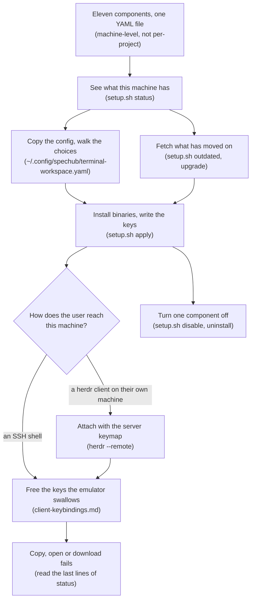

## User input

```text
$ARGUMENTS
```

# Terminal workspace

The user drives several coding agents from one terminal, on a machine they reach
over the network. Every agent dies when the connection drops, and the tools that
read diffs and pull requests expect a desktop that machine does not have. What
does that machine need?

This skill installs herdr, a terminal multiplexer that keeps sessions alive
after a disconnect. It adds the tools that read diffs, pull requests and files
around it, and writes every config from one YAML file.

SpecHub does not need any of this. Offer it, do not assume it.


```mermaid
flowchart TD
    IN["Eleven components, one YAML file<br/>(machine-level, not per-project)"] --> ST["See what this machine has<br/>(setup.sh status)"]
    ST --> CF["Copy the config, walk the choices<br/>(~/.config/spechub/terminal-workspace.yaml)"]
    CF --> AP["Install binaries, write the keys<br/>(setup.sh apply)"]
    AP --> Q{"How does the user reach<br/>this machine?"}
    Q -->|"an SSH shell"| KB["Free the keys the emulator swallows<br/>(client-keybindings.md)"]
    Q -->|"a herdr client on their own machine"| RM["Attach with the server keymap<br/>(herdr --remote)"]
    RM --> KB
    KB --> FB["Copy, open or download fails<br/>(read the last lines of status)"]
    AP --> OFF["Turn one component off<br/>(setup.sh disable, uninstall)"]
    ST --> UP["Fetch what has moved on<br/>(setup.sh outdated, upgrade)"]
    UP --> AP
```

| Step in the diagram                   | Detail    |
| ------------------------------------- | --------- |
| Eleven components, one YAML file      | section 1 |
| See what this machine has             | section 2 |
| Copy the config, walk the choices     | section 3 |
| Install binaries, write the keys      | section 4 |
| How does the user reach this machine? | section 5 |
| Attach with the server keymap         | section 5 |
| Free the keys the emulator swallows   | section 6 |
| Copy, open or download fails          | section 7 |
| Turn one component off                | section 8 |
| Fetch what has moved on               | section 9 |

## 1. Eleven components, installed for a user account and not for a project

*Eleven config components install twelve tools. herdr holds the terminals, and the rest read diffs, pull requests, files and databases, and commit the result.*

This is **machine-level, not per-project**. It installs binaries and writes
keybindings for the user account, so it does not belong in
`spechub/project.yaml`.

Count components when you mean config keys, and tools when you mean binaries.
The config holds eleven component sections, plus an `enabled` master switch
above them. Ten of those sections install twelve tools between them:

- Five tools the user drives day to day: herdr, gh-dash, diffnav, lazygit and harlequin. tuicr joins them once a review starts
- Five tools that support them: delta, tuicr, yazi, mermaid-ascii and glow
- Two helpers of SpecHub's own: spechub-md, and the spechub-clip and spechub-open pair

The eleventh, `neovim`, installs nothing. It writes one file into a neovim config
the user already has, and it is the only component that starts off.

Read [`components.md`](components.md) when the user asks what a component does, which key turns it on, or why a key sits where it does. It holds the table of all eleven and the two letters the setup reserves.

The two files this skill works with:

- **Config**: `~/.config/spechub/terminal-workspace.yaml`, copied from `assets/terminal-workspace/config.example.yaml`
- **Script**: `assets/terminal-workspace/setup.sh` in this plugin

The keys, on one page: [docs/terminal-workspace-keys.md](../../docs/terminal-workspace-keys.md).

Background and why each piece is there:
[docs/terminal-workspace.md](../../docs/terminal-workspace.md).

## 2. Run `status` first, always

*`status` reports what this machine already has, before anything changes it.*

The script takes six commands, and this skill uses all of them.

Section 2 runs `status` to report, and section 4 runs `apply` to install.
Section 8 runs `disable <component>` and `uninstall` to undo. Section 9 runs `outdated`
and `upgrade` to fetch what has moved on.

Run the script from the plugin directory. Resolve the path rather than
guessing it:

```bash
PLUGIN=$(dirname "$(dirname "$(dirname "$(readlink -f ~/.claude/spechub/bin/spechub)")")")
SETUP="$PLUGIN/assets/terminal-workspace/setup.sh"
bash "$SETUP" status
```

The SessionStart hook repoints that CLI symlink at every start, so it names
the newest installed version. The `host` skill resolves its own script the
same way.

It reports three things.

Which binaries this machine has. Which components the config enables. Whether
the herdr config still holds the managed block, meaning the region between the
`# >>> spechub terminal-workspace >>>` and
`# <<< spechub terminal-workspace <<<` comment lines that `apply` writes.

Its last lines say where a copy and an open will land on this machine. Section
7 reads them.

## 3. Copy the config, then walk the user through the choices

*The config exposes far more keys than this. Thirteen of them are worth raising with the user, and the two that need no new vocabulary come first.*

Copy the example config before the first `apply`:

```bash
cp "$(dirname "$SETUP")/config.example.yaml" ~/.config/spechub/terminal-workspace.yaml
```

Then read [`config-choices.md`](config-choices.md) and ask about the settings it lists, in its order.

## 4. `apply` installs the binaries and writes the keys

*One command, safe to repeat. Run it again after every config edit.*

```bash
bash "$SETUP" apply
```

`apply` installs any missing binary for an enabled component.

It writes the helper scripts and the herdr keymap. It writes the gh-dash
sections and keybindings. It sets delta as the git pager.

Running it again after a config edit updates every managed region in place.

The master switch comes first. With `enabled: false` at the top of the config,
`apply` exits without installing anything.

### 4.1. What `apply` never overwrites

*Marked regions only. Whatever the user wrote outside them survives every re-apply.*

- Every edit sits between `# >>> spechub terminal-workspace >>>` and `# <<< spechub terminal-workspace <<<` markers. Hand-written config around them survives, and re-applying replaces only the managed region
- The herdr config carries up to five managed regions, one each inside `[keys]`, `[ui]`, `[theme]` and `[ui.toast]`, plus one at the end for `[[keys.command]]` and `[worktrees]`
    - A key inside a marked region is spechub's, whatever table it sits in
    - A table gets a region only when the config names a value for it
    - So a user who asks for no theme keeps the one they wrote
- `apply` replaces a value the user set by hand on a key it manages, rather than joining it
    - TOML forbids two of one key, and yazi and herdr both answer an unparseable config by throwing the whole file away
    - `apply` drops a hand-written `[[mgr.prepend_keymap]]` on a key it claims, for the same reason: yazi would otherwise list two entries for one key
- `apply` merges the gh-dash config rather than overwriting it. It keeps the sections, themes and keybindings the user added
- Never edit the user's herdr or gh-dash config outside the managed markers

### 4.2. Confirm the config still loads

*Two commands prove the install took. Stop if the second one does not print `config: ok`.*

```bash
bash "$SETUP" status          # components installed and enabled
herdr config check            # config: ok
```

`herdr config check` must print `config: ok` after `apply`. If it prints
anything else, report the error and stop rather than reloading.

Then tell the user where each key list lives. In herdr, press `prefix+?`. In
gh-dash, press `?`. diffnav lists its keys in its footer.

## 5. How the user attaches, and why `--remote-keybindings server` is not optional

*The keymap lives on this machine. Only that flag makes herdr read it.*

The keymap this skill writes lives on the machine it runs on. How the user
reaches that machine is theirs to choose, and that choice changes what the
setup can do. Raise it once during `apply` rather than leaving them to find
out.

Recommend attaching from their own machine:

```bash
herdr --remote <host> --remote-keybindings server
```

Say what it buys and what it costs. Three points cover it:

- The client runs beside their clipboard and browser. Pasting a clipboard image into an agent pane works only on this path, and an SSH shell cannot do it at all
- `--remote-keybindings server` is not optional
    - Without it herdr resolves chords from the client's config. It then ignores everything `apply` just wrote, and every chord looks broken
    - This is the first thing they will report as a bug
    - The gh-dash keybindings still work, because gh-dash reads its own config where it runs
- It needs herdr on their own machine too, and key authentication through an agent. That is because herdr reuses one connection only on Unix, and a Windows client authenticates more than once per attach

Then offer the shortcut, because the command is long and they will run it many
times a day. On Windows it has to be a function, not an alias or a symlink.
Both map one name to another, so the target would arrive as an argument to
`herdr` itself, and `herdr` would reject it.

```powershell
function herdr-dev {
  & "$env:LOCALAPPDATA\Programs\Herdr\bin\herdr.exe" `
    --remote <host> --remote-keybindings server @args
}
```

A hyphenated name tab-completes where the second word of a two-word command
never will. On macOS or Linux the same thing is a shell function in their
profile.

Do not write any of this for them. The profile and the SSH config live on the
machine they type at, which this skill cannot reach. Hand them the lines, the
same way section 6 hands them a prompt.

## 6. Free the keys the user's terminal emulator swallows

*`apply` binds keys on this machine. The emulator the user types in may claim the same ones first.*

Read [`emulator-keys.md`](emulator-keys.md) after `apply`, and whenever the user reports a key doing nothing.

## 7. Copy, open and download, on a machine with no display

*Three gh-dash keys break there, and a file has no way off the machine at all. `apply` writes a route for each. The last lines of `status` say where a copy and an open will land.*

Read [`headless-clipboard.md`](headless-clipboard.md) when the user asks how to copy, open or download from this machine, or `o`, `y` or `Y` fails. It covers sections 7, 7.1 and 7.2.

## 8. Turning one component off, or all of them

*`disable` undoes one component. `uninstall` undoes the managed config. harlequin is the one binary either of them removes.*

Read [`turn-off-and-update.md`](turn-off-and-update.md) when the user asks to turn a component off or uninstall.

## 9. Keeping it current

*`outdated` reports what has moved on. `upgrade` fetches it.*

Run `outdated` first whenever the user invokes this skill on a machine that
already has the workspace. It only reads, and it costs one round trip per tool.

Then read [`turn-off-and-update.md`](turn-off-and-update.md) for the command, the exit codes, the four kinds of finding, and `upgrade`.
