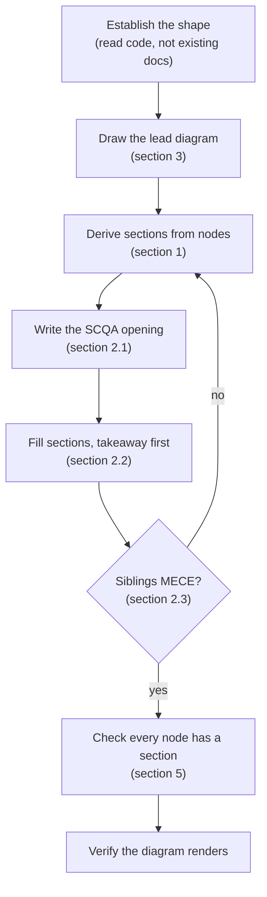
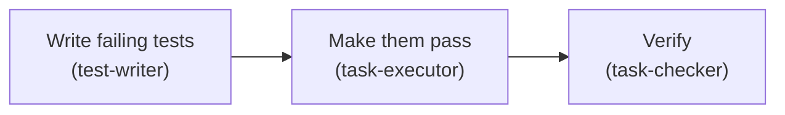

# visual-docs

*A reader should understand the shape of a system from one diagram, then find every detail in a section that maps to a part of that diagram.*

Most technical docs fail the same way: they explain in reading order rather than importance order, so the reader assembles the picture themselves and only knows what mattered at the end. This skill inverts that. One diagram carries the whole shape, and the section structure is derived from the diagram rather than invented alongside it.

| Step in the diagram      | Detail          |
| ------------------------ | --------------- |
| Derive sections          | section 1       |
| SCQA, vertical, MECE     | section 2       |
| Draw and label           | section 3       |
| Headings and voice       | section 4       |
| Full order of operations | section 5       |
| What to avoid            | section 6       |

## 1. The rule that makes this work

*The diagram is the table of contents. If a section has no home in the diagram, one of the two is wrong.*

Every numbered section maps to an element of the lead diagram, and section headings
reuse the diagram's node labels verbatim. This is mechanical, not stylistic:

- A **process node** with no section means the doc is incomplete
- A section covering no part of the diagram either belongs in another doc, or the
  diagram is missing something
- Renaming a node renames its section, and the reverse

Three exemptions, and only these three:

| Exempt                                            | Why                                              |
| ------------------------------------------------- | ------------------------------------------------ |
| **Terminals** – the incoming request, a datastore | inputs and outputs are not steps                 |
| **One section over adjacent nodes**               | allowed when they are one action, and the section names both |
| **Meta sections** – limits, what changes next     | about the document, not the system               |

Anything else without a match is a defect in one of the two. Do not add a section
to justify a node, or a node to justify a section.

End the lead diagram with a mapping table when the doc has more than four sections, so the reader can jump from a box to its detail.

## 2. Minto pyramid

*Answer first. Every level summarises the level below it. Siblings are the same kind of thing, and they are complete.*

### 2.1. Open with SCQA

*Four beats, usually four sentences, before any heading.*

| Beat             | What it does                                     |
| ---------------- | ------------------------------------------------ |
| **Situation**    | the stable fact the reader already accepts       |
| **Complication** | what changed or what breaks                      |
| **Question**     | the question the complication raises             |
| **Answer**       | your answer, stated flat – this is the takeaway  |

The answer goes in the opening, never at the end. A reader who stops after four sentences must still leave with the conclusion. Compress the situation and complication ruthlessly – one clause each is often enough – but never skip straight to the answer, because an answer with no complication reads as an arbitrary assertion.

### 2.2. The vertical rule

*A heading's takeaway must summarise everything under it, and nothing else.*

Under every H2 and H3, one italic line stating the section's point. Test it by deleting the section body: if the takeaway no longer tells the reader what they need, it was a label rather than a summary. Headings like "Overview" or "Details" always fail this, because they describe the section's position instead of its content.

### 2.3. The horizontal rule

*Sibling sections must be the same kind of thing, mutually exclusive, and collectively cover the parent.*

Three failures to check for:

- **Mixed kinds** – three sections about components and a fourth about history. The fourth belongs elsewhere
- **Overlap** – two sections that both explain the same mechanism from different angles. Merge them
- **Gaps** – the parent's takeaway claims something the children do not cover

Then order the siblings deliberately, and say which order you used if it is not obvious:

| Order         | Use when                                       |
| ------------- | ---------------------------------------------- |
| **Time**      | the thing is a sequence – a pipeline, a request |
| **Structure** | the thing has parts – components, modules       |
| **Degree**    | the parts differ by importance or size          |

## 3. Diagrams

*One diagram carries the doc. Others are local aids and are optional.*

### 3.1. Pick the type from the question being answered

| Question                        | Diagram              |
| ------------------------------- | -------------------- |
| What talks to what?             | `flowchart`           |
| In what order, and who waits?   | `sequenceDiagram`     |
| What states can this be in?     | `stateDiagram-v2`     |
| What decides which path?        | `flowchart` with gates |
| What is stored, and how related? | `erDiagram`           |

A workflow with decision points is a flowchart, not a sequence diagram. A handoff between agents or services over time is a sequence diagram, not a flowchart. Choosing wrong is the most common reason a diagram fails to explain anything.

### 3.2. Label for a reader who does not know the codebase

*Human-readable name first, technical name underneath.*

The ` ` line carries the file, agent, or command name. Someone who knows the system reads the second line; someone who does not reads the first. A diagram labelled only with identifiers explains nothing to the second reader, and they are the one who needed the diagram.

### 3.3. Keep it graspable

*Aim for a diagram a non-expert reads correctly on first look, without narration.*

- Roughly nine nodes is the ceiling for one diagram. Past that, split it and give each part its own section
- Label every edge that is not obvious. An unlabelled arrow asserts a relationship without naming it
- Show the failure path when there is one. A flow with only the happy path misrepresents the system
- Do not encode meaning in colour alone

## 4. Conventions

*Numbered headings, no trailing periods on fragments, and never repeat a parent doc.*

- **Number every heading, with a trailing period** – `## 1.`, `### 1.1.`. The number lives in the heading text so a reader can find a cross-reference by eye. Drop the third level in docs under roughly 200 lines
- **No trailing periods** on headings, table cells, or bullets that are not full sentences. Full sentences and paragraphs get them
- **Do not duplicate up the tree** – a child doc adds detail and links to its parent. If a section would restate what the parent says, cut it and link
- **En dashes only.** Never em dashes
- **Active voice, short sentences, no marketing register.** "The hook creates two symlinks", not "Two symlinks are created by the hook"

## 5. Process

*Diagram before prose. Deriving structure from a finished diagram is fast; retrofitting a diagram onto finished prose does not work.*

1. **Establish the shape.** Read the code, config and entry points. Do not start from existing docs – they are what you are replacing, and their errors propagate
2. **Draw the lead diagram first.** Getting it right forces the structure. If you cannot draw it, you do not yet understand the thing well enough to document it
3. **Derive the section list from the diagram nodes.** One section per node, headings reusing node labels
4. **Write the SCQA opening.** Do this before the body, so the body has a claim to support
5. **Fill each section.** Takeaway line first, then detail
6. **Check MECE across siblings**, then verify every node has a section and every section has a node
7. **Verify the diagram renders.** Mermaid fails silently in some viewers – check the fenced block parses and no label contains an unescaped quote or bracket

## 6. Anti-patterns

*Each of these looks like a normal doc and fails a reader in a specific way.*

| Pattern                              | Why it fails                                             |
| ------------------------------------ | -------------------------------------------------------- |
| Conclusion at the end                | the reader carries unresolved detail until the last line  |
| A diagram after the prose            | the reader has already built a mental model, possibly wrong |
| "Overview" or "Details" as a heading | describes position, not content, so it cannot be a takeaway |
| One diagram per section, none overall | no single artefact carries the shape                     |
| Diagram nodes labelled `AuthSvc`     | only legible to someone who already knows the system      |
| Sections mirroring the directory tree | directory layout is rarely the reader's question order    |
| Restating the parent doc             | two sources to keep in step, and they will drift          |
