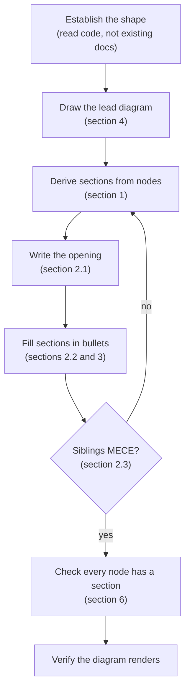
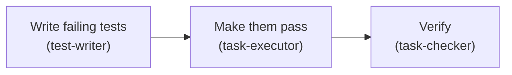

# visual-docs

*A reader should see the system's shape from one diagram. They then find every detail in a section that maps to a part of it.*

This skill makes a doc lead with a diagram, then derive its sections from that diagram.

- **Most technical docs explain in reading order rather than importance order**
    - The reader builds the picture themselves and learns what mattered last
- **One diagram carries the whole shape**, and every section maps to a part of it
- **The prose rules live in the `writing` skill**
- This skill owns shape alone

This skill owns document shape. Prose follows the `writing` skill.

| Step in the diagram      | Detail          |
| ------------------------ | --------------- |
| Derive sections          | section 1       |
| Opening, vertical, MECE  | section 2       |
| Bullets carry the body   | section 3       |
| Draw and label           | section 4       |
| Headings and duplication | section 5       |
| Full order of operations | section 6       |
| What to avoid            | section 7       |

## 1. The rule that makes this work

*The diagram is the table of contents. If a section has no home in the diagram, one of the two is wrong.*

Every numbered section maps to an element of the lead diagram, and a section heading reuses the diagram's node label verbatim. This is mechanical, not stylistic:

- A box showing something **happening**, with no section, means the doc is incomplete
- A section covering no part of the diagram either belongs in another doc, or the
  diagram is missing something
- Renaming a box renames its section, and the reverse

Three exemptions, and only these three.

- **Start and end boxes** – a box for what comes in, or what remains after, is not a step and needs no section
    - In a workflow diagram, the incoming request and the final stored output are both this
- **Two boxes, one command** – two boxes are sometimes worth drawing separately because they are two ideas, though one command does both
    - Give them one section and name both in the heading
        - The reader can tell it covers both
- **Sections about the document** – a section on what this doc leaves out, or what is about to change, is housekeeping for the reader
    - It describes the document rather than the system
        - No box should exist for it

**Start and end boxes.** A box for what comes in, or what remains after, is not
a step and needs no section. In a workflow diagram, the
incoming request and the final stored output are both this.

**Two boxes, one command.** Sometimes two boxes are worth drawing separately
because they are two ideas, but one command does both. Give them one section and
name both in the heading, so the reader can tell it covers both.

**Sections about the document.** A section on what this doc leaves out, or what is
about to change, is housekeeping for the reader. It describes the document, not the
system, so no box should exist for it.

- Anything else without a match is a defect in one of the two
- Do not add a section to justify a node, or a node to justify a section
- End the lead diagram with a mapping table when the doc has more than four sections
    - The table lets the reader jump from a box to its detail

End the lead diagram with a mapping table when the doc has more than four sections. It lets the reader jump from a box to its detail.

## 2. Minto pyramid

*Answer first. Every level summarises the level below it. Siblings are the same kind of thing, and they are complete.*

### 2.1. Open with one sentence, then bullets

*Say what the thing is and who it is for in one sentence. Put everything else in bullets under it.*

The opening is never a paragraph. A reader meeting the doc for the first time scans it, and a four-sentence block of setup is the part they skip.

- **Sentence one names the thing and what it does**, in words a developer who has never seen this repo already knows
- **Bullets under it carry the rest**: what problem it solves, what it costs, what it does not do
- **A bullet that needs context gets a sub-bullet**, and never a second sentence

| Beat | Where it goes |
| ---- | ------------- |
| **What this is** | the opening sentence |
| **What it solves** | the first bullet |
| **What it costs, or does not do** | a later bullet |
| **Where to go next** | the contents table, or the last bullet |

Two rules keep the opening honest.

- The answer goes first, and never at the end
- A reader who stops after the opening sentence and the first bullet must still leave with the conclusion

### 2.2. The vertical rule

*A heading's takeaway must summarise everything under it, and nothing else.*

- Put one italic line under every H2 and H3, stating the section's point
- Test it by deleting the section body
- It was a label rather than a summary, if the takeaway no longer tells the reader what they need
- A heading like "Overview" or "Details" always fails this
    - It describes the section's position instead of its content

### 2.3. The horizontal rule

*Sibling sections must be the same kind of thing, mutually exclusive, and collectively cover the parent.*

Three failures to check for:

- **Mixed kinds** – three sections about components and a fourth about history. The fourth belongs elsewhere
- **Overlap** – two sections that both explain the same mechanism from different angles. Merge them
- **Gaps** – the parent's takeaway claims something the children do not cover

Then order the siblings deliberately, and say which order you used if it is not obvious:

| Order         | Use when                                       |
| ------------- | ---------------------------------------------- |
| **Time**      | the thing is a sequence – a pipeline, a request |
| **Structure** | the thing has parts – components, modules       |
| **Degree**    | the parts differ by importance or size          |

## 3. Bullets carry the body

*A reader scans a list and skips a paragraph. Put the body in bullets, and keep prose for the opening.*

Ten rules govern a bullet. Each one is a way to write.

- **Bullets carry 90% or more of the body** – prose survives in the opening sentence and in a section takeaway, and nowhere else
- **One sentence per bullet** – split "X and also Y" into two siblings, or nest one under the other
- **No bullet ends in a period**, however long it runs – a question mark or an exclamation mark is fine
- **A sub-bullet carries what its parent cannot hold** – it argues for the parent, adds the detail the point needs, or lists the questions under it
- **Every level reads top-down** – a reader who stops at any level still leaves with the point
- **Nest as far as the argument needs, then stop** – depth costs nothing while every level adds a point
- **Cut a level that restates its parent** – that one costs the reader everything
- **Indent a markdown file by four spaces per level** – a `- ` marker opens its content at column 2
    - Eight spaces sit four past that column
        - CommonMark renders the child as a code block
- **Use parallel grammar across siblings** – the same kind of thing then reads as the same kind of thing
- **Cut any bullet that narrates, softens or restates**

Three shapes stay prose, because a bullet breaks them.

| Shape | Why it stays prose |
| ----- | ------------------ |
| the opening sentence | one sentence naming the thing, by section 2.1 |
| a section takeaway | one italic line under the heading, by section 2.2 |
| a numbered procedure | a step is a step, and rule 1 of the `writing` skill caps it at 20 words |

Pick a table over a bullet list wherever every item answers the same two or three questions. Pick a bullet list wherever the items differ in shape.

The output style `ac-writing-style` applies these same ten rules to a chat reply. This section is where the rules live, and that file is one reader of them.

The indent is the one rule that differs by medium.

- A terminal reply indents the first level eight spaces, then four more per level
    - The wider first step separates a child from its parent at a glance
- A markdown file cannot afford that step
    - It indents four per level throughout

## 4. Diagrams

*One diagram carries the doc. Others are local aids and are optional.*

### 4.1. Pick the type from the question the diagram answers

| Question                        | Diagram              |
| ------------------------------- | -------------------- |
| What talks to what?             | `flowchart`           |
| In what order, and who waits?   | `sequenceDiagram`     |
| What states can this be in?     | `stateDiagram-v2`     |
| What decides which path?        | `flowchart` with gates |
| What is stored, and how related? | `erDiagram`           |

- A workflow with decision points is a flowchart, and not a sequence diagram
- A handoff between agents or services over time is a sequence diagram, and not a flowchart
- Choosing wrong is the most common reason a diagram fails to explain anything

### 4.2. Label for a reader who does not know the codebase

*Human-readable name first, technical name underneath.*

- The ` ` line carries the file, agent or command name
- Someone who knows the system reads the second line, and someone who does not reads the first
- A diagram labelled only with identifiers explains nothing to the second reader, who is the one that needed the diagram

### 4.3. Keep it graspable

*Aim for a diagram a non-expert reads correctly on first look, without narration.*

- Roughly nine nodes is the ceiling for one diagram. Past that, split it and give each part its own section
- Label every edge that is not obvious. An unlabelled arrow asserts a relationship without naming it
- Show the failure path when there is one. A flow with only the happy path misrepresents the system
- Do not encode meaning in colour alone

## 5. Conventions

*Numbered headings, and never repeat a parent doc.*

- **Number every heading** – `## 1.`, `### 1.1.` – the period belongs to the number. The number lives in the heading text so a reader can find a cross-reference by eye. Drop the third level in docs under roughly 200 lines
- **Do not duplicate up the tree** – a child doc adds detail and links to its parent. If a section would restate what the parent says, cut it and link

## 6. Process

*Diagram before prose. Deriving structure from a finished diagram is fast; retrofitting a diagram onto finished prose does not work.*

1. **Establish the shape.** Read the code, config and entry points. Do not start from existing docs – they are what you are replacing, and their errors propagate
2. **Draw the lead diagram first.** Getting it right forces the structure. If you cannot draw it, you do not yet understand the thing well enough to document it
3. **Derive the section list from the diagram nodes.** One section per node, headings reusing node labels
4. **Write the opening sentence.** Do this before the body, so the body has a claim to support
5. **Fill each section.** Takeaway line first, then detail
6. **Check MECE across siblings**, then verify every node has a section and every section has a node
7. **Verify the diagram renders.** Mermaid fails silently in some viewers. Check that the fenced block parses, with no unescaped quote or bracket in any label

## 7. Anti-patterns

*Each of these looks like a normal doc and fails a reader in a specific way.*

| Pattern                              | Why it fails                                             |
| ------------------------------------ | -------------------------------------------------------- |
| Conclusion at the end                | the reader carries unresolved detail until the last line  |
| A diagram after the prose            | the reader has already built a mental model, possibly wrong |
| "Overview" or "Details" as a heading | describes position, not content, so it cannot be a takeaway |
| One diagram per section, none overall | no single artefact carries the shape                     |
| Diagram nodes labelled `AuthSvc`     | only legible to someone who already knows the system      |
| Sections mirroring the directory tree | directory layout is rarely the reader's question order    |
| Restating the parent doc             | two sources to keep in step, and they will drift          |
